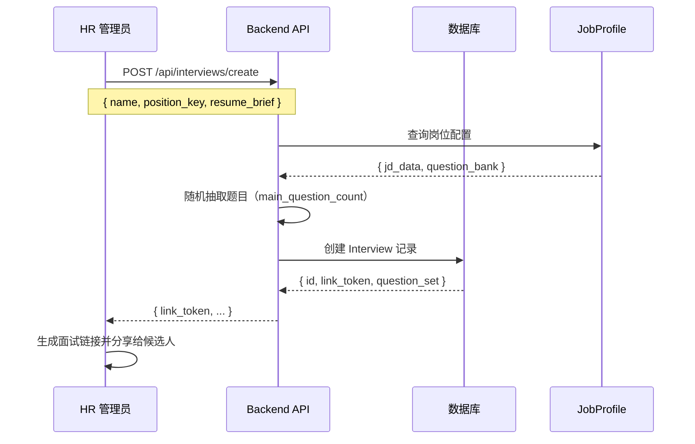
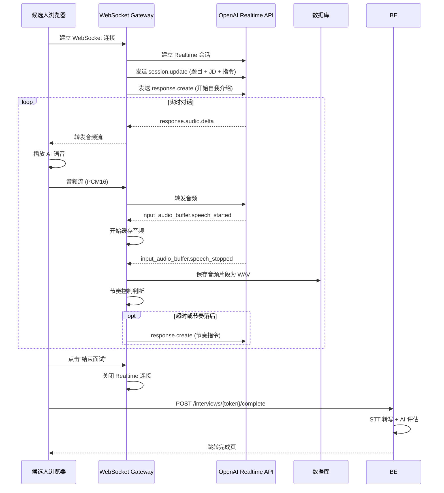
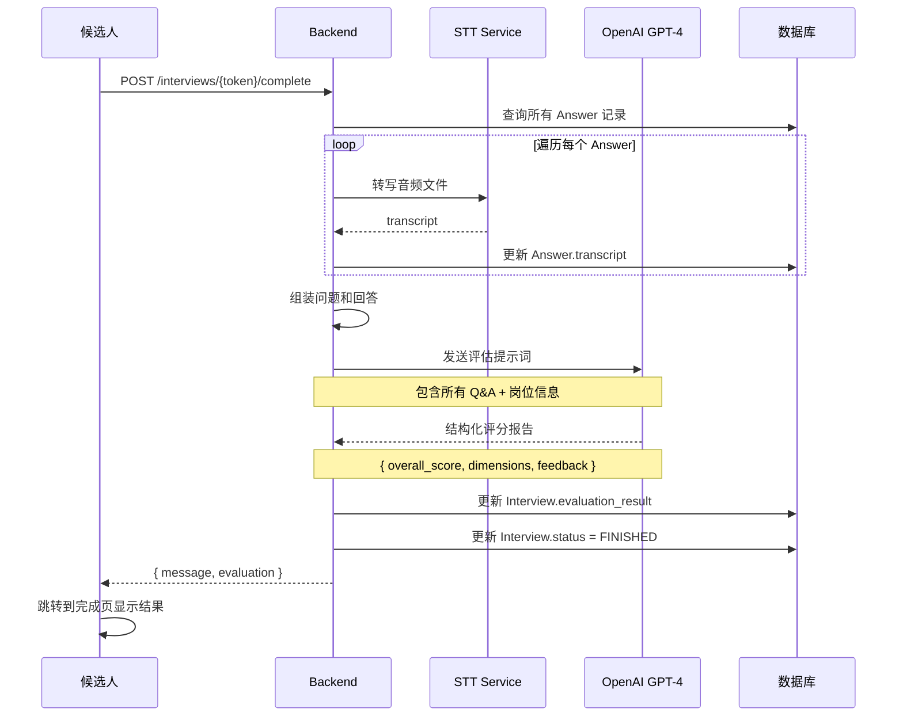

# 系统架构设计

## 📐 整体架构

AI 面试系统采用前后端分离架构，基于 OpenAI Realtime API 实现实时语音交互。

```
┌─────────────────────────────────────────────────────────────────┐
│                         候选人浏览器                               │
│  ┌──────────────────────────────────────────────────────────┐   │
│  │  React Frontend (Interview.tsx)                          │   │
│  │  ├─ Web Audio API (24kHz PCM16)                         │   │
│  │  ├─ WebSocket Client                                     │   │
│  │  ├─ 半双工音频门控                                         │   │
│  │  └─ 实时转写显示                                           │   │
│  └──────────────────────────────────────────────────────────┘   │
└─────────────────┬───────────────────────────────────────────────┘
                  │ WebSocket (音频流 + 控制消息)
                  ↓
┌─────────────────────────────────────────────────────────────────┐
│                    FastAPI 后端服务                                │
│  ┌──────────────────────────────────────────────────────────┐   │
│  │  WebSocket Gateway (realtime.py)                         │   │
│  │  ├─ 双向音频转发                                           │   │
│  │  ├─ VAD 事件监听                                           │   │
│  │  ├─ 节奏控制逻辑                                           │   │
│  │  └─ 音频录制与存储                                          │   │
│  └──────────────────────────────────────────────────────────┘   │
│  ┌──────────────────────────────────────────────────────────┐   │
│  │  业务逻辑层                                                 │   │
│  │  ├─ interviews.py (面试管理)                              │   │
│  │  ├─ job_profiles.py (岗位配置)                            │   │
│  │  ├─ admin.py (HR 后台)                                    │   │
│  │  └─ services/ (STT, 评估, 题目生成)                       │   │
│  └──────────────────────────────────────────────────────────┘   │
│  ┌──────────────────────────────────────────────────────────┐   │
│  │  数据层                                                     │   │
│  │  ├─ SQLAlchemy ORM                                       │   │
│  │  └─ PostgreSQL / SQLite                                  │   │
│  └──────────────────────────────────────────────────────────┘   │
└─────────────────┬───────────────────────────────────────────────┘
                  │ HTTPS (Realtime API)
                  ↓
┌─────────────────────────────────────────────────────────────────┐
│                   OpenAI Realtime API                             │
│  ├─ Server VAD (语音活动检测)                                    │
│  ├─ gpt-4o-realtime-mini (对话模型)                              │
│  ├─ Whisper (实时转写)                                           │
│  └─ TTS (语音合成)                                               │
└─────────────────────────────────────────────────────────────────┘
```

## 🔄 核心流程

### 1. 面试创建流程



### 2. 实时面试流程



### 3. 评估生成流程



## 🗄️ 数据模型

### Interview（面试记录）

```python
class Interview(Base):
    id: int                        # 主键
    name: str                      # 候选人姓名
    position: str                  # 岗位名称
    external_id: str               # 外部系统 ID
    resume_brief: str              # 简历摘要
    link_token: str                # 面试链接唯一标识
    question_set: JSON             # 题目列表（动态抽取）
    status: InterviewStatus        # CREATED/IN_PROGRESS/FINISHED
    evaluation_result: JSON        # AI 评估结果
    created_at: datetime
    completed_at: datetime
```

### Answer（回答记录）

```python
class Answer(Base):
    id: int                        # 主键
    interview_id: int              # 关联面试 ID
    question_index: int            # 题目索引
    audio_url: str                 # 音频文件路径
    transcript: str                # 转写文本
    created_at: datetime
```

### JobProfile（岗位配置）

```python
class JobProfile(Base):
    id: int                        # 主键
    position_key: str              # 岗位唯一标识（如 backend_engineer）
    position_name: str             # 岗位展示名称（如 后端工程师）
    jd_data: JSON                  # JD 结构化数据
    question_bank: JSON            # 题库列表
    created_at: datetime
    updated_at: datetime
```

#### jd_data 结构

```json
{
  "responsibilities": "岗位职责描述",
  "requirements": "任职要求描述",
  "plus": "加分项描述",
  "main_question_count": 3,
  "followup_limit_per_question": 1,
  "expected_duration_minutes": 10
}
```

#### question_bank 结构

```json
[
  {
    "question_text": "请介绍一下 Python 的 GIL",
    "reference": "全局解释器锁的概念和影响"
  },
  {
    "question_text": "如何设计一个高并发系统？",
    "reference": "考察负载均衡、缓存、数据库优化"
  }
]
```

## 🎙️ 音频处理架构

### 前端音频链路

```
麦克风输入
  ↓
getUserMedia() → MediaStream
  ↓
AudioContext (24kHz)
  ↓
MediaStreamSource
  ↓
ScriptProcessorNode (2048 samples)
  ↓
Float32Array → PCM16 → Base64
  ↓
WebSocket.send()
```

### 半双工门控策略

```typescript
// 时间轴控制
if (audioContext.currentTime < nextStartTimeRef.current + 0.2) {
  return; // AI 正在说话，阻止发送
}

// 预锁定机制
on('response.created') {
  nextStartTimeRef.current = currentTime + 1.5s;
}
```

### 后端音频处理

```
WebSocket 接收 Base64
  ↓
转发给 OpenAI Realtime API
  ↓
监听 VAD 事件
  ├─ speech_started: 开始缓存
  └─ speech_stopped: 保存 WAV 文件
       ↓
       PCM16 → WAV 封装
       ↓
       保存到 UPLOAD_DIR
       ↓
       创建 Answer 记录
```

## 🔌 API 设计

### REST API

| 端点 | 方法 | 说明 |
|-----|------|------|
| `/api/interviews/create` | POST | 创建面试 |
| `/api/interviews/{token}` | GET | 获取面试详情 |
| `/api/interviews/{token}/complete` | POST | 完成面试并评估 |
| `/api/job-profiles/upload` | POST | 上传岗位配置 |
| `/api/job-profiles` | GET | 列出所有岗位 |
| `/api/admin/login` | POST | HR 登录 |
| `/api/admin/interviews` | GET | 获取面试列表 |

### WebSocket API

**连接**：`ws://localhost:8000/api/realtime/ws/{token}`

**客户端 → 服务端**：

```json
{
  "type": "audio",
  "audio": "base64_pcm16_data"
}
```

**服务端 → 客户端**：

```json
// AI 音频流
{
  "type": "response.audio.delta",
  "audio": "base64_pcm16_data"
}

// AI 转写文本
{
  "type": "response.audio_transcript.delta",
  "delta": "你好"
}

// 会话事件
{
  "type": "response.created",
  ...
}
```

## 🛡️ 安全设计

### 1. 身份验证

- **候选人面试**：基于 `link_token`（一次性临时令牌）
- **HR 后台**：基于 JWT（username + password）

### 2. 数据隔离

- 每个面试使用唯一的 `link_token`
- `link_token` 采用 `secrets.token_urlsafe(32)`（256位熵）
- 面试完成后 token 仍有效（用于查看结果）

### 3. API 密钥保护

- `OPENAI_API_KEY` 仅存储在后端环境变量
- 前端通过 WebSocket Gateway 间接调用 Realtime API
- 不暴露 API Key 给客户端

### 4. 文件存储安全

- 音频文件存储在 `UPLOAD_DIR`（默认 `backend/app/static/uploads`）
- 文件名使用 `{token}_{question_index}_{random}.wav` 格式
- 生产环境建议使用对象存储（S3/OSS）

## 📊 性能优化

### 1. 数据库优化

- `link_token` 字段添加索引（快速查询）
- `position_key` 字段添加唯一索引
- 使用连接池管理数据库连接

### 2. 并发处理

- FastAPI 原生支持异步处理
- WebSocket 连接使用独立的事件循环
- 推荐使用 Gunicorn + Uvicorn Workers 部署

### 3. 音频流优化

- 前端使用 `ScriptProcessorNode` 实时处理（2048 samples buffer）
- 后端无缓冲转发（低延迟）
- OpenAI Realtime API 原生支持流式传输

### 4. 缓存策略

- JobProfile 配置可缓存（Redis）
- 评估结果缓存在数据库（避免重复计算）

## 🌐 部署架构

### 开发环境

```
localhost:5173 (Frontend Vite Dev Server)
    ↓
localhost:8000 (Backend Uvicorn)
    ↓
OpenAI Realtime API
```

### 生产环境（推荐）

```
                  ┌─ Frontend (Nginx 静态文件)
                  │
Internet → CDN → Nginx (反向代理)
                  │
                  └─ Backend (Gunicorn + Uvicorn Workers)
                      ↓
                  PostgreSQL
                      ↓
                  OpenAI Realtime API
```

### Docker 部署（可选）

```yaml
version: '3.8'
services:
  backend:
    build: ./backend
    ports:
      - "8000:8000"
    environment:
      - OPENAI_API_KEY=${OPENAI_API_KEY}
      - DATABASE_URL=postgresql://user:pass@db/ai_interview
    depends_on:
      - db

  frontend:
    build: ./frontend
    ports:
      - "5173:80"

  db:
    image: postgres:15
    environment:
      - POSTGRES_DB=ai_interview
      - POSTGRES_USER=user
      - POSTGRES_PASSWORD=pass
```

## 🔍 监控与日志

### 日志系统

- 统一日志格式（JSON）
- 不同级别：DEBUG/INFO/WARNING/ERROR
- 包含关键事件：连接建立、VAD 事件、音频保存、评估完成

详见：[日志模块](05_logging.md)

### 性能监控

- WebSocket 连接数
- 音频处理延迟
- OpenAI API 调用耗时
- 数据库查询性能

## 📚 相关文档

- [快速开始](01_quick_start.md)
- [实时面试功能](03_features/03.2_realtime_interview.md)
- [Realtime API 集成](04_technical_details/04.1_realtime_api.md)
- [音频处理技术](04_technical_details/04.2_audio_processing.md)
