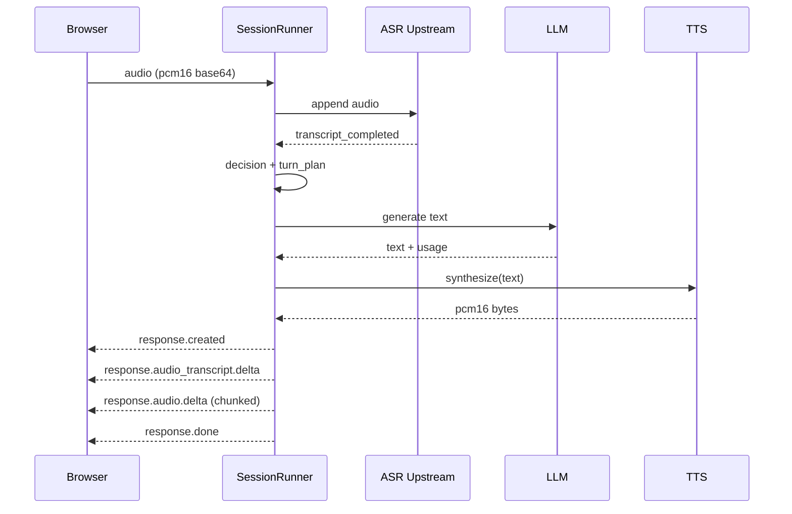

# 系统架构设计

## 整体架构

当前系统采用前后端分离 + 后端控轮策略。

```text
Browser (Web Audio + WS)
  -> FastAPI RealtimeSessionRunner
      -> ASR Upstream (sauc_v3 / openspeech_v2 / gateway_json)
      -> DecisionEngine (JSON action)
      -> ResponseGenerator (LLM)
      -> TtsSynthesizer (TTS)
      -> AudioChunker (PCM16 base64 chunks)
  -> Browser playback (response.audio.delta)
```

## 关键设计原则

1. **流程控制在后端**
- 候选人音频进入后端后，是否追问/换题/结束由状态机+决策层决定。
- 不依赖端到端语音模型自由推进业务流程。

2. **三段式语音链路**
- ASR：只负责转写。
- LLM：只负责生成文本。
- TTS：只负责语音合成。

3. **前端协议稳定**
- 客户端上行：`audio` / `end_turn` / `no_response_timeout`
- 服务端下行：`response.created` / `response.audio_transcript.delta` / `response.audio.delta` / `response.done` / `error`

## Realtime 主流程



## 数据与状态

- `SessionState` 维护阶段、题目序号、追问次数、提交状态、最近对话摘要。
- `RealtimeTurnOrchestrator` 负责 turn 生命周期和业务状态迁移。
- 音频持久化通过 `persist_audio_and_answer_sync` 落库 `Answer`。

## 配置分层

- 文本模型：`ARK_API_KEY + ARK_BASE_URL + ARK_LLM_MODEL`
- ASR：`ARK_ASR_MODE + ARK_ASR_WS_URL + ARK_ASR_APP_ID + ARK_ASR_ACCESS_TOKEN + ARK_ASR_RESOURCE_ID + ARK_ASR_CLUSTER`
- TTS：`ARK_TTS_MODEL + ARK_TTS_VOICE + ARK_TTS_SAMPLE_RATE`

## 与旧实现差异

- 旧实现依赖上游端到端语音 `response.*` 驱动；
- 新实现由后端本地生成 `response.created/response.done` 语义事件，并把 TTS 音频分片下发。
