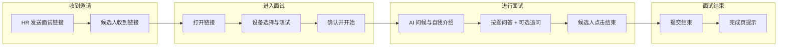
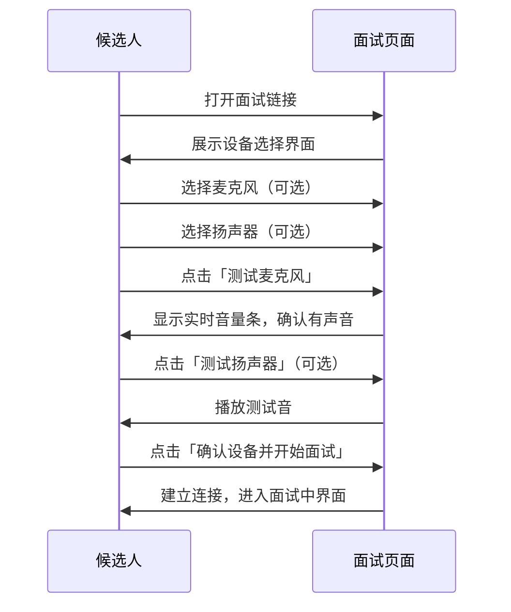
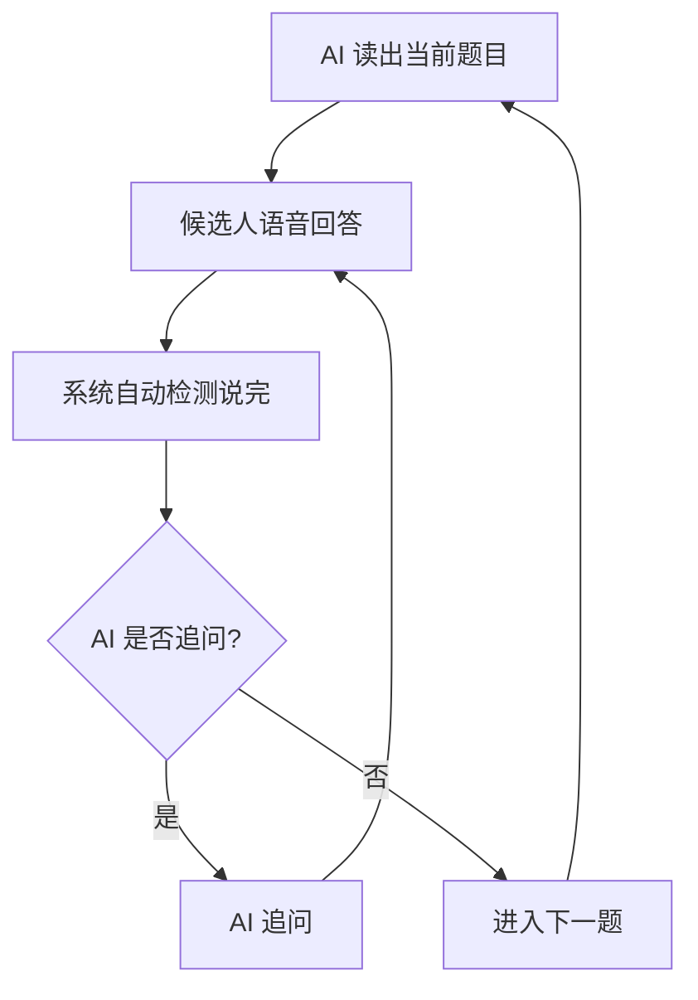
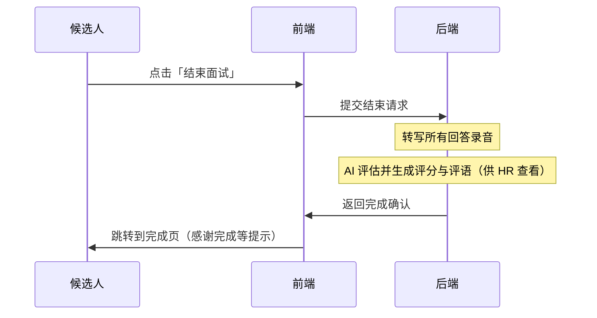

# 面试流程概览（候选人视角）

## 📝 概述

本文档从**候选人**角度描述一次完整的 AI 语音面试流程，包括从收到链接到完成面试的全程体验。**评估结果（评分、评语）仅 HR 在管理后台可见，候选人端不展示。** 技术实现细节见各专题文档。

## 🎯 候选人端到端流程

## 📱 阶段一：收到面试链接

| 候选人体验 | 说明 |
|------------|------|
| **收到内容** | HR 通过邮件/招聘系统发送一条面试链接，格式如：`https://your-domain.com/interview/{link_token}` |
| **链接用途** | 该链接唯一对应本场面试，无需注册或登录，点击即可进入 |
| **建议准备** | 在安静环境、使用电脑或手机浏览器，准备耳机（可选，可减少回声） |

**注意**：当前链接不会过期；面试完成后候选人再次打开链接会看到完成页，**不会看到评分或评语**（评估结果仅 HR 可见）。

---

## 📱 阶段二：设备准备（进入面试页后）

候选人打开链接后，首先进入**设备准备**界面。

| 候选人体验 | 说明 |
|------------|------|
| **设备选择** | 可选择麦克风、扬声器（若有多设备）；不选则使用系统默认 |
| **测试麦克风** | 说话时看到音量条变化，确认麦克风正常 |
| **测试扬声器** | 可听一段测试音，确认能听到 AI 声音 |
| **确认开始** | 点击后浏览器会请求麦克风权限，允许后即与 AI 建立连接 |

---

## 📱 阶段三：实时语音面试

设备确认后，进入**实时语音面试**。全程为语音对话，无需按键发言。

### 3.1 开场

- AI 面试官会先问候并可能请候选人做简短自我介绍。
- 候选人**直接说话即可**，系统自动检测说话开始与结束（无需按「开始/结束」按钮）。

### 3.2 问答过程

| 候选人体验 | 说明 |
|------------|------|
| **听题** | AI 会逐题朗读题目；界面有实时转写，可看到 AI 说的话 |
| **回答** | 对着麦克风正常说话即可；说完停顿一段时间后，系统自动判定「说完了」并交给 AI 处理 |
| **追问** | AI 可能根据回答质量进行少量追问（次数由岗位配置决定） |
| **未回答时重新提问** | 若候选人长时间未说话（约 18 秒），AI 会简短重复当前问题或礼貌提醒作答，不会直接换题 |
| **节奏** | 面试有建议时长；若时间紧张，AI 会减少追问并自然收尾 |
| **界面提示** | 当 AI 正在说话时，会提示「AI 正在发言，请稍后再回答…」；在 AI 开场前，会提示「请等待 AI 面试官开场…」，避免打断 |

### 3.3 结束面试

- 候选人**主动点击「结束面试」**按钮结束本场面试。
- 点击后连接关闭，页面会跳转到**完成页**（感谢完成等提示；**不展示评分或评语**）。

---

## 📱 阶段四：面试结束

候选人点击「结束面试」后，后端会提交结束请求并执行转写与 AI 评估；**候选人端仅看到完成页，不展示任何评分或评语**。

| 候选人体验 | 说明 |
|------------|------|
| **完成页** | 感谢完成、面试已结束等提示；**不显示总分、维度分或评语** |
| **评估结果** | 由系统后台生成并保存在系统中，**仅 HR 在管理后台可查看** |
| **再次打开链接** | 面试完成后，候选人再次打开同一链接会看到完成页，而非评分内容 |

---

## ⏱ 整体时间预期

| 阶段 | 典型耗时 |
|------|----------|
| 设备准备 | 1–2 分钟 |
| 面试进行 | 由岗位配置决定，常见为 5–15 分钟（如 10 分钟） |
| **合计（候选人侧）** | 约 7–20 分钟（视题目数量与时长配置而定） |

---

## ❓ 候选人常见问题

### 必须用耳机吗？

不是必须。使用耳机可以减轻回声、体验更稳定；不用耳机也可进行，系统会尽量降低回声影响。

### 可以说一半暂停再继续说吗？

可以。说完一段停顿后，系统会判定「说完了」并送交 AI；若 AI 还未开始回复，你可以继续补充，后续内容会在下一轮被识别。

### 没听清题目怎么办？

可以口头说「没听清，请再读一遍」或「请重复一下题目」，AI 会重新读题或换一种方式说明。

### 长时间没说话会怎样？

若约 18 秒内没有开口，系统会视为「未回答」，AI 会简短重复当前问题或礼貌提醒（如「您可以先简单说说想法」），不会直接跳过或换题。一旦你开始说话，该计时会重置。

### 可以中途刷新或关掉页面吗？

刷新或关闭会断开当前面试；再次打开同一链接会重新进入。是否可「续面」取决于实现，当前行为以实际产品为准（通常建议一次完成）。

### 我能看到自己的评分或评语吗？

不能。**候选人端不展示评估结果**（总分、维度分、评语）。评估由系统后台自动完成，仅 **HR 在管理后台**可查看。

---

## 📚 相关文档

| 文档 | 说明 |
|------|------|
| [面试创建流程](03.1_interview_creation.md) | HR 如何创建面试并生成链接 |
| [实时语音面试](03.2_realtime_interview.md) | 实时连接、音频、节奏控制等技术说明 |
| [AI 评估系统](03.3_ai_evaluation.md) | 评分维度、评语生成与结果格式 |
| [岗位配置管理](03.5_job_profile_config.md) | 题目数量、时长、追问次数等如何配置 |
