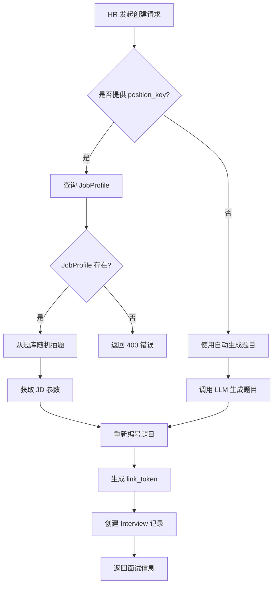

# 面试创建流程

## 📝 概述

面试创建是整个系统的起点，HR 通过 API 创建面试后，系统会生成唯一的面试链接（包含 token），候选人通过该链接进入实时语音面试。

## 🎯 核心功能

- ✅ 创建面试记录并生成唯一 token
- ✅ 支持使用岗位配置（JobProfile）自动抽题
- ✅ 支持自动生成题目（无岗位配置时）
- ✅ 记录候选人基本信息和简历摘要

## 🔄 创建流程

### 流程图



## 🔌 API 接口

### 端点

```
POST /api/interviews/create
```

### 请求格式

**Content-Type**: `application/json`

```json
{
  "name": "张三",
  "position": "后端工程师",
  "position_key": "backend_engineer",
  "external_id": "candidate_001",
  "resume_brief": "5年 Python 开发经验，熟悉 Django 和 FastAPI"
}
```

### 请求参数

| 字段 | 类型 | 必填 | 说明 |
|-----|------|------|------|
| `name` | string | 是 | 候选人姓名 |
| `position` | string | 否 | 岗位名称（展示用） |
| `position_key` | string | 否 | 岗位配置标识（用于匹配 JobProfile） |
| `external_id` | string | 否 | 外部系统的候选人 ID（如 ATS 系统） |
| `resume_brief` | string | 否 | 简历摘要（供 AI 参考） |

**关键字段说明**：

- **position_key**：如果提供，系统会从对应的 JobProfile 中抽取题目
- **position**：如果未提供且有 `position_key`，会使用 JobProfile 的 `position_name`

### 响应格式

```json
{
  "id": 123,
  "name": "张三",
  "position": "后端工程师",
  "external_id": "candidate_001",
  "resume_brief": "5年 Python 开发经验，熟悉 Django 和 FastAPI",
  "link_token": "MT6Wo_9jJ3srJHMmaBij-hJsZN0X2fZIUQybLo-r6Dw",
  "question_set": [
    {
      "order_index": 1,
      "question_text": "请介绍一下 Python 的 GIL",
      "reference": "全局解释器锁的概念、影响和规避方法"
    },
    {
      "order_index": 2,
      "question_text": "如何设计一个高并发系统？",
      "reference": "负载均衡、缓存策略、数据库优化、异步处理"
    },
    {
      "order_index": 3,
      "question_text": "请描述一次线上故障排查经历",
      "reference": null
    }
  ],
  "status": "created",
  "created_at": "2026-03-11T10:30:00Z",
  "completed_at": null,
  "evaluation_result": null
}
```

### 面试链接

生成的面试链接格式：

```
http://localhost:5173/interview/{link_token}
```

示例：
```
http://localhost:5173/interview/MT6Wo_9jJ3srJHMmaBij-hJsZN0X2fZIUQybLo-r6Dw
```

## 💻 代码实现

### 核心逻辑

**代码位置**：[backend/app/api/interviews.py:21-65](../../backend/app/api/interviews.py#L21)

```python
@router.post("/create", response_model=InterviewResponse)
def create_interview(interview_in: InterviewCreate, db: Session = Depends(get_db)):
    # 1. 生成唯一 token（256位熵）
    link_token = secrets.token_urlsafe(32)

    position = interview_in.position
    questions = []

    # 2. 检查是否使用 JobProfile
    if interview_in.position_key:
        job_profile = db.query(JobProfile).filter(
            JobProfile.position_key == interview_in.position_key
        ).first()

        if not job_profile:
            raise HTTPException(
                status_code=400,
                detail=f"Job profile with position_key '{interview_in.position_key}' not found"
            )

        # 使用 JobProfile 的 position_name
        position = job_profile.position_name or position

        # 从 JD 获取主问题数量
        main_question_count = job_profile.jd_data.get('main_question_count', 3)

        # 从题库随机抽题
        bank = job_profile.question_bank
        sample_size = min(main_question_count, len(bank))
        sampled = random.sample(bank, sample_size)

        # 重新编号
        questions = [
            {
                "order_index": i + 1,
                "question_text": q["question_text"],
                "reference": q.get("reference")
            }
            for i, q in enumerate(sampled)
        ]
    else:
        # 回退到自动生成题目
        questions = generate_questions(position, interview_in.resume_brief)

    # 3. 创建数据库记录
    db_interview = Interview(
        name=interview_in.name,
        position=position,
        external_id=interview_in.external_id,
        resume_brief=interview_in.resume_brief,
        link_token=link_token,
        question_set=questions,
        status=InterviewStatus.CREATED
    )
    db.add(db_interview)
    db.commit()
    db.refresh(db_interview)

    return db_interview
```

### Token 生成

使用 Python `secrets` 模块生成密码学安全的随机 token：

```python
link_token = secrets.token_urlsafe(32)
# 生成 32 字节（256位）随机数据，Base64URL 编码
# 示例：MT6Wo_9jJ3srJHMmaBij-hJsZN0X2fZIUQybLo-r6Dw
```

**安全性**：
- 256 位熵，几乎不可能被暴力破解
- 使用 `secrets` 而非 `random`，确保密码学安全
- Base64URL 编码，URL 安全

### 题目生成逻辑

#### 方式 1：使用 JobProfile（推荐）

```python
# 从 job_profile.question_bank 随机抽取
sample_size = min(main_question_count, len(bank))
sampled = random.sample(bank, sample_size)
```

**优点**：
- 题目质量稳定
- 可控的题目范围
- 包含参考答案方向

#### 方式 2：自动生成

**代码位置**：[backend/app/services/question_generator.py](../../backend/app/services/question_generator.py)

```python
def generate_questions(position: str, resume_brief: str) -> List[dict]:
    """
    使用 LLM 根据岗位和简历自动生成面试题目
    """
    prompt = f"""
    为岗位"{position}"生成3道面试题目。
    候选人背景：{resume_brief}

    要求：
    1. 题目应该针对该岗位的核心技能
    2. 难度适中，适合初步筛选
    3. 返回 JSON 格式
    """

    # 调用 OpenAI API
    response = openai.ChatCompletion.create(...)
    questions = parse_response(response)

    return questions
```

**缺点**：
- 每次生成不同，不利于标准化评估
- 依赖 LLM，可能生成质量不稳定
- 增加 API 成本

## 📊 数据模型

### Interview 模型

```python
class Interview(Base):
    __tablename__ = "interviews"

    id = Column(Integer, primary_key=True)
    name = Column(String, nullable=False)              # 候选人姓名
    position = Column(String)                          # 岗位名称
    external_id = Column(String)                       # 外部系统 ID
    resume_brief = Column(String)                      # 简历摘要
    link_token = Column(String, unique=True, index=True)  # 面试链接 token
    question_set = Column(JSON)                        # 题目列表
    status = Column(Enum(InterviewStatus))             # 面试状态
    evaluation_result = Column(JSON)                   # 评估结果
    created_at = Column(DateTime, default=datetime.utcnow)
    completed_at = Column(DateTime)
```

### InterviewStatus 枚举

```python
class InterviewStatus(str, Enum):
    CREATED = "created"          # 已创建，未开始
    IN_PROGRESS = "in_progress"  # 进行中
    FINISHED = "finished"        # 已完成
```

## 🔄 完整使用示例

### 示例 1：使用岗位配置

```bash
# 1. 先上传岗位配置
curl -X POST http://localhost:8000/api/job-profiles/ \
  -F "position_key=backend_engineer" \
  -F "position_name=后端工程师" \
  -F "jd_file=@backend_jd.json" \
  -F "question_csv=@backend_questions.csv"

# 2. 创建面试（使用岗位配置）
curl -X POST http://localhost:8000/api/interviews/create \
  -H "Content-Type: application/json" \
  -d '{
    "name": "张三",
    "position_key": "backend_engineer",
    "external_id": "ATS-12345",
    "resume_brief": "5年 Python 开发经验"
  }'

# 3. 返回结果
{
  "id": 1,
  "link_token": "MT6Wo_9jJ3srJHMmaBij-hJsZN0X2fZIUQybLo-r6Dw",
  "position": "后端工程师",
  "question_set": [
    {
      "order_index": 1,
      "question_text": "请介绍一下 Python 的 GIL",
      "reference": "全局解释器锁的概念和影响"
    },
    ...
  ],
  ...
}

# 4. 分享面试链接给候选人
http://localhost:5173/interview/MT6Wo_9jJ3srJHMmaBij-hJsZN0X2fZIUQybLo-r6Dw
```

### 示例 2：不使用岗位配置（自动生成）

```bash
curl -X POST http://localhost:8000/api/interviews/create \
  -H "Content-Type: application/json" \
  -d '{
    "name": "李四",
    "position": "前端工程师",
    "resume_brief": "3年 React 开发经验"
  }'

# 系统会调用 LLM 自动生成题目
```

## 🔍 常见问题

### Q1: 如何批量创建面试？

```python
import requests

candidates = [
    {"name": "张三", "position_key": "backend_engineer"},
    {"name": "李四", "position_key": "backend_engineer"},
    {"name": "王五", "position_key": "frontend_engineer"},
]

for candidate in candidates:
    response = requests.post(
        "http://localhost:8000/api/interviews/create",
        json=candidate
    )
    result = response.json()
    print(f"{candidate['name']}: {result['link_token']}")
```

### Q2: Token 会过期吗？

当前实现中 token **不会过期**，面试完成后仍可通过 token 查看结果。

如需添加过期机制：

```python
# 在 Interview 模型添加字段
expires_at = Column(DateTime)

# 创建时设置过期时间
expires_at = datetime.utcnow() + timedelta(days=7)

# 访问时检查
if interview.expires_at and datetime.utcnow() > interview.expires_at:
    raise HTTPException(status_code=410, detail="Interview link expired")
```

### Q3: 如何关联到外部系统（ATS）？

使用 `external_id` 字段：

```python
# 创建时传入 ATS 系统的候选人 ID
{
  "name": "张三",
  "external_id": "ATS-12345",
  ...
}

# 后续通过 external_id 查询
interview = db.query(Interview).filter(
    Interview.external_id == "ATS-12345"
).first()
```

### Q4: 题目数量可以动态调整吗？

如果使用 JobProfile，题目数量由 `jd_data.main_question_count` 控制：

```json
{
  "main_question_count": 5  // 从题库抽 5 题
}
```

## 📚 相关文档

- [面试流程概览（候选人视角）](03.0_interview_flow_candidate.md) - 整体流程与候选人体验
- [岗位配置管理](03.5_job_profile_config.md) - 如何上传题库和 JD
- [实时语音面试](03.2_realtime_interview.md) - 候选人如何参加面试
- [系统架构](../02_architecture.md) - 整体数据流
- [API 文档](http://localhost:8000/docs) - 完整的 API 交互文档
