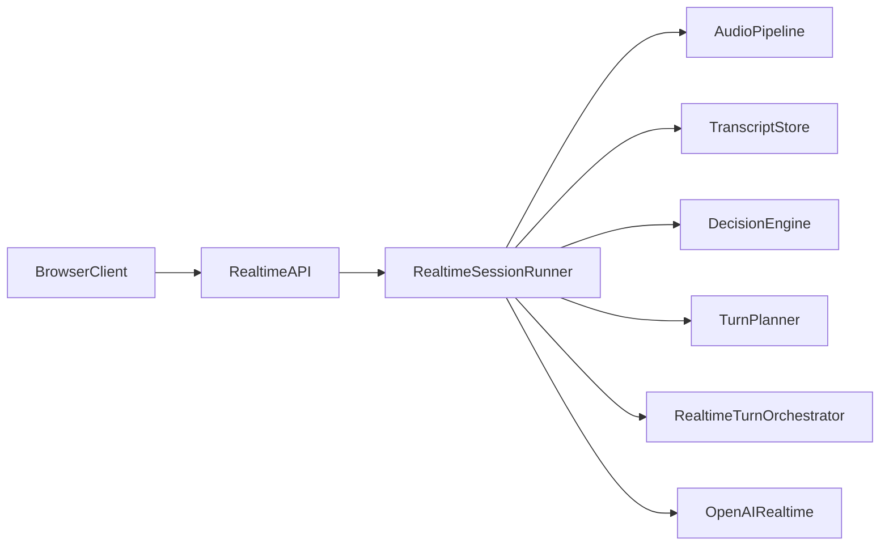
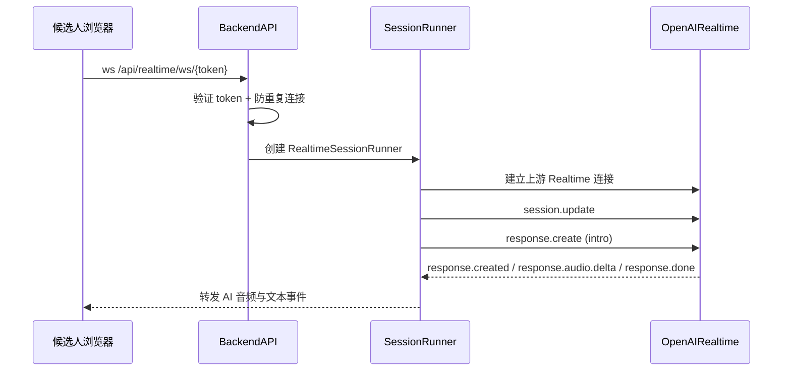

# 实时语音面试功能

## 功能概述

实时语音面试是系统的核心交互链路。候选人通过浏览器与后端 WebSocket 建立会话，后端再连接 OpenAI Realtime API，按“候选人回答 -> 转写 -> 决策 -> AI 语音回复”的单一线性链条推进整场面试。

当前实现的主入口位于 [`backend/app/api/realtime.py`](../../backend/app/api/realtime.py)，真正的运行时控制器位于 [`backend/app/services/realtime/session_runner.py`](../../backend/app/services/realtime/session_runner.py)。

## 核心特性

- **实时双向音频通信**：浏览器持续发送 PCM16 音频，后端流式转发到 OpenAI Realtime。
- **单一决策链条**：不再由多个事件源并行推进下一轮，而是统一由 `finalize_candidate_segment()` 串行推进。
- **显式后端控轮**：`turn_detection.create_response = false`，所有 `response.create` 由后端单点发起。
- **独立决策层**：候选人转写完成后，后端调用独立文本 LLM 生成流程动作，再映射为 `TurnPlan`。
- **规则兜底**：决策超时、返回非法动作或解析失败时，自动回退到 `TurnPlanner.legacy_plan()`。
- **追问与澄清上限**：`followup`、`clarify` 都由后端根据当前题目的已用次数和上限动态放行。
- **澄清默认限额**：当前版本 `clarify` 默认每个主问题最多 1 次，超过后将不再出现在 `allowed_actions` 中。
- **不回答候选人问题**：当前版本的 AI 面试官不处理候选人提问，不提供流程答复或 HR redirect 动作。
- **回答有效性门槛**：最后一题若回答过短或仅为确认词，会生成 `REASK_PROMPT` 而非直接进入 closing。
- **半双工前端门控**：AI 播放期间前端停止上行候选人音频，避免回声与自激对话。
- **实时转写复用**：候选人语音转写来自 `conversation.item.input_audio_transcription.completed`，优先直接写入 `Answer.transcript` 供后续评估复用。

## 当前后端架构



### 模块职责

- [`backend/app/api/realtime.py`](../../backend/app/api/realtime.py)
  - 验证 token
  - 防重复连接
  - 构造并启动 `RealtimeSessionRunner`
- [`backend/app/services/realtime/session_runner.py`](../../backend/app/services/realtime/session_runner.py)
  - 维护整场会话的线性推进
  - 协调音频提交、转写等待、决策、`response.create`
  - 在 `response.done(completed)` 后推进业务状态
- [`backend/app/services/realtime/audio_pipeline.py`](../../backend/app/services/realtime/audio_pipeline.py)
  - 管理音频缓冲、VAD 边界、`CandidateSegment`
- [`backend/app/services/realtime/transcript_store.py`](../../backend/app/services/realtime/transcript_store.py)
  - 存储候选人转写并提供短时等待
- [`backend/app/services/realtime/decision_engine.py`](../../backend/app/services/realtime/decision_engine.py)
  - 校验与调用独立文本决策层
- [`backend/app/services/realtime/turn_planner.py`](../../backend/app/services/realtime/turn_planner.py)
  - 构建 `TurnPlan`
  - 维护 fallback 规则规划
- [`backend/app/services/realtime_turn_orchestrator.py`](../../backend/app/services/realtime_turn_orchestrator.py)
  - 管理 turn 生命周期与 business transition

## 端到端链路

### 1. 连接与开场



### 2. 单一决策链条

```mermaid
flowchart LR
    candidateAudio[CandidateAudio]
    speechStopped[SpeechStopped]
    finalize[finalize_candidate_segment]
    commitStage[Commit]
    transcriptStage[WaitForTranscript]
    decisionStage[DecisionOrFallback]
    respondStage[response.create]
    doneStage[response.done]
    transitionStage[BusinessTransition]

    candidateAudio --> speechStopped
    speechStopped --> finalize
    finalize --> commitStage
    commitStage --> transcriptStage
    transcriptStage --> decisionStage
    decisionStage --> respondStage
    respondStage --> doneStage
    doneStage --> transitionStage
```



### 3. 为什么 `speech_stopped` 不是“直接决策点”

旧链路里，`speech_stopped` 常常早于 `conversation.item.input_audio_transcription.completed` 到达。如果在 `speech_stopped` 事件里立即决策，就可能基于空文本或旧文本误判，从而出现：

- 还在澄清却跳到下一题
- 还没答完却提前 closing
- 同一轮被 `speech_stopped` 和 `end_turn` 重复触发

新实现中，`speech_stopped` 只表示“音频边界已经形成”，真正推进由 `RealtimeSessionRunner._finalize_candidate_segment()` 完成，且顺序固定为：

1. commit 音频
2. 等待同一 `item_id` 的候选人转写
3. 执行决策层或 fallback planner
4. 由单点发送 `response.create`

## 运行时状态

[`backend/app/services/realtime/state.py`](../../backend/app/services/realtime/state.py) 中的 `SessionState` 统一保存运行时状态：

- `current_stage`
- `current_main_question_order`
- `main_questions_completed`
- `followups_used_for_current`
- `clarifies_used_for_current`
- `current_input_item_id`
- `pending_plan`
- `pipeline_stage`
- `decision_pending`

其中 `pipeline_stage` 目前枚举为：

- `idle`
- `audio_collecting`
- `committed`
- `transcribed`
- `decided`
- `responding`

## 候选人音频与转写

浏览器仍按既有协议发送：

```json
{
  "type": "audio",
  "audio": "base64_encoded_pcm16_audio"
}
```

后端行为为：

1. `AudioPipeline.on_client_audio()` 记录缓冲并转发上游
2. `input_audio_buffer.speech_started` 时进入 `audio_collecting`
3. `input_audio_buffer.speech_stopped` 时形成 `CandidateSegment`
4. `conversation.item.input_audio_transcription.completed` 时写入 `TranscriptStore`
5. `Answer.transcript` 优先使用该实时转写

## 决策层与规则兜底

决策层只输出结构化动作：

```json
{
  "action": "followup | next_question | clarify | finish_interview",
  "reason": "简要说明"
}
```

关键约束：

- `allowed_actions` 动态下发
- `followup` 和 `clarify` 都受当前题目剩余额度约束
- 当前版本 `clarify` 默认上限为每题 1 次
- 当前动作集合不包含 `answer_candidate_question`
- `finish_interview` 只有在 `main_questions_completed >= main_count_target` 时才允许真正落到 closing
- 任何异常都会回退到 `TurnPlanner.legacy_plan()`

## AI 回复与状态推进

AI 轮次只有在收到 `response.done` 且状态为 `completed` 时才会推进 business transition。也就是说：

- `response.created` 只表示这轮 AI 已经开始生成
- `response.audio.delta` / `response.audio_transcript.delta` 只表示流式输出
- `response.done(completed)` 才是“本轮已真正说完”的业务完成点

这样可以避免：

- AI 被打断但题号仍然前进
- closing 话术未完整播完就提前结束
- `pending_plan` 先于真实回复落地

## 长时间无回答

当前仍保留“候选人长时间无回答时重新提醒”的能力。其原则是：

- 不换题
- 只做轻量 `REASK_PROMPT`
- 不推进主问题计数

该逻辑仍由会话主控统一发起，不再从多个地方并发触发。

## 面试结束与评估

候选人手动结束或 AI 自然 closing 后，`POST /interviews/{token}/complete` 会进入评估链路：

- 优先使用实时链路中已写入的 `Answer.transcript`
- 对缺失 transcript 的答案再补 STT
- 再进入评估模型生成结构化评分结果

详见 [`03.3_ai_evaluation.md`](03.3_ai_evaluation.md)。

## 相关文档

- [OpenAI Realtime API 集成](../04_technical_details/04.1_realtime_api.md)
- [Realtime Turn 编排器技术文档](../04_technical_details/04.5_realtime_turn_orchestrator.md)
- [日志系统](../05_logging.md)
- [100 并发面试承载优化清单](../07_scalability/07.1_100_concurrent_interviews_optimization_checklist.md)
