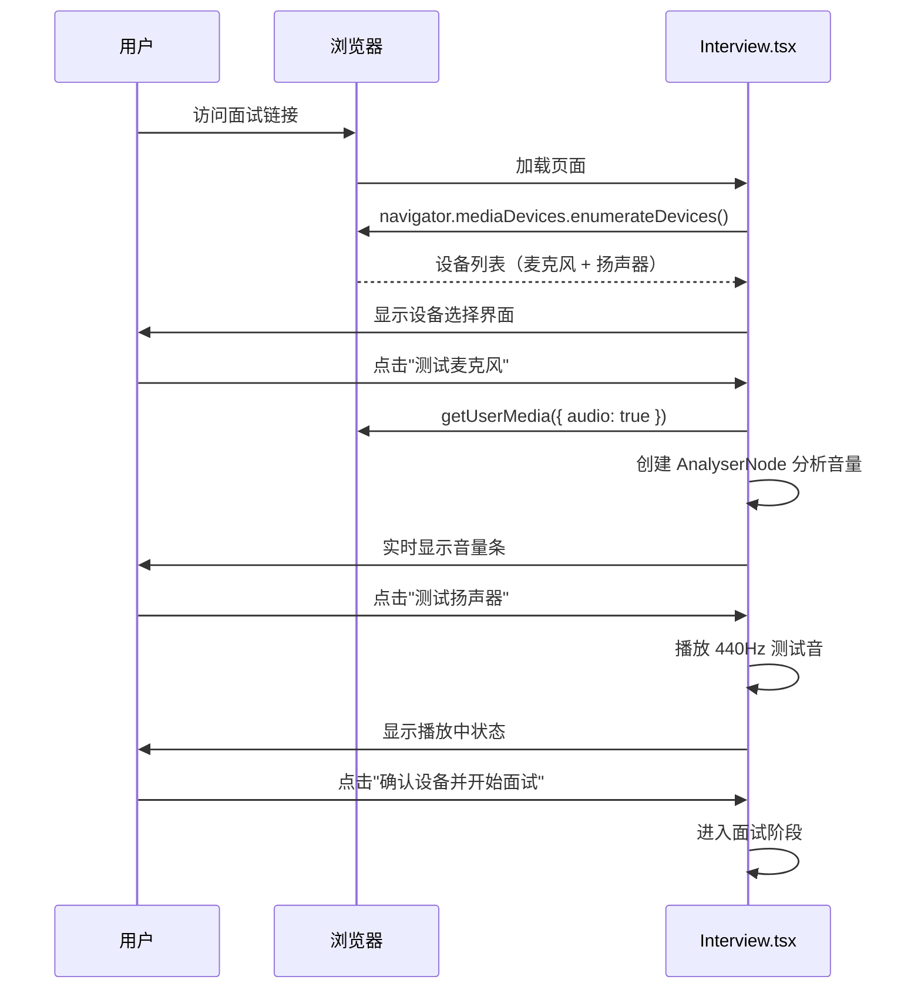
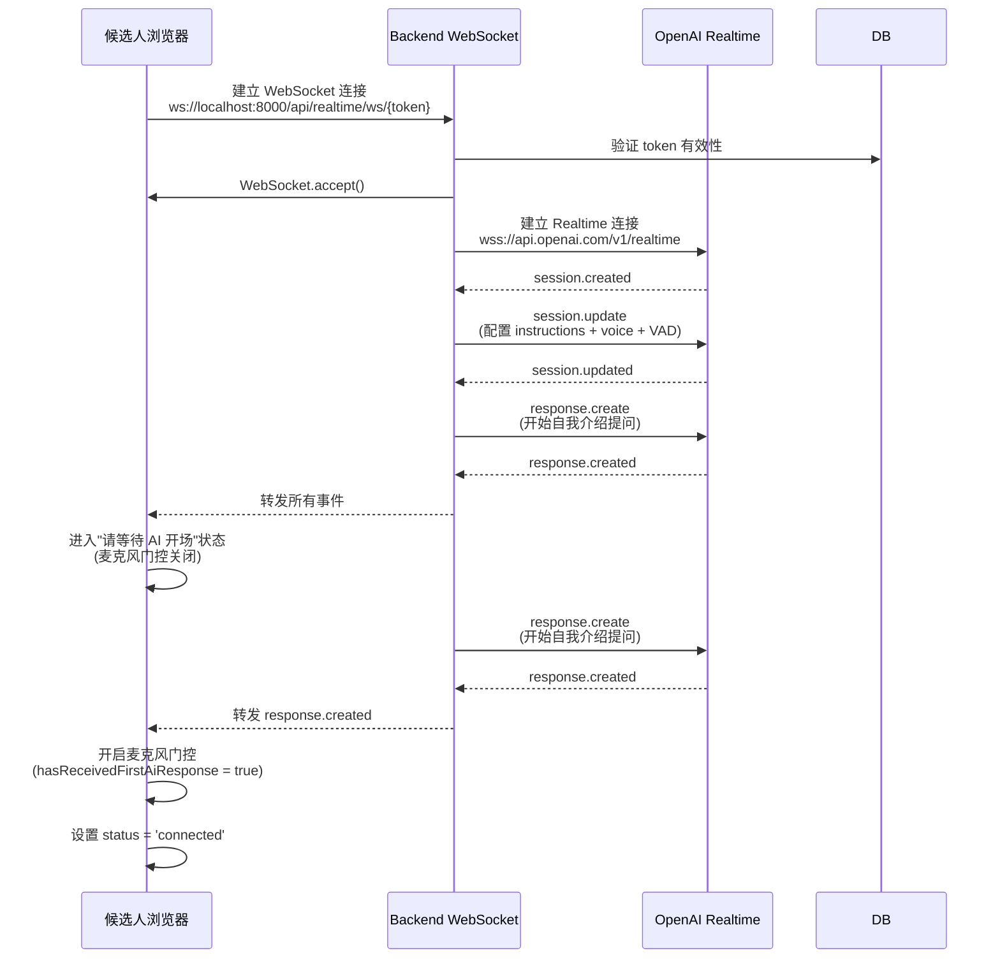
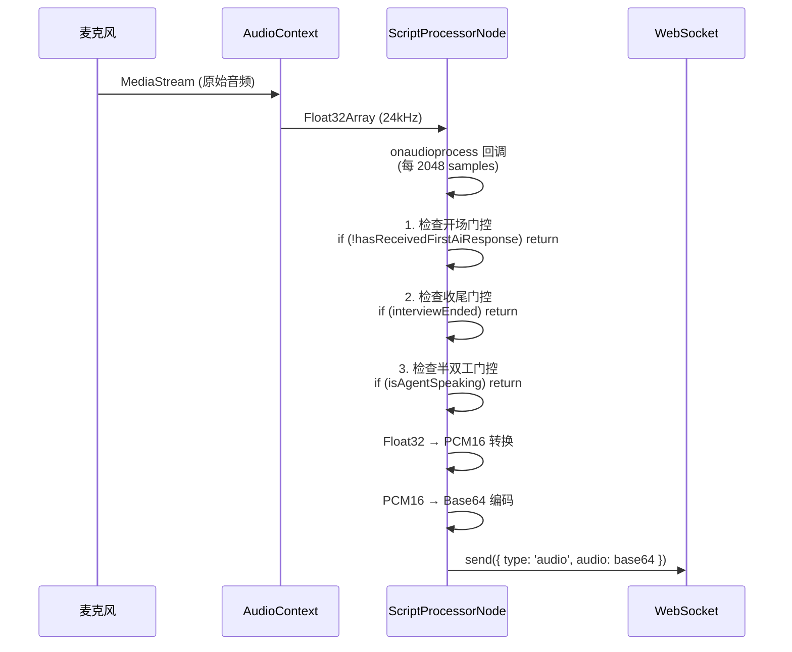
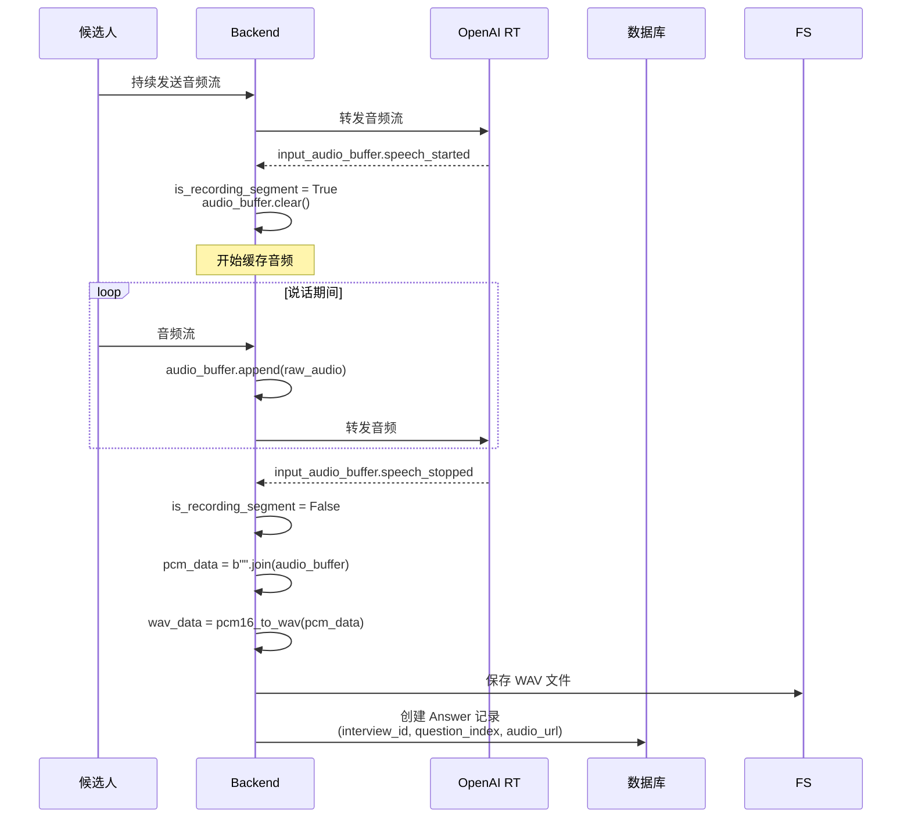
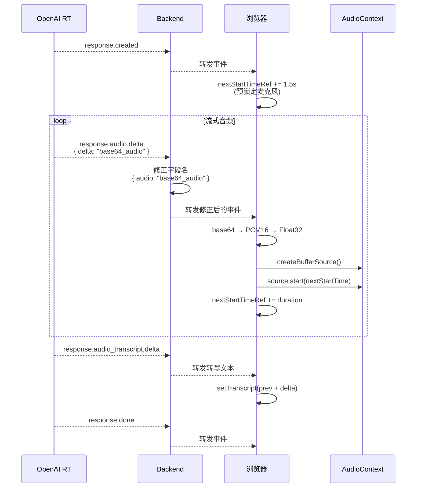
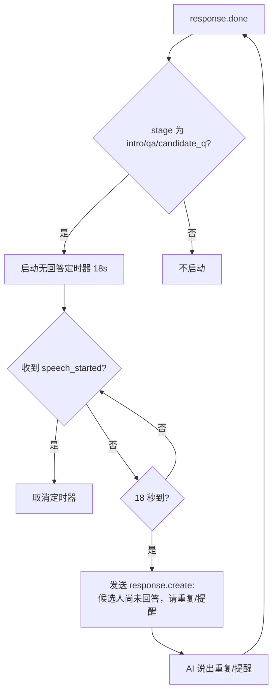
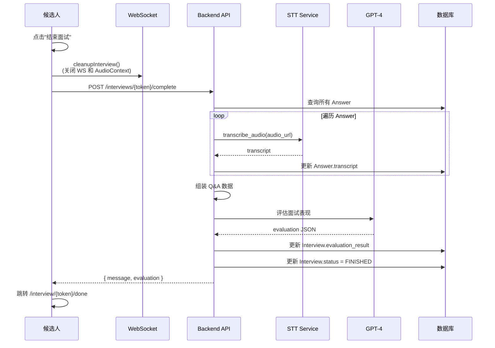

# 实时语音面试功能

## 📝 功能概述

实时语音面试是系统的核心功能，基于 OpenAI Realtime API 实现低延迟的语音对话。候选人通过浏览器与 AI 面试官进行自然的语音交流，无需手动录音和上传。

## 🎯 核心特性

- ✅ **实时双向通信**：WebSocket 全双工连接，音频流式传输
- ✅ **AI 主导流程**：面试开始由 AI 发起对话，结束由 AI 收尾，期间自动屏蔽用户语音
- ✅ **Server VAD**：自动检测说话起止，无需手动操作
- ✅ **智能追问**：AI 根据回答质量自动追问
- ✅ **未回答时重新提问**：候选人长时间未说话时，AI 自动重复题目或礼貌提醒
- ✅ **节奏控制**：根据预设时长自动调整提问节奏
- ✅ **设备适配**：支持麦克风/扬声器选择和测试
- ✅ **半双工策略**：防止 AI 声音被麦克风采集（回声消除）
- ✅ **实时转写**：流式显示 AI 对话内容

## 🔄 完整流程

### 1. 设备准备阶段



**关键代码**（[Interview.tsx:277-328](../../frontend/src/pages/Interview.tsx#L277)）：

```typescript
const testMicrophone = async () => {
  const stream = await navigator.mediaDevices.getUserMedia({
    audio: { deviceId: selectedMicrophone ? { exact: selectedMicrophone } : undefined }
  });

  const audioCtx = new AudioContext();
  const analyser = audioCtx.createAnalyser();
  const source = audioCtx.createMediaStreamSource(stream);
  source.connect(analyser);

  // 实时计算 RMS 音量
  const updateVolume = () => {
    analyser.getByteTimeDomainData(dataArray);
    const rms = calculateRMS(dataArray);
    setTestMicVolume(rms);
    requestAnimationFrame(updateVolume);
  };
  updateVolume();
};
```

### 2. 连接建立阶段



**关键代码**（[realtime.py:74-152](../../backend/app/api/realtime.py#L74)）：

```python
# 初始化 Realtime 会话
init_event = {
    "type": "session.update",
    "session": {
        "instructions": f"""
你是一名专业的 AI 面试官。你正在面试候选人 {interview.name}，岗位是 {interview.position}。
...
题目列表与参考方向：
{questions_str}
""",
        "voice": "alloy",
        "modalities": ["text", "audio"],
        "input_audio_format": "pcm16",
        "output_audio_format": "pcm16",
        "turn_detection": {
            "type": "server_vad",
            "threshold": 0.5,
            "silence_duration_ms": 600
        }
    }
}
await openai_ws.send(json.dumps(init_event))

# 开始第一个问题
first_question_event = {
    "type": "response.create",
    "response": {
        "instructions": "请开始面试，向候选人问好并请他进行简短的自我介绍。"
    }
}
await openai_ws.send(json.dumps(first_question_event))
```

### 3. 实时对话阶段

#### 3.1 音频采集与发送



**关键代码**（[Interview.tsx:232-269](../../frontend/src/pages/Interview.tsx#L232)）：

```typescript
processor.onaudioprocess = (e) => {
  const inputData = e.inputBuffer.getChannelData(0);

  // 计算音量（RMS）
  const rms = calculateRMS(inputData);
  setVolume(rms);

  // 1. 开场前门控
  if (!hasReceivedFirstAiResponseRef.current) return;

  // 2. 收尾后门控
  if (interviewEndedRef.current) return;

  // 3. 半双工门控：检查 AI 是否正在说话
  const now = audioContext.currentTime;
  const isAgentSpeaking = now < (nextStartTimeRef.current + 0.1);

  if (isAgentSpeaking) {
    return; // AI 正在说话，阻止发送音频
  }

  // 转换并发送
  const pcm16 = floatTo16BitPCM(inputData);
  const base64Audio = arrayBufferToBase64(pcm16);
  ws.send(JSON.stringify({ type: 'audio', audio: base64Audio }));
};
```

#### 3.2 VAD 检测与录制



**关键代码**（[realtime.py:240-341](../../backend/app/api/realtime.py#L240)）：

```python
elif event_type == "input_audio_buffer.speech_started":
    logger.info(f"VAD: Speech started for question {current_question_index}")
    is_recording_segment = True
    audio_buffer.clear()

elif event_type == "input_audio_buffer.speech_stopped":
    logger.info(f"VAD: Speech stopped for question {current_question_index}")
    is_recording_segment = False

    if audio_buffer:
        pcm_data = b"".join(audio_buffer)
        wav_data = pcm16_to_wav(pcm_data)

        file_name = f"{token}_{current_question_index}_{secrets.token_hex(4)}.wav"
        file_path = os.path.join(settings.UPLOAD_DIR, file_name)
        with open(file_path, "wb") as f:
            f.write(wav_data)

        db_answer = Answer(
            interview_id=interview.id,
            question_index=current_question_index,
            audio_url=file_path
        )
        db.add(db_answer)
        db.commit()
```

#### 3.3 AI 响应播放



**关键代码**（[Interview.tsx:430-494](../../frontend/src/pages/Interview.tsx#L430)）：

```typescript
const enqueueAudio = (base64Audio: string) => {
  // Base64 → Binary → PCM16 → Float32
  const binary = atob(base64Audio);
  const bytes = new Uint8Array(binary.length);
  for (let i = 0; i < binary.length; i++) {
    bytes[i] = binary.charCodeAt(i);
  }

  const pcm16 = new Int16Array(bytes.buffer);
  const float32 = new Float32Array(pcm16.length);
  for (let i = 0; i < pcm16.length; i++) {
    float32[i] = pcm16[i] / 32768;
  }

  // 创建 AudioBuffer (24kHz)
  const audioBuffer = audioContext.createBuffer(1, float32.length, 24000);
  audioBuffer.getChannelData(0).set(float32);

  // 无缝衔接播放
  const source = audioContext.createBufferSource();
  source.buffer = audioBuffer;
  source.connect(audioContext.destination);

  const startTime = Math.max(audioContext.currentTime, nextStartTimeRef.current);
  source.start(startTime);
  nextStartTimeRef.current = startTime + audioBuffer.duration;
};
```

### 4. 节奏控制与超时处理

```mermaid
flowchart TD
    A[VAD: speech_stopped] --> B{计算已用时间}
    B --> C{elapsed >= time_budget?}
    C -->|是| D[进入 overtime_mode]
    C -->|否| E{elapsed > (time_budget + hard_timeout)?}

    E -->|是| F[强制结束面试]
    E -->|否| G{检查节奏}

    G --> H{elapsed_ratio > q_progress + 0.1?}
    H -->|是| I[发送节奏指令:<br/>减少追问]
    H -->|否| J{main_questions_asked >= target?}

    J -->|是| K[进入 candidate_q stage]
    J -->|否| L[继续正常对话]

    D --> M[发送超时指令:<br/>礼貌结束]
    M --> N[current_stage = closing]
```

**关键代码**（[realtime.py:258-318](../../backend/app/api/realtime.py#L258)）：

```python
# 检查超时
elapsed = time.time() - interview_start_ts
if elapsed >= time_budget_sec and not overtime_mode:
    overtime_mode = True

# 硬超时保护
hard_timeout_buffer = max(time_budget_sec * 0.2, 300)
if elapsed >= (time_budget_sec + hard_timeout_buffer):
    force_close_event = {
        "type": "response.create",
        "response": {
            "instructions": "面试时间已严重超时，请立即告知候选人面试必须结束。"
        }
    }
    await openai_ws.send(json.dumps(force_close_event))
    await asyncio.sleep(5)
    await websocket.close(code=1000, reason="Interview hard timeout")
    return

# 节奏控制
q_progress = main_questions_asked / main_count_target
if elapsed_ratio > q_progress + 0.1:
    pacing_instruction = "节奏落后：请减少或停止追问，尽快进入下一个主问题。"
    pacing_event = {
        "type": "response.create",
        "response": {"instructions": pacing_instruction}
    }
    await openai_ws.send(json.dumps(pacing_event))
```

### 4.1 长时间无回答时重新提问

若候选人一直不开口，VAD 不会触发 `speech_stopped`，AI 不会自动得到「用户输入」。为避免长时间静默，后端在 **AI 每次说完（response.done）** 后启动一个定时器；若在约定时间内（默认 **18 秒**）仍未检测到候选人开始说话（`speech_started`），则发送一条 `response.create`，指令 AI 简短重复当前问题或礼貌提醒作答，不换题。



**关键逻辑**（[realtime.py](../../backend/app/api/realtime.py)）：

- 常量 `NO_RESPONSE_REASK_SECONDS = 18`。
- `response.done` 时：若 `current_stage in ("intro", "qa", "candidate_q")` 且未超时，取消旧定时器并启动 `schedule_no_response_reask()`。
- `input_audio_buffer.speech_started` 时：取消定时器。
- 会话 instructions 中约定：收到「候选人尚未回答」时，AI 简短重复当前问题或提醒，不要换题。

超时阶段（overtime_mode）与 closing 阶段不启动该定时器。

### 5. 面试结束阶段



## 🛡️ 半双工策略详解

### 问题背景

在实时语音对话中，如果麦克风持续采集音频，会出现以下问题：

1. **回声反馈**：AI 播放的声音被麦克风采集，导致 AI 听到自己的声音
2. **自我回复循环**：AI 误将自己的声音当作候选人的回答，产生对话循环
3. **VAD 误判**：OpenAI Server VAD 无法区分是 AI 还是候选人在说话

### 解决方案：时间轴门控

**原理**：利用 `AudioContext.currentTime` 和预定播放结束时间进行对比，在 AI 播放期间阻止音频发送。

**实现**（[Interview.tsx:244-263](../../frontend/src/pages/Interview.tsx#L244)）：

```typescript
// 全局变量
const nextStartTimeRef = useRef<number>(0); // AI 音频播放结束时间
const isAgentSpeakingRef = useRef(false);

// 音频采集回调
processor.onaudioprocess = (e) => {
  const now = audioContext.currentTime;

  // 策略 A：时间轴门控（当前时间 < 播放结束时间 + 缓冲）
  const isAgentSpeaking = now < (nextStartTimeRef.current + 0.2);

  // 更新状态
  if (isAgentSpeaking !== isAgentSpeakingRef.current) {
    isAgentSpeakingRef.current = isAgentSpeaking;
    setIsAgentSpeaking(isAgentSpeaking); // 触发 UI 更新
  }

  // 门控：AI 正在说话时，跳过音频发送
  if (isAgentSpeaking) {
    return;
  }

  // 正常发送音频
  ws.send(JSON.stringify({ type: 'audio', audio: base64Audio }));
};
```

**预锁定机制**（[Interview.tsx:202-208](../../frontend/src/pages/Interview.tsx#L202)）：

```typescript
// 收到 response.created 时提前锁定麦克风
if (data.type === 'response.created') {
  // 提前 1.5 秒锁定，覆盖 AI 思考期间
  nextStartTimeRef.current = Math.max(
    nextStartTimeRef.current,
    audioContext.currentTime + 1.5
  );
}
```

**音频播放更新**（[Interview.tsx:493](../../frontend/src/pages/Interview.tsx#L493)）：

```typescript
// 每次播放音频后更新结束时间
source.start(startTime);
nextStartTimeRef.current = startTime + audioBuffer.duration;
```

详见：[半双工策略技术文档](../04_technical_details/04.4_half_duplex_strategy.md)

## 🎨 用户界面

### 设备选择界面

- **麦克风选择**：下拉列表显示所有输入设备
- **扬声器选择**：下拉列表显示所有输出设备
- **测试按钮**：实时音量可视化
- **音量条**：RMS 音量实时展示（绿色正常，黄色偏低）

### 面试中界面

- **麦克风图标**：显示当前通话状态
- **音量指示器**：候选人说话音量可视化
- **AI 发言提示**："AI 正在发言，请稍后再回答..."
- **开场提示**："请等待 AI 面试官开场..."
- **实时转写**：AI 对话内容逐字显示
- **结束按钮**：红色醒目，点击后跳转评估

## 🔍 调试技巧

### 浏览器控制台日志

```javascript
[MIC] Stream acquired: abc-123 active: true
[MIC] AudioContext state: running
[TTS] AudioContext created, sampleRate = 24000
[WS] Event: session.created
[WS] Event: response.created
[TTS] response.audio.delta chunk #1, base64 length = 1024
[TTS] Decoded audio chunk: samples = 512, firstSample = -0.023
[TTS] Scheduling audio playback at 2.5, duration = 0.21
[MIC] onaudioprocess rms = 0.045, isAgentSpeaking = false
```

### 后端日志

```
2026-03-10 14:24:50 - INFO - WebSocket connected for token: abc123
2026-03-10 14:24:50 - INFO - OpenAI Realtime connection established
2026-03-10 14:24:51 - INFO - OpenAI Event: response.created
2026-03-10 14:24:52 - INFO - VAD: Speech started for question 0
2026-03-10 14:24:55 - INFO - VAD: Speech stopped for question 0
2026-03-10 14:24:55 - INFO - VAD: Saved speech segment to uploads/abc123_0_a1b2.wav
```

详见：[故障排查指南](../06_troubleshooting.md)

## 📚 相关文档

- [面试流程概览（候选人视角）](03.0_interview_flow_candidate.md) - 整体流程与候选人体验
- [系统架构](../02_architecture.md)
- [OpenAI Realtime API 集成](../04_technical_details/04.1_realtime_api.md)
- [音频处理技术](../04_technical_details/04.2_audio_processing.md)
- [VAD 机制](../04_technical_details/04.3_vad_mechanism.md)
- [半双工策略](../04_technical_details/04.4_half_duplex_strategy.md)
