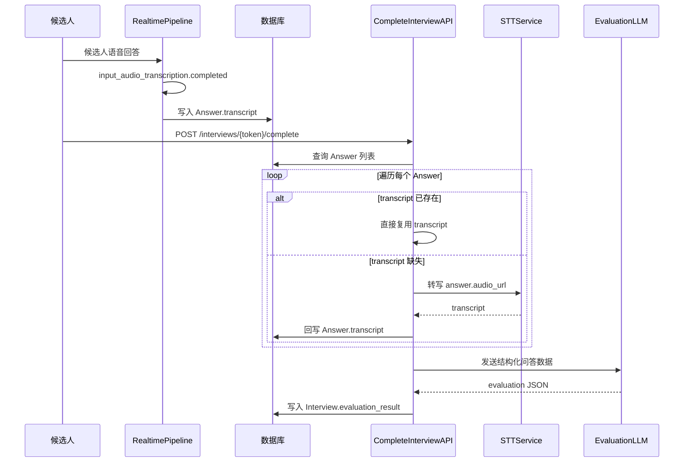

# AI 评估系统

## 概述

AI 评估系统在面试结束后对候选人的表现进行统一评分。对于 Realtime 面试，候选人的回答文本优先来自实时链路中的转写结果，而不是在完成面试后对所有音频再做一次全量 STT。

当前评估链路的核心目标是：

1. 尽量复用实时链路已经得到的 `Answer.transcript`
2. 仅对缺失 transcript 的答案补做 STT
3. 将所有候选人回答汇总后交给评估模型生成结构化结果

## 评估链路与 Realtime 的关系



## 实时转写来源

Realtime 面试中的候选人文本，当前来源于以下链路：

- 浏览器发送音频到 realtime WebSocket
- [`backend/app/services/realtime/session_runner.py`](../../backend/app/services/realtime/session_runner.py) 监听 `conversation.item.input_audio_transcription.completed`
- [`backend/app/services/realtime/transcript_store.py`](../../backend/app/services/realtime/transcript_store.py) 保存 `item_id -> transcript`
- 在保存音频分段时，后端优先将这份 transcript 写入 `Answer.transcript`

这意味着：

- 评估阶段通常不需要再对这些音频做一次 STT
- 只有 transcript 缺失或为空时，才会回退到传统 STT 补写

## 为什么要优先复用实时 transcript

- **减少重复费用**：避免 Realtime 已转写一次后，完成面试时再做第二次 Whisper/STT。
- **减少评估等待时间**：无需串行转写全部音频文件。
- **与单一决策链保持一致**：Realtime 期间用同一份候选人文本做决策和落库，评估继续复用同一来源，减少语义分叉。

## 评估入口

评估入口位于 [`backend/app/api/interviews.py`](../../backend/app/api/interviews.py)，由 `complete_interview` 触发后台处理。

处理顺序为：

1. 查询当前面试的 `Answer`
2. 对缺失 transcript 的答案补做 STT
3. 组装 `answers_data`
4. 调用 [`backend/app/services/evaluator.py`](../../backend/app/services/evaluator.py)
5. 将评估结果写回 `Interview.evaluation_result`

## 评估输入结构

评估模型消费的是整理后的问答数组，典型字段包括：

- `question_index`
- `question_text`
- `reference`
- `transcript`

其中 `transcript` 的优先级为：

1. `Answer.transcript` 中已有的实时转写
2. 评估阶段补做 STT 后得到的转写

## 评估输出格式

```json
{
  "total_score": 85,
  "dimension_scores": {
    "沟通能力": 90,
    "专业技能": 80,
    "问题理解": 85,
    "逻辑思维": 88
  },
  "comment": "候选人沟通清晰，技术回答较完整，具备一定项目经验。"
}
```

## 与新 Realtime 架构的对齐点

本次后端重构后，评估文档需要与以下事实保持一致：

- Realtime 主链路是单一线性 Pipeline：`candidate_audio -> transcription -> decision -> ai_response`
- 决策层使用的是候选人转写文本，而不是单独的音频理解
- 评估层继续复用这份候选人转写，避免出现“Realtime 决策用一份文本，评估又重新生成另一份文本”的双轨问题

## 推荐的质量保障

### 1. transcript 缺失兜底

任何 `Answer.transcript` 为空的情况，都应在评估前补做 STT。这样可以保证评分链路完整，即使某一轮实时转写晚到或失败，评估也不会直接缺失回答。

### 2. transcript 清洗

在送评估模型前，可以对文本做轻量清洗，例如：

- 去掉明显语气词
- 统一空白字符
- 去掉重复断句

### 3. 保持题号一致

评估使用的 `question_index` 必须和 realtime 运行时写入 `Answer` 的题号保持一致，否则可能出现：

- 回答内容和题目错位
- closing 前的补答被归到错误题号

## 相关文档

- [实时语音面试功能](03.2_realtime_interview.md)
- [OpenAI Realtime API 集成](../04_technical_details/04.1_realtime_api.md)
- [Realtime Turn 编排器技术文档](../04_technical_details/04.5_realtime_turn_orchestrator.md)
- [日志系统](../05_logging.md)
