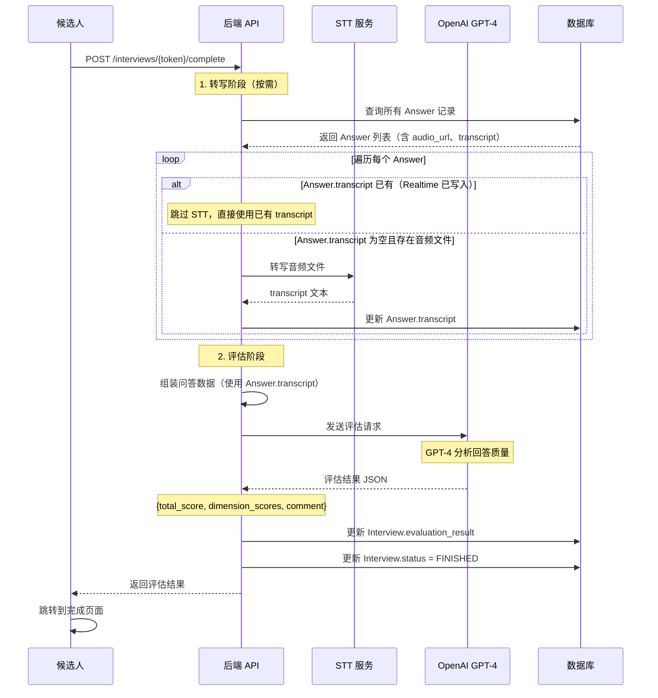

# AI 评估系统

## 📝 概述

AI 评估系统在面试结束后自动对候选人的表现进行多维度评分。系统使用 OpenAI GPT-4 分析所有问答记录，生成结构化的评分报告，包括总分、维度评分和综合评语。

## 🎯 评估流程

### 完整流程图



**说明**：若面试走的是 Realtime WebSocket 且已开启 `input_audio_transcription`，候选人每段语音的转写会在实时链路中写入 `Answer.transcript`，后台评测会直接使用该字段，**不再调用 STT**，从而节省一次 Whisper 费用。

## 🔧 核心实现

### 评估函数

**代码位置**：[backend/app/services/evaluator.py](../../backend/app/services/evaluator.py)

```python
async def evaluate_interview(answers: List[Dict[str, Any]]) -> Dict[str, Any]:
    """
    使用 OpenAI Chat Completion API 对整场面试进行统一评分。
    """
    if not settings.OPENAI_API_KEY:
        return {
            "total_score": 0,
            "dimension_scores": {},
            "comment": "OpenAI API Key not configured."
        }

    client = openai.AsyncOpenAI(api_key=settings.OPENAI_API_KEY)

    # 1. 构建评估提示词
    prompt = "你是一名资深面试官。请根据以下面试问答记录，对候选人的表现进行综合评分。\n\n"

    for a in answers:
        prompt += f"问题 {a['question_index'] + 1}: {a.get('question_text', '未知问题')}\n"
        prompt += f"回答: {a['transcript']}\n\n"

    prompt += """
请以 JSON 格式输出评分结果，包含以下字段：
- total_score: 总分 (0-100)
- dimension_scores: 维度分 (对象，如 {"communication": 80, "technical": 70})
- comment: 综合评语

示例输出：
{
  "total_score": 85,
  "dimension_scores": {"沟通能力": 90, "专业技能": 80},
  "comment": "表现良好..."
}
"""

    # 2. 调用 GPT-4
    try:
        response = await client.chat.completions.create(
            model="gpt-4o",
            messages=[
                {"role": "system", "content": "你是一名专业的面试评估专家。"},
                {"role": "user", "content": prompt}
            ],
            response_format={"type": "json_object"}  # 强制返回 JSON
        )

        result = json.loads(response.choices[0].message.content)
        return result

    except Exception as e:
        print(f"LLM evaluation error: {e}")
        return {
            "total_score": 0,
            "dimension_scores": {},
            "comment": f"评分生成失败: {str(e)}"
        }
```

### 调用入口

**代码位置**：[backend/app/api/interviews.py](../../backend/app/api/interviews.py)（`complete_interview` 触发后台任务 `process_interview_evaluation`）

评估在后台任务中执行，核心逻辑如下：

- **转写**：仅当 `Answer.transcript` 为空且存在 `answer.audio_url` 时才调用 `transcribe_audio`。Realtime 面试下，若已开启 `input_audio_transcription`，实时链路会在保存 Answer 时写入 transcript，此处会跳过 STT。
- **评估**：使用 DB 中已有的 `Answer.transcript`（可能来自 Realtime 或刚完成的 STT）组装 `answers_data`，再调用 `evaluate_interview(answers_data)`。
- **保存**：将评估结果写入 `Interview.evaluation_result` 并更新状态。

## 📊 评估输出格式

### 标准格式

```json
{
  "total_score": 85,
  "dimension_scores": {
    "沟通能力": 90,
    "专业技能": 80,
    "问题理解": 85,
    "逻辑思维": 88
  },
  "comment": "候选人表现良好，沟通清晰，技术功底扎实。对 Python GIL 的理解较深入，能够说明其影响和规避方法。在系统设计问题上，提到了缓存和负载均衡等关键点。建议进一步考察分布式系统经验。"
}
```

### 字段说明

| 字段 | 类型 | 范围 | 说明 |
|-----|------|------|------|
| `total_score` | int | 0-100 | 总分 |
| `dimension_scores` | object | 各维度 0-100 | 维度评分（由 GPT-4 自动生成维度名称） |
| `comment` | string | - | 综合评语，包含优点、不足和建议 |

## 🎯 评估维度

GPT-4 会根据面试内容自动选择评估维度，常见维度包括：

### 技术岗位

- **专业技能**：技术深度和广度
- **问题理解**：能否准确理解问题
- **逻辑思维**：思路是否清晰、有条理
- **实战经验**：是否有实际项目经验
- **沟通能力**：表达是否清晰、有说服力

### 管理岗位

- **领导力**：团队管理和决策能力
- **沟通协调**：跨部门协作能力
- **战略思维**：全局观和前瞻性
- **问题解决**：应对复杂问题的能力
- **情商**：人际交往和情绪管理

### 通用维度

- **态度积极性**：是否主动、热情
- **学习能力**：快速学习新知识的能力
- **抗压能力**：面对挑战的心态

## 💡 提示词工程

### 当前提示词结构

```
系统提示词：
"你是一名专业的面试评估专家。"

用户提示词：
"你是一名资深面试官。请根据以下面试问答记录，对候选人的表现进行综合评分。

问题 1: ...
回答: ...

问题 2: ...
回答: ...

请以 JSON 格式输出评分结果，包含以下字段：
- total_score: 总分 (0-100)
- dimension_scores: 维度分
- comment: 综合评语"
```

### 优化建议

#### 1. 增加岗位上下文

```python
prompt = f"""
你是一名资深面试官，正在评估【{interview.position}】岗位的候选人。

岗位要求：
{jd_info}

候选人背景：
{interview.resume_brief}

面试问答记录：
...
"""
```

#### 2. 增加参考答案

```python
for a in answers:
    prompt += f"问题 {a['question_index']}: {a['question_text']}\n"
    if a.get('reference'):
        prompt += f"参考要点: {a['reference']}\n"
    prompt += f"候选人回答: {a['transcript']}\n\n"
```

#### 3. 定制评分标准

```python
prompt += """
评分标准：
- 90-100分：优秀，完全满足岗位要求，有突出亮点
- 75-89分：良好，基本满足要求，有一定经验
- 60-74分：及格，部分满足要求，需要培养
- 0-59分：不合格，不满足基本要求

评估维度：
1. 专业技能 (40%): 技术深度和广度
2. 实战经验 (30%): 项目经验和问题解决能力
3. 沟通能力 (20%): 表达清晰度和逻辑性
4. 学习潜力 (10%): 学习态度和成长空间
"""
```

## 🔍 评分质量保障

### 1. Few-Shot 示例

在提示词中增加评分示例：

```python
prompt += """
示例 1（优秀回答）：
问题: 请介绍 Python 的 GIL
回答: GIL 即全局解释器锁，是 CPython 的特性。它确保同一时间只有一个线程执行 Python 字节码。
      这导致多线程在 CPU 密集任务中无法利用多核。常见规避方法包括：
      1) 使用多进程 (multiprocessing)
      2) 使用 C 扩展
      3) 切换到 PyPy 或 Jython
评分: 专业技能 95 分（理解深入，给出多个解决方案）

示例 2（及格回答）：
问题: 请介绍 Python 的 GIL
回答: GIL 是一个锁，Python 多线程有这个限制。
评分: 专业技能 60 分（理解浅显，缺乏细节）
"""
```

### 2. 一致性检查

```python
# 评估后验证
if evaluation['total_score'] < 0 or evaluation['total_score'] > 100:
    logger.warning(f"Invalid total_score: {evaluation['total_score']}")
    evaluation['total_score'] = max(0, min(100, evaluation['total_score']))

# 检查维度分是否合理
dimension_avg = sum(evaluation['dimension_scores'].values()) / len(evaluation['dimension_scores'])
if abs(dimension_avg - evaluation['total_score']) > 15:
    logger.warning(f"Total score {evaluation['total_score']} differs significantly from dimension average {dimension_avg}")
```

### 3. 多模型对比（可选）

```python
# 使用不同模型评估并取平均
models = ["gpt-4o", "gpt-4-turbo"]
results = []

for model in models:
    result = await evaluate_with_model(model, answers_data)
    results.append(result)

# 平均分数
final_score = sum(r['total_score'] for r in results) / len(results)
```

## 📈 评估结果展示

### HR 查看界面

评估结果保存在 `Interview.evaluation_result` 字段（JSON），HR 可通过管理后台查看：

```tsx
// frontend/src/pages/InterviewDone.tsx
const evaluation = interview.evaluation_result;

<div>
  <h2>总分：{evaluation.total_score}/100</h2>

  <h3>维度评分</h3>
  {Object.entries(evaluation.dimension_scores).map(([dim, score]) => (
    <div key={dim}>
      {dim}: {score}/100
      <progress value={score} max={100} />
    </div>
  ))}

  <h3>综合评语</h3>
  <p>{evaluation.comment}</p>
</div>
```

### 导出报告

```python
# 生成 PDF 报告（可选）
from reportlab.pdfgen import canvas

def generate_pdf_report(interview: Interview):
    pdf = canvas.Canvas(f"report_{interview.id}.pdf")

    # 候选人信息
    pdf.drawString(100, 800, f"候选人：{interview.name}")
    pdf.drawString(100, 780, f"岗位：{interview.position}")

    # 评分
    eval = interview.evaluation_result
    pdf.drawString(100, 750, f"总分：{eval['total_score']}/100")

    # 维度分
    y = 720
    for dim, score in eval['dimension_scores'].items():
        pdf.drawString(100, y, f"{dim}: {score}/100")
        y -= 20

    # 评语
    pdf.drawString(100, y - 20, "综合评语：")
    pdf.drawString(100, y - 40, eval['comment'])

    pdf.save()
```

## 🔍 常见问题

### Q1: 评分是否客观？

AI 评分受以下因素影响：
- ✅ 提示词设计（决定评分标准）
- ✅ 参考答案质量（如果提供）
- ✅ STT 转写准确度
- ⚠️ LLM 的主观性（不同模型可能有差异）

**建议**：
- 将 AI 评分作为初筛参考
- 关键岗位仍需人工复核
- 记录历史评分，持续优化提示词

### Q2: 如何处理转写错误？

```python
# 在评估前进行文本清洗
def clean_transcript(text: str) -> str:
    # 移除常见转写错误
    text = text.replace("嗯嗯", "")
    text = text.replace("呃", "")
    # 修正常见错误词
    text = text.replace("技依", "技术")
    return text.strip()

# 应用到评估数据
for a in answers_data:
    a['transcript'] = clean_transcript(a['transcript'])
```

### Q3: 评分太高或太低怎么办？

调整提示词的评分标准：

```python
# 严格模式
prompt += "请严格评分，只有真正优秀的回答才能超过 85 分。"

# 宽松模式
prompt += "请鼓励性评分，只要回答基本合理就给予 70 分以上。"
```

### Q4: 如何支持多语言面试？

```python
# 检测语言
from langdetect import detect

language = detect(answers[0]['transcript'])

if language == 'en':
    system_prompt = "You are a professional interview evaluator."
else:
    system_prompt = "你是一名专业的面试评估专家。"
```

## 💡 最佳实践

### 1. 定期校准评分

```python
# 收集人工评分数据
human_scores = [
    {"interview_id": 1, "human_score": 85, "ai_score": 88},
    {"interview_id": 2, "human_score": 70, "ai_score": 75},
]

# 计算相关系数
from scipy.stats import pearsonr
correlation, _ = pearsonr(
    [s['human_score'] for s in human_scores],
    [s['ai_score'] for s in human_scores]
)
print(f"AI-人工评分相关性: {correlation}")
```

### 2. A/B 测试不同提示词

```python
# 测试两种提示词
prompts = {
    "v1": "严格评分，注重技术深度",
    "v2": "综合评分，平衡技术和软技能"
}

# 对比结果
for version, instruction in prompts.items():
    result = await evaluate_with_instruction(instruction, answers_data)
    print(f"{version}: {result['total_score']}")
```

### 3. 记录评估日志

```python
logger.info(f"Evaluation started for interview {interview.id}")
logger.info(f"Evaluation completed: total_score={evaluation['total_score']}")
logger.info(f"Dimension scores: {evaluation['dimension_scores']}")
```

## 📚 相关文档

- [面试流程概览（候选人视角）](03.0_interview_flow_candidate.md) - 整体流程与候选人体验
- [面试创建流程](03.1_interview_creation.md) - 题目来源和参考答案
- [实时面试功能](03.2_realtime_interview.md) - 音频录制和转写
- [岗位配置管理](03.5_job_profile_config.md) - JD 信息用于评估
- [系统架构](../02_architecture.md) - 评估在整体流程中的位置
