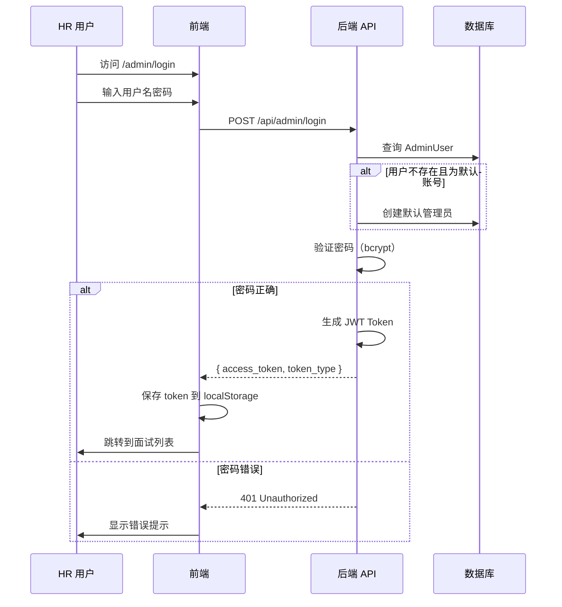

# HR 管理后台

## 📝 概述

HR 管理后台提供面试管理和结果查看功能。HR 可以登录后台，查看所有面试记录、候选人信息、评分结果，并导出报告。

## 🎯 核心功能

- ✅ **用户认证**：基于 JWT 的登录系统
- ✅ **面试列表**：查看所有面试记录及状态
- ✅ **详情查看**：查看单个面试的完整信息
- ✅ **评分展示**：可视化展示 AI 评分结果
- ✅ **音频回放**：播放候选人的回答录音（可选）

## 🔐 认证系统

### 登录流程



### API 实现

**代码位置**：[backend/app/api/admin.py](../../backend/app/api/admin.py)

```python
from ..services.auth import get_current_admin

@router.post("/login", response_model=Token)
def login(form_data: OAuth2PasswordRequestForm = Depends(), db: Session = Depends(get_db)):
    # ... 验证逻辑 ...
    access_token = create_access_token(data={"sub": admin.username})
    return {"access_token": access_token, "token_type": "bearer"}

@router.get("/interviews", response_model=List[InterviewSummary])
def list_interviews(
    db: Session = Depends(get_db),
    current_admin: AdminUser = Depends(get_current_admin)  # 强制校验 JWT
):
    # ...
```

### JWT Token 管理

**代码位置**：[backend/app/services/auth.py](../../backend/app/services/auth.py)

```python
from fastapi import Depends, HTTPException, status
from fastapi.security import OAuth2PasswordBearer

oauth2_scheme = OAuth2PasswordBearer(tokenUrl="api/admin/login")

async def get_current_admin(token: str = Depends(oauth2_scheme), db: Session = Depends(get_db)):
    credentials_exception = HTTPException(
        status_code=status.HTTP_401_UNAUTHORIZED,
        detail="Could not validate credentials",
        headers={"WWW-Authenticate": "Bearer"},
    )
    try:
        payload = jwt.decode(token, settings.JWT_SECRET, algorithms=[settings.ALGORITHM])
        username: str = payload.get("sub")
        if username is None:
            raise credentials_exception
    except JWTError:
        raise credentials_exception
    
    admin = db.query(AdminUser).filter(AdminUser.username == username).first()
    if admin is None:
        raise credentials_exception
    return admin
```

### 前端登录与路由守卫

**代码位置**：[frontend/src/App.tsx](../../frontend/src/App.tsx)

```typescript
const RequireAdminAuth: React.FC<{ children: React.ReactNode }> = ({ children }) => {
  const token = localStorage.getItem('admin_token');
  if (!token) {
    return <Navigate to="/admin/login" replace />;
  }
  return <>{children}</>;
};

// 路由配置
<Route 
  path="/admin/interviews" 
  element={
    <RequireAdminAuth>
      <AdminInterviews />
    </RequireAdminAuth>
  } 
/>
```

**登录处理**：[frontend/src/pages/AdminLogin.tsx](../../frontend/src/pages/AdminLogin.tsx)

```typescript
const handleLogin = async (e: React.FormEvent) => {
  e.preventDefault();

  const formData = new URLSearchParams();
  formData.append('username', username);
  formData.append('password', password);

  try {
    const response = await fetch('/api/admin/login', {
      method: 'POST',
      headers: { 'Content-Type': 'application/x-www-form-urlencoded' },
      body: formData
    });

    if (response.ok) {
      const data = await response.json();
      // 保存 token
      localStorage.setItem('admin_token', data.access_token);
      // 跳转到面试列表
      navigate('/admin/interviews');
    } else {
      setError('用户名或密码错误');
    }
  } catch (err) {
    setError('登录失败，请重试');
  }
};
```

## 📋 面试列表

### 功能特性

- 显示所有面试记录
- 按状态过滤（已创建/进行中/已完成）
- 按评分排序
- 搜索候选人姓名
- 分页展示

### API 接口

**端点**：`GET /api/admin/interviews`

**响应格式**：

```json
[
  {
    "id": 1,
    "name": "张三",
    "position": "后端工程师",
    "status": "finished",
    "created_at": "2026-03-11T10:30:00Z",
    "total_score": 85
  },
  {
    "id": 2,
    "name": "李四",
    "position": "前端工程师",
    "status": "in_progress",
    "created_at": "2026-03-11T11:00:00Z",
    "total_score": null
  }
]
```

### 实现代码

**后端**：[backend/app/api/admin.py:48-63](../../backend/app/api/admin.py#L48)

```python
@router.get("/interviews", response_model=List[InterviewSummary])
def list_interviews(db: Session = Depends(get_db)):
    interviews = db.query(Interview).all()

    # 提取评分
    results = []
    for i in interviews:
        score = i.evaluation_result.get("total_score") if i.evaluation_result else None
        results.append(InterviewSummary(
            id=i.id,
            name=i.name,
            position=i.position,
            status=i.status,
            created_at=i.created_at,
            total_score=score
        ))

    return results
```

**前端**：[frontend/src/pages/AdminInterviews.tsx](../../frontend/src/pages/AdminInterviews.tsx)

```typescript
useEffect(() => {
  fetch('/api/admin/interviews', {
    headers: {
      'Authorization': `Bearer ${localStorage.getItem('admin_token')}`
    }
  })
    .then(res => res.json())
    .then(data => setInterviews(data))
    .catch(err => console.error(err));
}, []);

return (
  <table>
    <thead>
      <tr>
        <th>ID</th>
        <th>候选人</th>
        <th>岗位</th>
        <th>状态</th>
        <th>评分</th>
        <th>操作</th>
      </tr>
    </thead>
    <tbody>
      {interviews.map(interview => (
        <tr key={interview.id}>
          <td>{interview.id}</td>
          <td>{interview.name}</td>
          <td>{interview.position}</td>
          <td>
            <StatusBadge status={interview.status} />
          </td>
          <td>
            {interview.total_score !== null
              ? `${interview.total_score}/100`
              : '-'}
          </td>
          <td>
            <button onClick={() => viewDetail(interview.id)}>
              查看详情
            </button>
          </td>
        </tr>
      ))}
    </tbody>
  </table>
);
```

## 🔍 面试详情

### 功能特性

- 候选人基本信息
- 面试题目列表
- 每道题的回答转写
- AI 评分详情（总分 + 维度分）
- 综合评语

### API 接口

**端点**：`GET /api/admin/interviews/{interview_id}`

**响应格式**：

```json
{
  "interview": {
    "id": 1,
    "name": "张三",
    "position": "后端工程师",
    "external_id": "ATS-12345",
    "resume_brief": "5年 Python 开发经验",
    "link_token": "abc123...",
    "question_set": [
      {
        "order_index": 1,
        "question_text": "请介绍一下 Python 的 GIL",
        "reference": "全局解释器锁的概念和影响"
      }
    ],
    "status": "finished",
    "evaluation_result": {
      "total_score": 85,
      "dimension_scores": {
        "沟通能力": 90,
        "专业技能": 80
      },
      "comment": "表现良好..."
    },
    "created_at": "2026-03-11T10:30:00Z",
    "completed_at": "2026-03-11T10:45:00Z"
  },
  "answers": [
    {
      "id": 1,
      "question_index": 0,
      "audio_url": "/uploads/abc123_0_xxxx.wav",
      "transcript": "GIL 即全局解释器锁..."
    }
  ]
}
```

### 实现代码

**后端**：[backend/app/api/admin.py:65-77](../../backend/app/api/admin.py#L65)

```python
@router.get("/interviews/{interview_id}")
def get_interview_detail(interview_id: int, db: Session = Depends(get_db)):
    interview = db.query(Interview).filter(Interview.id == interview_id).first()
    if not interview:
        raise HTTPException(status_code=404, detail="Interview not found")

    answers = db.query(Answer).filter(Answer.interview_id == interview.id).all()

    return {
        "interview": interview,
        "answers": answers
    }
```

**前端**：[frontend/src/pages/AdminInterviewDetail.tsx](../../frontend/src/pages/AdminInterviewDetail.tsx)

```typescript
const DetailPage: React.FC = () => {
  const { id } = useParams();
  const [data, setData] = useState<any>(null);

  useEffect(() => {
    fetch(`/api/admin/interviews/${id}`, {
      headers: {
        'Authorization': `Bearer ${localStorage.getItem('admin_token')}`
      }
    })
      .then(res => res.json())
      .then(setData);
  }, [id]);

  if (!data) return <div>加载中...</div>;

  const { interview, answers } = data;
  const eval = interview.evaluation_result || {};

  return (
    <div>
      <h1>{interview.name} - {interview.position}</h1>

      {/* 基本信息 */}
      <section>
        <h2>基本信息</h2>
        <p>外部 ID: {interview.external_id}</p>
        <p>简历: {interview.resume_brief}</p>
        <p>状态: {interview.status}</p>
      </section>

      {/* 评分结果 */}
      {eval.total_score && (
        <section>
          <h2>评分结果</h2>
          <div className="score-card">
            <h3>总分: {eval.total_score}/100</h3>
            <h4>维度评分</h4>
            {Object.entries(eval.dimension_scores).map(([dim, score]) => (
              <div key={dim}>
                {dim}: {score}/100
                <progress value={score} max={100} />
              </div>
            ))}
            <h4>综合评语</h4>
            <p>{eval.comment}</p>
          </div>
        </section>
      )}

      {/* 问答记录 */}
      <section>
        <h2>问答记录</h2>
        {interview.question_set.map((q, idx) => {
          const answer = answers.find(a => a.question_index === idx);
          return (
            <div key={idx} className="qa-item">
              <h3>问题 {q.order_index}: {q.question_text}</h3>
              {q.reference && <p className="reference">参考: {q.reference}</p>}
              {answer && (
                <>
                  <p className="transcript">{answer.transcript || '未转写'}</p>
                  {answer.audio_url && (
                    <audio controls src={answer.audio_url}>
                      您的浏览器不支持音频播放
                    </audio>
                  )}
                </>
              )}
            </div>
          );
        })}
      </section>
    </div>
  );
};
```

## 🎨 界面设计

### 登录页面

```
┌─────────────────────────────────────┐
│                                     │
│         AI 面试系统 - 管理后台         │
│                                     │
│  ┌───────────────────────────────┐ │
│  │ 用户名: [__________________] │ │
│  │ 密码:   [__________________] │ │
│  │                               │ │
│  │       [ 登  录 ]              │ │
│  └───────────────────────────────┘ │
│                                     │
└─────────────────────────────────────┘
```

### 面试列表页面

```
┌─────────────────────────────────────────────────────────┐
│ AI 面试系统                            [ 退出登录 ]      │
├─────────────────────────────────────────────────────────┤
│ 面试列表                        [ 创建面试 ]             │
│                                                         │
│ 搜索: [_____________]  状态: [全部 ▼]  [搜索]          │
│                                                         │
│ ┌─────┬──────┬────────┬──────┬──────┬────────┐        │
│ │ ID  │ 候选人│  岗位   │ 状态  │ 评分  │ 操作    │        │
│ ├─────┼──────┼────────┼──────┼──────┼────────┤        │
│ │ 001 │ 张三  │后端工程师│已完成 │ 85/100│[详情]  │        │
│ │ 002 │ 李四  │前端工程师│进行中 │   -   │[详情]  │        │
│ │ 003 │ 王五  │测试工程师│已创建 │   -   │[详情]  │        │
│ └─────┴──────┴────────┴──────┴──────┴────────┘        │
│                                                         │
│ 第 1 页 / 共 5 页                  [ < ] [ 1 ] [ > ]  │
└─────────────────────────────────────────────────────────┘
```

### 面试详情页面

```
┌─────────────────────────────────────────────────────────┐
│ [ < 返回 ]  张三 - 后端工程师                            │
├─────────────────────────────────────────────────────────┤
│ 基本信息                                                 │
│ • 外部 ID: ATS-12345                                    │
│ • 简历: 5年 Python 开发经验                              │
│ • 状态: 已完成                                           │
│ • 创建时间: 2026-03-11 10:30                            │
│ • 完成时间: 2026-03-11 10:45                            │
├─────────────────────────────────────────────────────────┤
│ 评分结果                                                 │
│ ┌─────────────────────────┐                            │
│ │  总分: 85/100           │                            │
│ │                         │                            │
│ │  沟通能力: 90/100       │ [██████████████████░░]   │
│ │  专业技能: 80/100       │ [████████████████░░░░]   │
│ │                         │                            │
│ │  综合评语:              │                            │
│ │  表现良好，沟通清晰...   │                            │
│ └─────────────────────────┘                            │
├─────────────────────────────────────────────────────────┤
│ 问答记录                                                 │
│ ┌───────────────────────────────────────────────────┐  │
│ │ 问题 1: 请介绍一下 Python 的 GIL                   │  │
│ │ 参考: 全局解释器锁的概念和影响                      │  │
│ │                                                    │  │
│ │ 回答: GIL 即全局解释器锁，是 CPython 的特性...     │  │
│ │                                                    │  │
│ │ 音频: [▶️ 播放] [00:00 / 02:30]                   │  │
│ └───────────────────────────────────────────────────┘  │
│                                                         │
│ [导出 PDF 报告]  [导出 Excel]                           │
└─────────────────────────────────────────────────────────┘
```

## 🔒 安全性考虑

### 1. 密码存储

使用 `bcrypt` 哈希算法：

```python
from passlib.context import CryptContext

pwd_context = CryptContext(schemes=["bcrypt"], deprecated="auto")

# 存储时哈希
password_hash = pwd_context.hash("admin123")

# 验证时比对
is_valid = pwd_context.verify("admin123", password_hash)
```

### 2. JWT Token 过期

```python
# Token 有效期 2 小时
ACCESS_TOKEN_EXPIRE_MINUTES = 120

# 前端检查过期
const token = localStorage.getItem('admin_token');
const payload = JSON.parse(atob(token.split('.')[1]));
const isExpired = payload.exp * 1000 < Date.now();

if (isExpired) {
  // 跳转到登录页
  navigate('/admin/login');
}
```

### 3. 错误处理与反馈

前端页面会捕获并显示 API 返回的错误代码（如 401 Unauthorized）。当 Token 过期或权限不足时，页面顶部会显示红色的错误横幅，明确告知用户错误原因。

### 4. HTTPS 强制

生产环境建议：

```nginx
server {
    listen 80;
    server_name admin.example.com;
    return 301 https://$server_name$request_uri;
}

server {
    listen 443 ssl;
    server_name admin.example.com;
    ssl_certificate /path/to/cert.pem;
    ssl_certificate_key /path/to/key.pem;
    ...
}
```

## 📊 数据导出

### 导出 Excel

```typescript
// frontend - 使用 xlsx 库
import * as XLSX from 'xlsx';

const exportToExcel = () => {
  const data = interviews.map(i => ({
    'ID': i.id,
    '候选人': i.name,
    '岗位': i.position,
    '状态': i.status,
    '评分': i.total_score || '-',
    '创建时间': new Date(i.created_at).toLocaleString()
  }));

  const ws = XLSX.utils.json_to_sheet(data);
  const wb = XLSX.utils.book_new();
  XLSX.utils.book_append_sheet(wb, ws, '面试列表');
  XLSX.writeFile(wb, 'interviews.xlsx');
};
```

### 导出 PDF 报告

```python
# backend - 使用 reportlab
from reportlab.pdfgen import canvas
from reportlab.lib.pagesizes import A4

def generate_report(interview: Interview) -> bytes:
    buffer = io.BytesIO()
    pdf = canvas.Canvas(buffer, pagesize=A4)

    # 标题
    pdf.setFont("Helvetica-Bold", 16)
    pdf.drawString(100, 800, f"面试报告 - {interview.name}")

    # 基本信息
    pdf.setFont("Helvetica", 12)
    pdf.drawString(100, 770, f"岗位: {interview.position}")

    # 评分
    eval = interview.evaluation_result
    if eval:
        pdf.drawString(100, 740, f"总分: {eval['total_score']}/100")

    pdf.save()
    buffer.seek(0)
    return buffer.read()
```

## 🔍 常见问题

### Q1: 如何添加新的管理员？

方法 1：直接修改环境变量（仅支持一个账号）

```bash
# .env
ADMIN_USERNAME=admin
ADMIN_PASSWORD=newpassword123
```

方法 2：通过数据库添加（支持多账号）

```python
# Python 脚本
from app.services.auth import get_password_hash
from app.models.admin_user import AdminUser

admin = AdminUser(
    username="hr_user",
    password_hash=get_password_hash("password123")
)
db.add(admin)
db.commit()
```

### Q2: 如何重置管理员密码？

```python
# Python 脚本
admin = db.query(AdminUser).filter(AdminUser.username == "admin").first()
admin.password_hash = get_password_hash("new_password")
db.commit()
```

### Q3: 如何限制访问 IP？

Nginx 配置：

```nginx
location /api/admin {
    allow 192.168.1.0/24;  # 允许内网访问
    deny all;              # 拒绝其他
    proxy_pass http://backend;
}
```

## 📚 相关文档

- [面试创建流程](03.1_interview_creation.md) - 如何创建面试
- [AI 评估系统](03.3_ai_evaluation.md) - 评分机制详解
- [系统架构](../02_architecture.md) - 整体架构
- [故障排查](../06_troubleshooting.md) - 常见问题解决
