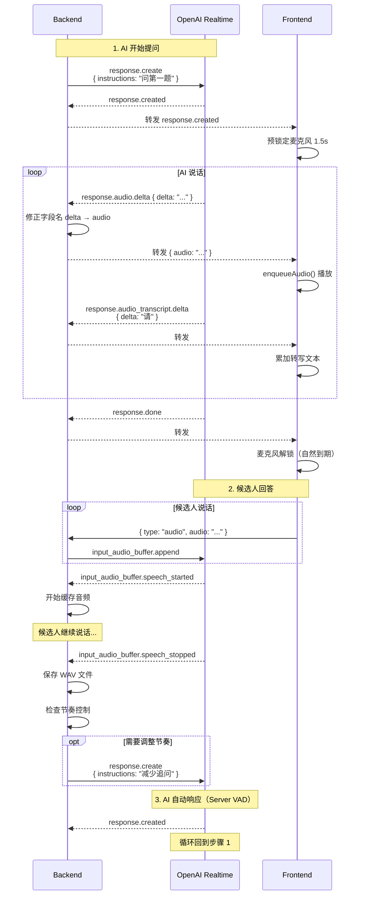

# OpenAI Realtime API 集成

## 📝 概述

本系统基于 OpenAI Realtime API 实现实时语音对话功能。Realtime API 是 OpenAI 提供的 WebSocket 接口，支持低延迟的语音输入输出和实时转写。

## 🔌 API 基础信息

### 连接端点

```
wss://api.openai.com/v1/realtime?model=gpt-4o-mini-realtime-preview
```

### 认证方式

```python
headers = {
    "Authorization": f"Bearer {OPENAI_API_KEY}",
    "OpenAI-Beta": "realtime=v1"
}
```

### 支持的模型

- `gpt-4o-realtime-preview` - 标准版本
- `gpt-4o-mini-realtime-preview` - 轻量版本（本项目使用）

## 🎛️ Session 配置

### 初始化会话

在建立 WebSocket 连接后，首先发送 `session.update` 事件配置会话参数。

**代码位置**：[backend/app/api/realtime.py:94-141](../../backend/app/api/realtime.py#L94)

```python
init_event = {
    "type": "session.update",
    "session": {
        # AI 角色和面试逻辑的核心指令
        "instructions": f"""
你是一名专业的 AI 面试官。你正在面试候选人 {interview.name}，岗位是 {interview.position}。

岗位背景信息 (JD)：
{jd_info}

本次面试流程：
1. **自我介绍** (intro)：请候选人进行简短的自我介绍。
2. **主问题问答** (qa)：根据题目列表进行提问，并根据节奏进行追问。
3. **候选人提问** (candidate_q)：主问题结束后，邀请候选人提问。
4. **自然结束** (closing)：礼貌地结束面试。

本次面试规则与参数：
1. **主问题数量**：本次面试共包含 {main_question_count} 个主问题。
2. **追问限额**：每个主问题之后，最多允许进行 {followup_limit} 次简短追问。
3. **预期时长**：整场面试大约持续 {expected_duration} 分钟。
...

题目列表与参考方向：
{questions_str}
""",

        # 语音配置
        "voice": "alloy",  # 可选：alloy, echo, fable, onyx, nova, shimmer
        "modalities": ["text", "audio"],  # 支持文本和音频

        # 音频格式（固定 24kHz PCM16）
        "input_audio_format": "pcm16",
        "output_audio_format": "pcm16",

        # 实时转写
        "input_audio_transcription": {
            "model": "whisper-1"
        },

        # Server VAD 配置
        "turn_detection": {
            "type": "server_vad",           # 使用服务端 VAD
            "threshold": 0.5,                # 语音检测阈值 (0.0-1.0)
            "prefix_padding_ms": 300,        # 说话前缓冲时间
            "silence_duration_ms": 600       # 静音多久判定结束
        }
    }
}

await openai_ws.send(json.dumps(init_event))
```

### 关键配置参数说明

| 参数 | 类型 | 说明 |
|-----|------|------|
| `instructions` | string | AI 的系统提示词，定义角色、流程、规则 |
| `voice` | string | TTS 语音类型 |
| `modalities` | array | 启用的模态（text/audio） |
| `input_audio_format` | string | 输入音频格式（pcm16/g711_ulaw/g711_alaw） |
| `output_audio_format` | string | 输出音频格式（pcm16/g711_ulaw/g711_alaw） |
| `turn_detection.type` | string | VAD 类型（server_vad/none） |
| `turn_detection.threshold` | float | 语音检测敏感度（0.0-1.0，越高越严格） |
| `turn_detection.silence_duration_ms` | int | 静音多久触发 speech_stopped |

**重要提示**：
- PCM16 格式固定为 **24kHz** 采样率（不可配置）
- Server VAD 模式下，候选人说完话会自动触发 AI 回复，无需手动发送 `response.create`

## 📡 事件流

### 客户端 → 服务端事件

#### 1. 发送音频数据

```json
{
  "type": "input_audio_buffer.append",
  "audio": "base64_encoded_pcm16_audio"
}
```

**说明**：前端持续发送 PCM16 音频流，OpenAI 在后台累积到 buffer 中。

#### 2. 手动提交音频 buffer（可选）

```json
{
  "type": "input_audio_buffer.commit"
}
```

**说明**：在 `server_vad` 模式下通常不需要手动提交，VAD 会自动处理。

#### 3. 创建 AI 响应

```json
{
  "type": "response.create",
  "response": {
    "modalities": ["text", "audio"],
    "instructions": "请开始面试，向候选人问好并请他进行简短的自我介绍。"
  }
}
```

**用途**：
- 启动对话（如第一个问题）
- 动态调整 AI 行为（如节奏控制指令）

**代码位置**：[backend/app/api/realtime.py:145-152](../../backend/app/api/realtime.py#L145)

### 服务端 → 客户端事件

#### 会话事件

```json
// 会话创建
{
  "type": "session.created",
  "session": { ... }
}

// 会话更新确认
{
  "type": "session.updated",
  "session": { ... }
}
```

#### VAD 事件

```json
// 检测到说话开始
{
  "type": "input_audio_buffer.speech_started",
  "audio_start_ms": 1000,
  "item_id": "item_abc123"
}

// 检测到说话结束
{
  "type": "input_audio_buffer.speech_stopped",
  "audio_end_ms": 5000,
  "item_id": "item_abc123"
}
```

**后端处理**：[backend/app/api/realtime.py:240-250](../../backend/app/api/realtime.py#L240)

```python
elif event_type == "input_audio_buffer.speech_started":
    logger.info(f"VAD: Speech started for question {current_question_index}")
    is_recording_segment = True
    candidate_speaking = True
    audio_buffer.clear()

elif event_type == "input_audio_buffer.speech_stopped":
    logger.info(f"VAD: Speech stopped for question {current_question_index}")
    is_recording_segment = False
    candidate_speaking = False

    # 保存录音片段
    if audio_buffer:
        pcm_data = b"".join(audio_buffer)
        wav_data = pcm16_to_wav(pcm_data)
        # ... 保存为 WAV 文件
```

#### AI 响应事件

```json
// 响应创建
{
  "type": "response.created",
  "response": {
    "id": "resp_abc123",
    "status": "in_progress"
  }
}

// 音频流式输出
{
  "type": "response.audio.delta",
  "delta": "base64_encoded_pcm16_audio",
  "response_id": "resp_abc123",
  "item_id": "item_abc123",
  "output_index": 0,
  "content_index": 0
}

// 音频转写流式输出
{
  "type": "response.audio_transcript.delta",
  "delta": "你好",
  "response_id": "resp_abc123",
  "item_id": "item_abc123",
  "output_index": 0,
  "content_index": 0
}

// 响应完成
{
  "type": "response.done",
  "response": {
    "id": "resp_abc123",
    "status": "completed",
    "output": [ ... ]
  }
}
```

**前端处理**：[frontend/src/pages/Interview.tsx:173-217](../../frontend/src/pages/Interview.tsx#L173)

```typescript
ws.onmessage = async (event) => {
  const data = JSON.parse(event.data);

  if (data.type === 'response.audio.delta') {
    // 修正字段名：delta → audio
    const modifiedEvent = { ...data, audio: data.delta };
    enqueueAudio(modifiedEvent.audio);
  }
  else if (data.type === 'response.audio_transcript.delta') {
    setTranscript(prev => prev + data.delta);
  }
  else if (data.type === 'response.created') {
    // 预锁定麦克风 1.5 秒
    nextStartTimeRef.current = audioContext.currentTime + 1.5;
    setTranscript(''); // 清空上一轮转写
  }
};
```

#### 错误事件

```json
{
  "type": "error",
  "error": {
    "type": "invalid_request_error",
    "code": "invalid_value",
    "message": "Invalid audio format",
    "param": "input_audio_format"
  }
}
```

## 🔄 完整事件流示例

### 场景：AI 提问 → 候选人回答 → AI 追问



## 🎯 关键实现细节

### 1. 音频格式修正

OpenAI 在 `response.audio.delta` 事件中使用 `delta` 字段名，而前端期望 `audio` 字段。后端需要修正：

**代码位置**：[backend/app/api/realtime.py:213-228](../../backend/app/api/realtime.py#L213)

```python
if event_type == "response.audio.delta":
    if "delta" in event:
        # 修正字段名以兼容前端
        modified_event = event.copy()
        modified_event["audio"] = event["delta"]
        await websocket.send_text(json.dumps(modified_event))
    else:
        logger.warning(f"response.audio.delta missing 'delta' field")
        await websocket.send_text(json.dumps(event))
```

### 2. 节奏控制指令

通过动态发送 `response.create` 调整 AI 行为：

```python
# 超时模式
if overtime_mode and not overtime_closing_sent:
    pacing_instruction = "面试时间已到。请不要再问新的主问题或追问，礼貌自然地结束面试。"
    pacing_event = {
        "type": "response.create",
        "response": {
            "instructions": pacing_instruction
        }
    }
    await openai_ws.send(json.dumps(pacing_event))

# 节奏落后
if elapsed_ratio > q_progress + 0.1:
    pacing_instruction = "节奏落后：请减少或停止追问，尽快进入下一个主问题。"
    # ... 发送 pacing_event
```

**代码位置**：[backend/app/api/realtime.py:286-318](../../backend/app/api/realtime.py#L286)

### 3. 日志记录

记录所有关键事件（除音频二进制外）：

```python
if event_type in ["response.audio.delta", "response.audio_transcript.delta", "response.text.delta"]:
    pass  # 避免刷屏
else:
    logger.info(f"OpenAI Event: {event_type} - {json.dumps(event)}")
```

**代码位置**：[backend/app/api/realtime.py:206-210](../../backend/app/api/realtime.py#L206)

## 📊 性能与限制

### API 限制

- **最大连接时长**：建议不超过 30 分钟
- **音频 buffer 大小**：无明确限制，但建议持续发送
- **并发连接数**：根据账户等级

### 延迟性能

- **端到端延迟**：通常 1-2 秒
  - 网络延迟：50-200ms
  - VAD 检测延迟：600ms（silence_duration_ms）
  - TTS 生成延迟：500-1000ms
  - 音频传输延迟：100-300ms

### 成本估算

以 10 分钟面试为例（`gpt-4o-mini-realtime-preview`）：

- **音频输入**：10 分钟 × 60s × 24000Hz × 2 bytes ≈ 28.8 MB
- **音频输出**：假设 AI 说话 5 分钟 ≈ 14.4 MB
- **LLM Token**：约 2000-5000 tokens
- **总成本**：约 $0.5-1.0

详见：[OpenAI Pricing](https://openai.com/api/pricing/)

## 🔍 调试技巧

### 1. 启用详细日志

```python
# backend/app/api/realtime.py
logger.setLevel(logging.DEBUG)

# 记录所有原始事件
logger.debug(f"Raw event: {message}")
```

### 2. 使用 WebSocket 调试工具

```bash
# 使用 wscat 测试连接
npm install -g wscat

wscat -c "wss://api.openai.com/v1/realtime?model=gpt-4o-mini-realtime-preview" \
  -H "Authorization: Bearer $OPENAI_API_KEY" \
  -H "OpenAI-Beta: realtime=v1"
```

### 3. 检查事件序列

正常流程应该是：

```
session.created
→ session.updated
→ response.created (首次提问)
→ response.audio.delta (多次)
→ response.audio_transcript.delta (多次)
→ response.done
→ input_audio_buffer.speech_started (候选人说话)
→ input_audio_buffer.speech_stopped
→ response.created (自动)
→ ...
```

### 4. 常见问题

| 问题 | 原因 | 解决方案 |
|-----|------|---------|
| 连接建立失败 | API Key 无效 | 检查环境变量 |
| 无语音输出 | 音频格式不匹配 | 确认使用 PCM16 @ 24kHz |
| VAD 不触发 | threshold 太高 | 降低到 0.3-0.5 |
| 响应延迟高 | 网络问题 | 使用代理或切换区域 |

## 📚 相关文档

- [系统架构](../02_architecture.md)
- [实时面试功能](../03_features/03.2_realtime_interview.md)
- [VAD 机制](04.3_vad_mechanism.md)
- [音频处理](04.2_audio_processing.md)
- [OpenAI Realtime API 官方文档](https://platform.openai.com/docs/guides/realtime)
