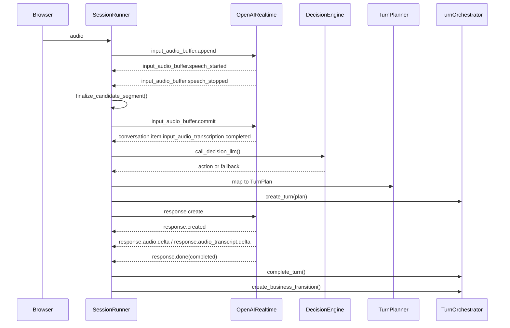

# OpenAI Realtime API 集成

## 概述

系统通过 OpenAI Realtime API 实现实时语音面试，但当前实现并不是“把回复权完全交给 Realtime 模型”，而是采用：

- `server_vad`
- `create_response = false`
- 后端单点发送 `response.create`

这样后端可以把整场会话严格收敛为单一线性链条：

`candidate_audio -> transcription -> decision -> ai_response`

## 连接信息

### 连接端点

```text
wss://api.openai.com/v1/realtime?model=gpt-realtime-mini
```

### 认证方式

```python
headers = {
    "Authorization": f"Bearer {OPENAI_API_KEY}",
    "OpenAI-Beta": "realtime=v1",
}
```

### 当前使用模型

- `gpt-realtime-mini`

## Session 初始化

会话由 [`backend/app/services/realtime/session_runner.py`](../../backend/app/services/realtime/session_runner.py) 初始化。业务入口 [`backend/app/api/realtime.py`](../../backend/app/api/realtime.py) 只负责：

- token 校验
- 单 token 会话互斥
- 创建并启动 `RealtimeSessionRunner`

### 当前关键配置

```json
{
  "type": "session.update",
  "session": {
    "voice": "alloy",
    "modalities": ["text", "audio"],
    "input_audio_format": "pcm16",
    "output_audio_format": "pcm16",
    "input_audio_transcription": {
      "model": "whisper-1"
    },
    "turn_detection": {
      "type": "server_vad",
      "threshold": 0.5,
      "prefix_padding_ms": 300,
      "silence_duration_ms": 1200,
      "create_response": false
    }
  }
}
```

### 为什么 `create_response = false`

这是本次重构后的关键约束。关闭自动回复后，后端才能确保：

1. 候选人音频已经被 commit
2. 对应 `item_id` 的转写已经完成
3. 独立文本决策层已经完成动作选择
4. `TurnPlan` 已经映射完成
5. 本轮 `response.create` 由唯一入口发出

如果让 Realtime API 在 `speech_stopped` 后自动回复，就会重新引入：

- 未转写先决策
- 旧上下文误判
- `speech_stopped` / `end_turn` 双触发
- 业务状态推进早于真实 AI 回复

## 后端模块与 Realtime API 的职责映射

### 入口层

- [`backend/app/api/realtime.py`](../../backend/app/api/realtime.py)
  - 接收浏览器 WebSocket
  - 防重复连接
  - 启动 `RealtimeSessionRunner`

### 主控层

- [`backend/app/services/realtime/session_runner.py`](../../backend/app/services/realtime/session_runner.py)
  - 管理下游浏览器消息和上游 OpenAI 事件
  - 维护线性 Pipeline
  - 统一发送 `response.create`
  - 只在 `response.done(completed)` 后推进业务状态

### 子模块

- [`backend/app/services/realtime/audio_pipeline.py`](../../backend/app/services/realtime/audio_pipeline.py)
  - 处理 `speech_started` / `speech_stopped`
  - 管理音频缓冲
- [`backend/app/services/realtime/transcript_store.py`](../../backend/app/services/realtime/transcript_store.py)
  - 保存 `conversation.item.input_audio_transcription.completed`
  - 按 `item_id` 等待转写
- [`backend/app/services/realtime/decision_engine.py`](../../backend/app/services/realtime/decision_engine.py)
  - 调用独立文本决策模型
  - 校验 `allowed_actions`
- [`backend/app/services/realtime/turn_planner.py`](../../backend/app/services/realtime/turn_planner.py)
  - 决策结果到 `TurnPlan` 的映射
  - legacy fallback 规则
- [`backend/app/services/realtime_turn_orchestrator.py`](../../backend/app/services/realtime_turn_orchestrator.py)
  - turn 生命周期管理
  - business transition 守门

## 浏览器与后端协议

### 浏览器 -> 后端

浏览器当前仍使用轻量自定义协议，不要求直接发送 OpenAI 原生事件。

#### 1. 候选人音频

```json
{
  "type": "audio",
  "audio": "base64_encoded_pcm16_audio"
}
```

#### 2. 手动结束当前输入

```json
{
  "type": "end_turn"
}
```

`end_turn` 现在只表示“请求尽快收束当前 segment”，不会直接越过转写和决策阶段。

#### 3. 长时间无回答提醒

```json
{
  "type": "no_response_timeout"
}
```

该消息只会触发轻量 `REASK_PROMPT`，不会推进主问题计数。

## OpenAI -> 后端关键事件

### 1. VAD 边界

```json
{
  "type": "input_audio_buffer.speech_started",
  "item_id": "item_abc123"
}
```

```json
{
  "type": "input_audio_buffer.speech_stopped",
  "item_id": "item_abc123"
}
```

语义说明：

- `speech_started`：候选人开始说话，后端进入 `audio_collecting`
- `speech_stopped`：只代表一个候选人音频分段结束，不代表可以立刻决策

### 2. 候选人转写完成

```json
{
  "type": "conversation.item.input_audio_transcription.completed",
  "item_id": "item_abc123",
  "transcript": "候选人回答文本"
}
```

这是当前后端用于“候选人文本可用”的权威事件。  
后端会把该文本：

- 写入 `TranscriptStore`
- 追加到 dialogue log
- 优先写入 `Answer.transcript`

### 3. AI 响应生命周期

```json
{
  "type": "response.created",
  "response": {
    "id": "resp_abc123",
    "status": "in_progress"
  }
}
```

```json
{
  "type": "response.audio.delta",
  "delta": "base64_encoded_pcm16_audio",
  "response_id": "resp_abc123"
}
```

```json
{
  "type": "response.audio_transcript.delta",
  "delta": "你好",
  "response_id": "resp_abc123"
}
```

```json
{
  "type": "response.done",
  "response": {
    "id": "resp_abc123",
    "status": "completed"
  }
}
```

其中：

- `response.created`：本轮 AI 开始生成
- `response.audio.delta`：流式音频输出
- `response.audio_transcript.delta`：AI 文字增量
- `response.done(completed)`：本轮 AI 真正完成，此时才允许状态推进

## 当前完整链路



## 决策层约束

独立决策层输出固定 JSON：

```json
{
  "action": "followup | next_question | clarify | finish_interview",
  "reason": "简要说明"
}
```

关键约束：

- 动作必须在 `allowed_actions` 之内
- `followup` 受 `followup_limit` 控制
- `clarify` 受 `clarify_limit` 控制，当前默认值为每题 1 次
- 当前版本不下发 `answer_candidate_question`，AI 面试官不会回答候选人的问题
- `finish_interview` 只有在主问题全部完成后才允许真正 closing
- 任何超时、解析失败、动作非法都会立即回退到 legacy planner

## 前端兼容行为

虽然内部架构已重构为单链路，后端仍保持对现有前端的兼容：

- 接收浏览器的 `audio`
- 转发 `response.audio.delta`
- 同时补充 `audio` 字段供前端播放器使用
- 转发 `response.audio_transcript.delta`
- 转发 `response.created` 与 `response.done`

也就是说，重构主要发生在后端内部，不要求前端同步做协议级重写。

## 快速验证

推荐使用以下测试脚本验证链路：

- [`backend/tests/realtime/test_dialogue_simulation.py`](../../backend/tests/realtime/test_dialogue_simulation.py)
- [`backend/tests/realtime/README.md`](../../backend/tests/realtime/README.md)

默认 mock 测试验证：

- `commit -> transcription -> decision -> response.create`
- 仅在 `response.done(completed)` 后推进 business transition
- 并发 finalize 不会重复推进

## 相关文档

- [实时语音面试功能](../03_features/03.2_realtime_interview.md)
- [Realtime Turn 编排器技术文档](04.5_realtime_turn_orchestrator.md)
- [日志系统](../05_logging.md)
- [OpenAI Realtime API 官方文档](https://platform.openai.com/docs/guides/realtime)
