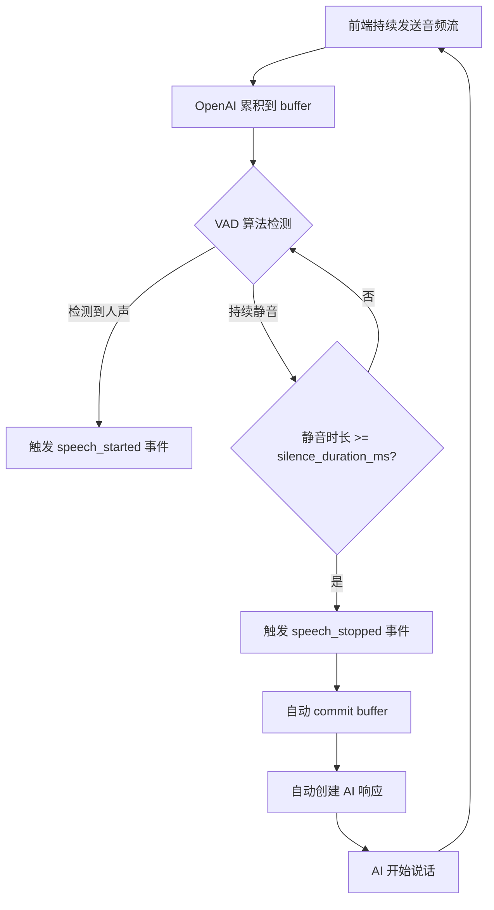
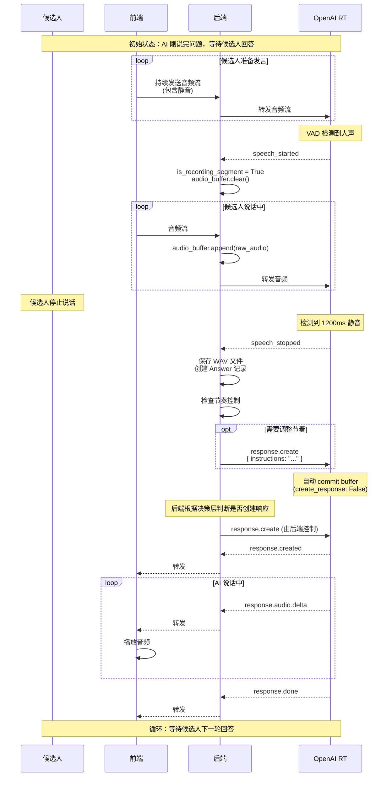

# VAD 语音活动检测机制

## 📝 概述

VAD (Voice Activity Detection，语音活动检测) 是判断音频流中是否包含人声的技术。本系统使用 OpenAI Realtime API 提供的 **Server VAD**，自动检测候选人说话的起止时间，实现全自动对话流程。

## 🎯 Server VAD 工作原理

### 基本流程



### 关键参数

**代码位置**：[backend/app/api/realtime.py:133-139](../../backend/app/api/realtime.py#L133)

```python
"turn_detection": {
    "type": "server_vad",        # 使用服务端 VAD
    "threshold": 0.5,             # 检测阈值 (0.0-1.0)
    "prefix_padding_ms": 300,     # 说话前缓冲时间
    "silence_duration_ms": 1200,  # 静音多久判定结束
    "create_response": False      # 禁用自动响应，由后端单点控制
}
```

| 参数 | 范围 | 默认值 | 说明 |
|-----|------|--------|------|
| `threshold` | 0.0-1.0 | 0.5 | 检测敏感度，越高越严格（越不容易触发） |
| `prefix_padding_ms` | 0-1000 | 300 | 说话前预留时间，避免首个音节丢失 |
| `silence_duration_ms` | 200-2000 | 1200 | 持续静音多久后判定说话结束 |
| `create_response` | boolean | false | 是否自动创建响应。设为 false 时由后端单点控制 |

## 📡 VAD 事件流

### speech_started 事件

**时机**：当 VAD 检测到音频能量超过阈值时触发。

**事件结构**：

```json
{
  "type": "input_audio_buffer.speech_started",
  "audio_start_ms": 1234,
  "item_id": "item_abc123"
}
```

**后端处理**：[backend/app/api/realtime.py:240-245](../../backend/app/api/realtime.py#L240)

```python
elif event_type == "input_audio_buffer.speech_started":
    logger.info(f"VAD: Speech started for question {current_question_index}")
    is_recording_segment = True
    candidate_speaking = True
    audio_buffer.clear()  # 清空缓存，准备记录新片段
```

### speech_stopped 事件

**时机**：当检测到持续静音超过 `silence_duration_ms` 时触发。

**事件结构**：

```json
{
  "type": "input_audio_buffer.speech_stopped",
  "audio_end_ms": 5678,
  "item_id": "item_abc123"
}
```

**后端处理**：[backend/app/api/realtime.py:247-341](../../backend/app/api/realtime.py#L247)

```python
elif event_type == "input_audio_buffer.speech_stopped":
    logger.info(f"VAD: Speech stopped for question {current_question_index}")
    is_recording_segment = False
    candidate_speaking = False

    # 1. 保存音频片段
    if audio_buffer:
        pcm_data = b"".join(audio_buffer)
        wav_data = pcm16_to_wav(pcm_data)

        file_name = f"{token}_{current_question_index}_{secrets.token_hex(4)}.wav"
        file_path = os.path.join(settings.UPLOAD_DIR, file_name)
        with open(file_path, "wb") as f:
            f.write(wav_data)

        logger.info(f"VAD: Saved speech segment to {file_path}")

        # 创建 Answer 记录
        db_answer = Answer(
            interview_id=interview.id,
            question_index=current_question_index,
            audio_url=file_path
        )
        db.add(db_answer)
        db.commit()

    # 2. 节奏控制逻辑
    elapsed = time.time() - interview_start_ts
    # ... 检查超时和节奏
    # ... 发送 pacing_instruction 如果需要

    # 注意：在 server_vad 模式下，OpenAI 会自动 commit buffer
    # 但由于设置了 create_response: False，不会自动创建响应
    # 需要后端根据业务逻辑手动创建响应
```

## 🎬 完整对话周期

### 时序图



## 🔧 精确录制机制

### 为什么需要 VAD 精确录制？

**问题**：如果直接录制整个面试过程，会包含：
- AI 的问题音频
- 背景噪音
- 候选人思考时的静音

**解决方案**：使用 VAD 事件精确标记录制范围。

### 实现细节

#### 1. 音频缓存策略

```python
# 全局状态
audio_buffer = []           # 累积的音频片段
is_recording_segment = False  # 是否正在录制

# 在 relay_client_to_openai 中
async def relay_client_to_openai():
    async for message in websocket.iter_text():
        data = json.loads(message)
        if data.get("type") == "audio":
            audio_data = data["audio"]
            raw_audio = base64.b64decode(audio_data)

            # 只有在 speech_started 之后才缓存
            if is_recording_segment:
                audio_buffer.append(raw_audio)

            # 总是转发给 OpenAI（VAD 需要完整流）
            audio_event = {
                "type": "input_audio_buffer.append",
                "audio": audio_data
            }
            await openai_ws.send(json.dumps(audio_event))
```

**代码位置**：[backend/app/api/realtime.py:172-190](../../backend/app/api/realtime.py#L172)

#### 2. 为什么要持续转发音频？

即使在 `is_recording_segment = False` 时，也需要向 OpenAI 发送音频：

- ✅ VAD 需要完整的音频上下文才能准确判断
- ✅ 避免因停止发送导致 WebSocket 超时
- ✅ 确保 `speech_started` 能及时触发

#### 3. 录制精度

```
时间轴（秒）：
0        1        2        3        4        5        6
├────────┼────────┼────────┼────────┼────────┼────────┤
│  AI 说话  │  静音  │  候选人说话     │  静音  │
                  ↑                  ↑
            speech_started    speech_stopped
                  └────────────────┘
                   精确录制范围
```

**精度误差**：
- 前端音频 buffer：~85ms (2048 samples @ 24kHz)
- VAD 检测延迟：~100-200ms
- 总误差：~200-300ms（可接受）

## 🎛️ 参数调优

### threshold（检测阈值）

**作用**：控制多大的声音会被判定为"说话"。

| 值 | 效果 | 适用场景 |
|----|------|---------|
| 0.3-0.4 | 非常敏感，轻微声音也会触发 | 安静环境，声音较小的候选人 |
| 0.5 | 默认值，平衡灵敏度和抗噪 | 大多数场景 |
| 0.6-0.7 | 不太敏感，需要明显的声音 | 嘈杂环境，抑制背景噪音 |

### silence_duration_ms（静音判定时长）

**作用**：控制候选人停顿多久后触发 `speech_stopped`。

| 值 | 效果 | 适用场景 |
|----|------|---------|
| 400-600ms | 快速响应，但可能截断句子 | 节奏紧凑的快问快答 |
| 1200ms | 默认值，适合正常对话节奏 | 大多数面试场景 |
| 1500-2000ms | 容忍更长停顿，避免误判 | 候选人思考时间较长 |

### 调优示例

**场景 1：候选人说话声音很小**

```python
"turn_detection": {
    "type": "server_vad",
    "threshold": 0.35,  # 降低阈值
    "silence_duration_ms": 600
}
```

**场景 2：候选人说话有较多停顿**

```python
"turn_detection": {
    "type": "server_vad",
    "threshold": 0.5,
    "silence_duration_ms": 1500  # 增加容忍时间
}
```

## 🔍 调试技巧

### 1. 监控 VAD 事件

```python
# backend/app/api/realtime.py
elif event_type == "input_audio_buffer.speech_started":
    logger.info(f"VAD: Speech started at {event.get('audio_start_ms')}ms")

elif event_type == "input_audio_buffer.speech_stopped":
    logger.info(f"VAD: Speech stopped at {event.get('audio_end_ms')}ms")
    logger.info(f"Duration: {event.get('audio_end_ms') - last_start_ms}ms")
```

### 2. 检查录制文件

```bash
# 查看生成的 WAV 文件
ls -lh backend/app/static/uploads/*.wav

# 播放录音（Mac）
afplay backend/app/static/uploads/abc123_0_xxxx.wav

# 查看音频信息
ffprobe backend/app/static/uploads/abc123_0_xxxx.wav
```

### 3. 常见问题

| 问题 | 可能原因 | 解决方案 |
|-----|---------|---------|
| VAD 不触发 | threshold 太高 | 降低到 0.3-0.4 |
| 频繁误触发 | threshold 太低或环境噪音大 | 提高到 0.6-0.7 |
| 句子被截断 | silence_duration_ms 太短 | 增加到 800-1000ms |
| 响应延迟高 | silence_duration_ms 太长 | 减少到 400-500ms |
| 录音文件为空 | is_recording_segment 逻辑错误 | 检查 speech_started 是否触发 |

### 4. 日志分析示例

```
2026-03-11 14:30:10 - INFO - VAD: Speech started for question 0
2026-03-11 14:30:10 - INFO - [MIC] onaudioprocess rms = 0.045, isAgentSpeaking = false
2026-03-11 14:30:11 - INFO - [MIC] onaudioprocess rms = 0.123, isAgentSpeaking = false
2026-03-11 14:30:12 - INFO - [MIC] onaudioprocess rms = 0.089, isAgentSpeaking = false
2026-03-11 14:30:13 - INFO - VAD: Speech stopped for question 0
2026-03-11 14:30:13 - INFO - VAD: Saved speech segment to uploads/abc123_0_a1b2.wav
```

**分析**：
- 说话持续时间：3 秒
- 音量峰值：0.123（正常范围）
- 成功保存录音

## 📊 性能影响

### Server VAD 的优势

| 方面 | Client VAD | Server VAD |
|-----|-----------|-----------|
| **延迟** | 低（本地处理） | 中（网络往返） |
| **准确性** | 依赖客户端算法 | OpenAI 优化算法 |
| **实现复杂度** | 高（需自己实现） | 低（开箱即用） |
| **资源消耗** | 客户端 CPU | 无额外消耗 |
| **跨平台一致性** | 差（浏览器差异） | 好（统一后端） |

### 延迟组成

```
用户说完话
  ↓ (0-100ms: 网络传输)
OpenAI 检测到静音
  ↓ (1200ms: silence_duration_ms)
触发 speech_stopped
  ↓ (50-100ms: 后端处理)
保存录音 + 后端决策是否创建响应
  ↓ (500-1000ms: AI 思考)
AI 开始说话
```

**总延迟**：约 2-2.5 秒（可接受）

## 📚 相关文档

- [OpenAI Realtime API](04.1_realtime_api.md)
- [实时面试功能](../03_features/03.2_realtime_interview.md)
- [音频处理技术](04.2_audio_processing.md)
- [故障排查](../06_troubleshooting.md)
