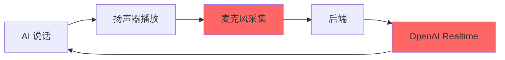

# 半双工音频策略

## 📝 问题背景

在实时语音对话系统中，如果麦克风持续采集音频并发送给后端，会出现严重的**回声反馈**问题：

### 回声循环示意图



**问题链**：

1. AI 通过扬声器播放语音
2. 麦克风采集到扬声器的声音
3. 前端将采集的音频发送给后端
4. 后端转发给 OpenAI Realtime API
5. OpenAI 的 VAD 检测到"人声"（实际是 AI 自己的声音）
6. OpenAI 触发 `speech_stopped` 并生成响应
7. AI 对自己的话做出回应，形成**自我对话循环**

**实际影响**：
- AI 重复自己说过的话
- 无法正常等待候选人回答
- 面试流程完全失控

## 🎯 解决方案：半双工门控

**核心思路**：在 AI 播放音频期间，**阻止前端向后端发送音频数据**，实现类似"对讲机"的半双工通信。

### 全双工 vs 半双工

| 模式 | 特点 | 适用场景 |
|-----|------|---------|
| **全双工 (Full Duplex)** | 双方可同时说话和听 | 电话通话、视频会议 |
| **半双工 (Half Duplex)** | 同一时间只有一方发言 | 对讲机、单人面试 |

本系统采用**半双工模式**：
- AI 说话时：麦克风静音（不发送数据）
- 候选人说话时：麦克风开启（正常发送）

## 🔧 实现：时间轴门控 (Strategy A)

### 核心原理

利用 `AudioContext.currentTime`（音频时间轴）和预定播放结束时间进行对比：

```
时间轴（秒）：
0        1        2        3        4        5        6
├────────┼────────┼────────┼────────┼────────┼────────┤
│  AI Audio 1 (1.5s)      │  AI Audio 2 (0.8s) │
│                         │                    │
nextStartTimeRef:   0 → 1.5 → 2.3
                            ↑
                     currentTime = 2.0

判断：currentTime (2.0) < nextStartTimeRef (2.3) + 0.0
     => isAgentSpeaking = true
     => 阻止发送音频
```

### 关键变量

```typescript
// 全局引用（不触发 React 重渲染）
const nextStartTimeRef = useRef<number>(0);       // AI 音频播放结束时间
const isAgentSpeakingRef = useRef(false);         // AI 是否正在说话（缓存）

// React 状态（触发 UI 更新）
const [isAgentSpeaking, setIsAgentSpeaking] = useState(false);
```

### 完整实现

**代码位置**：[frontend/src/pages/Interview.tsx:232-269](../../frontend/src/pages/Interview.tsx#L232)

```typescript
processor.onaudioprocess = (e) => {
  if (ws.readyState === WebSocket.OPEN && audioContextRef.current) {
    const inputData = e.inputBuffer.getChannelData(0);

    // 1. 计算音量（用于可视化）
    let sum = 0;
    for (let i = 0; i < inputData.length; i++) {
      sum += inputData[i] * inputData[i];
    }
    const rms = Math.sqrt(sum / inputData.length);
    setVolume(rms); // 更新音量条（即使 AI 在说话也显示）

    // 2. 时间轴门控判断
    const now = audioContextRef.current.currentTime;
    const isActuallySpeaking = now < (nextStartTimeRef.current + 0.0);

    // 3. 更新状态（避免不必要的重渲染）
    if (isActuallySpeaking !== isAgentSpeakingRef.current) {
      isAgentSpeakingRef.current = isActuallySpeaking;
      setIsAgentSpeaking(isActuallySpeaking);
    }

    // 每 30 帧打印一次日志（避免刷屏）
    if (frameCount % 30 === 0) {
      console.log(
        '[MIC] rms =', rms,
        'isAgentSpeaking =', isActuallySpeaking,
        'now =', now,
        'nextStart =', nextStartTimeRef.current
      );
    }
    frameCount += 1;

    // 4. 半双工门控：AI 正在说话时返回（不发送音频）
    if (isActuallySpeaking) {
      return; // ← 关键：阻止向后端发送音频
    }

    // 5. 正常发送音频
    const pcm16 = floatTo16BitPCM(inputData);
    const base64Audio = arrayBufferToBase64(pcm16);
    ws.send(JSON.stringify({ type: 'audio', audio: base64Audio }));
  }
};
```

### 为什么一开始会加 0.2 秒缓冲？

```typescript
const isActuallySpeaking = now < (nextStartTimeRef.current + 0.0);
```

**最初的原因**：
- **音频播放调度误差**：`source.start(startTime)` 的实际播放时间可能有小幅偏差
- **扬声器延迟**：音频从 AudioContext 到实际扬声器输出有延迟
- **麦克风采集延迟**：声音传播 + 硬件采集延迟

早期版本使用过 **0.2 秒缓冲**，可以更保险地覆盖这些误差，确保扬声器完全停止后才开启麦克风；但实际测试中发现会让候选人感觉“AI 说完之后还要等一小会儿才能说话”。当前实现将缓冲调整为 **0.0 秒**，让候选人可以在 AI 语音结束的瞬间立即开始说话，换取更自然的抢话体验。

## 🎬 预锁定机制

### 问题：AI 思考期间的间隙

在收到 `response.created` 和第一个 `response.audio.delta` 之间，通常有 0.5-1.5 秒的间隙（AI 思考时间）。如果此时麦克风是开启的，可能会采集到：

- 候选人的咳嗽、呼吸声
- 环境噪音
- 扬声器残留的回声

**解决方案**：预锁定麦克风

**代码位置**：[frontend/src/pages/Interview.tsx:202-208](../../frontend/src/pages/Interview.tsx#L202)

```typescript
else if (data.type === 'response.created') {
  // 预先锁定麦克风 1.5 秒
  if (audioContextRef.current) {
    nextStartTimeRef.current = Math.max(
      nextStartTimeRef.current,
      audioContextRef.current.currentTime + 1.5
    );
    console.log('[TTS] Pre-locking mic for 1.5s on response.created');
  }

  // 清空上一轮转写
  setTranscript('');
  ttsChunkCountRef.current = 0;
  transcriptLengthRef.current = 0;
}
```

### 预锁定时间轴

```
时间轴（秒）：
0        1        2        3        4        5
├────────┼────────┼────────┼────────┼────────┤
│                 ↑
│            response.created
│            nextStartTimeRef = 1.0 + 1.5 = 2.5
│                 │
│                 ├─── 预锁定期 (1.5s) ───┤
│                                          ↑
│                                   第一个音频到达
│                                   nextStartTimeRef 更新
```

**好处**：
- 覆盖 AI 思考期间的杂音
- 确保第一个音频块到达前麦克风已经关闭
- 避免误触发 VAD

## 🎨 用户界面提示

### AI 发言指示器

**代码位置**：[frontend/src/pages/Interview.tsx:694-698](../../frontend/src/pages/Interview.tsx#L694)

```typescript
{isAgentSpeaking && (
  <p style={{ color: '#007bff', fontSize: '0.9rem', fontWeight: 'bold' }}>
    AI 正在发言，请稍后再回答...
  </p>
)}
```

**效果**：
- 候选人可以清楚地知道何时该等待
- 避免候选人在 AI 说话时插话
- 提升用户体验

## 📊 策略对比

### 可选策略

| 策略 | 原理 | 优点 | 缺点 | 本项目采用 |
|-----|------|------|------|-----------|
| **A. 时间轴门控** | 基于 `AudioContext.currentTime` | 精确、无延迟 | 需要精确计算播放时间 | ✅ 是 |
| **B. 状态标志** | 监听 `source.onended` 事件 | 简单直观 | 有延迟（事件触发慢） | ❌ 否 |
| **C. 音量检测** | 分析输出音频音量 | 动态适应 | 不可靠（环境噪音干扰） | ❌ 否 |
| **D. WebRTC AEC** | 浏览器内置回声消除 | 自动化 | 效果不稳定，依赖浏览器 | ❌ 否 |

### 策略 A vs 策略 B 详细对比

#### 策略 A（本项目实现）

```typescript
// 优势：实时精确
const now = audioContext.currentTime;
const isAgentSpeaking = now < nextStartTimeRef.current + 0.0;
```

- ✅ 每个 `onaudioprocess` 回调都能实时判断
- ✅ 延迟仅为音频 buffer 大小（~85ms）
- ✅ 可以提前预锁定

#### 策略 B（事件驱动）

```typescript
// 问题：onended 事件延迟
source.onended = () => {
  setIsAgentSpeaking(false);
};
```

- ❌ `onended` 事件触发有 100-300ms 延迟
- ❌ 无法提前预锁定
- ❌ 多个音频块叠加时逻辑复杂

## 🔍 调试技巧

### 1. 启用详细日志

```typescript
// 每帧都打印（调试时）
console.log(
  '[MIC] frame =', frameCount,
  'rms =', rms.toFixed(3),
  'isAgentSpeaking =', isAgentSpeaking,
  'now =', now.toFixed(2),
  'nextStart =', nextStartTimeRef.current.toFixed(2),
  'gap =', (nextStartTimeRef.current - now).toFixed(2)
);
```

### 2. 可视化时间轴

```typescript
// 绘制时间轴状态
const canvas = document.getElementById('timeline');
const ctx = canvas.getContext('2d');

// 绿色：麦克风开启，红色：麦克风关闭
ctx.fillStyle = isAgentSpeaking ? 'red' : 'green';
ctx.fillRect(currentTime * 10, 0, 10, 50);
```

### 3. 检查门控效果

观察日志，确认以下模式：

```
[MIC] isAgentSpeaking = false  (AI 尚未开场，门控生效)
[WS] Event: response.created
[TTS] First AI response received, opening mic gate
[TTS] Pre-locking mic for 1.5s
[MIC] isAgentSpeaking = true   (AI 正在说话，门控生效)
...
[MIC] isAgentSpeaking = false  (AI 播放结束，麦克风恢复)
...
[WS] Event: interview.natural_end
[MIC] isAgentSpeaking = false  (面试已结束，门控永久生效)
```

## 🚪 开场前与收尾后门控

为了确保面试流程由 AI 主导（AI 先开口、AI 收尾），前端在 `onaudioprocess` 中增加了两道额外的逻辑门控：

### 1. 开场前门控 (Opening Gate)
- **目的**：在 WebSocket 连接成功后，直到收到 AI 的第一个 `response.created` 事件之前，屏蔽所有用户语音。
- **实现**：使用 `hasReceivedFirstAiResponseRef`。
- **UI 提示**：显示“请等待 AI 面试官开场...”。

### 2. 收尾后门控 (Closing Gate)
- **目的**：在收到后端的 `interview.natural_end` 事件后（即 AI 完成最后一句收尾语），永久屏蔽用户语音。
- **实现**：使用 `interviewEndedRef`。
- **效果**：即使在 15 秒自动提交倒计时期间，用户说话也不会被发送到后端。

### 门控优先级
在 `onaudioprocess` 中，门控的判断顺序如下：
1. **开场前门控**（若未收到首条 AI 回复，直接 return）
2. **收尾后门控**（若面试已结束，直接 return）
3. **Strategy A 时间轴门控**（若 AI 正在说话，直接 return）
4. **发送音频**

### 4. 常见问题排查

| 问题 | 可能原因 | 解决方案 |
|-----|---------|---------|
| AI 听到自己的声音 | 门控未生效 | 检查 `isAgentSpeaking` 逻辑 |
| 候选人说话被截断 | 缓冲时间太长 | 将缓冲时间调小（例如从 0.1s 调到 0.0s） |
| AI 响应延迟 | 麦克风关闭时间过长 | 检查 `nextStartTimeRef` 更新逻辑 |
| 音量条不显示 | RMS 计算在 return 之前 | 确认 `setVolume(rms)` 在门控前 |

## 📈 性能影响

### CPU 使用

- **门控判断**：每次 `onaudioprocess` 回调仅 1 次浮点比较，几乎无开销
- **总 CPU 增加**：<1%

### 内存使用

- **额外变量**：3 个 Ref（`nextStartTimeRef`, `isAgentSpeakingRef`, `audioContextRef`）
- **内存增加**：< 1 KB

### 网络流量

- **节省带宽**：AI 说话期间不发送音频
- **假设 AI 说话占 50% 时间**：
  - 原始上传：400 KB/s × 600s = 240 MB
  - 半双工优化：400 KB/s × 300s = 120 MB
  - **节省 50% 上传带宽** ✅

## 🎯 最佳实践

### 1. 总是保留音量可视化

```typescript
// ✅ 正确：先更新音量，再门控
setVolume(rms);
if (isAgentSpeaking) return;

// ❌ 错误：门控后音量条会卡住
if (isAgentSpeaking) return;
setVolume(rms);
```

### 2. 使用 Ref 避免重渲染

```typescript
// ✅ 正确：Ref 变化不触发渲染
const now = audioContext.currentTime;
const isActuallySpeaking = now < nextStartTimeRef.current + 0.0;

// ❌ 错误：useState 会导致每帧都重渲染
const [nextStartTime, setNextStartTime] = useState(0);
```

### 3. 预锁定使用 Math.max

```typescript
// ✅ 正确：防止倒退
nextStartTimeRef.current = Math.max(
  nextStartTimeRef.current,
  audioContext.currentTime + 1.5
);

// ❌ 错误：可能覆盖后续音频的结束时间
nextStartTimeRef.current = audioContext.currentTime + 1.5;
```

## 📚 相关文档

- [实时面试功能](../03_features/03.2_realtime_interview.md)
- [音频处理技术](04.2_audio_processing.md)
- [VAD 机制](04.3_vad_mechanism.md)
- [故障排查](../06_troubleshooting.md)
