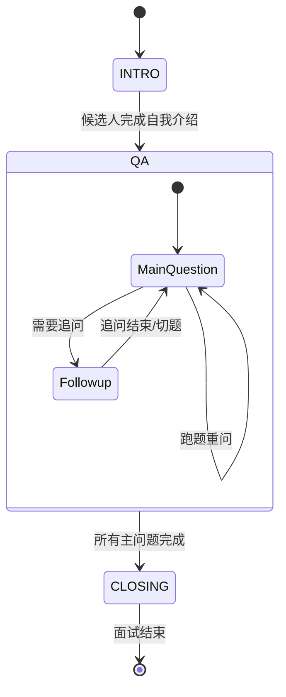

# Realtime Turn 编排器技术文档

## 📝 概述

`RealtimeTurnOrchestrator` 是实时面试系统的核心业务逻辑控制层。它负责管理对话的生命周期（Turn Lifecycle）、维护面试状态机、并处理 OpenAI Realtime API 事件与业务逻辑之间的映射。

## 🏗️ 核心概念

### 1. Turn (轮次)
一个 Turn 代表了从 AI 发起提问到候选人完成回答的一个完整交互单元。
- **TurnKind**: 定义了轮次的类型，如 `INTRO_PROMPT`（开场）、`MAIN_PROMPT`（主问题）、`FOLLOWUP_PROMPT`（追问）、`REASK_PROMPT`（重问）等。
- **TurnStatus**: 跟踪轮次的状态，包括 `PENDING`（待响应）、`IN_PROGRESS`（进行中）、`COMPLETED`（已完成）、`CANCELLED`（已取消）。

### 2. TurnPlan (轮次规划)
在候选人停止说话后，系统会预先生成一个 `TurnPlan`。它包含了：
- 下一个轮次的类型。
- 轮次完成后预期进入的面试阶段（`InterviewStage`）。
- 具体的 AI 控制指令（`control_instruction`）。
- **目标题号 (`question_order_after_completion`)**：该轮次预期推进到的题号，用于 drift 校验。

### 3. BusinessTransition (业务状态转换)
只有当一个 Turn 成功 `COMPLETED`（即 AI 完整说完了指令内容且未被中断）时，才会应用业务状态转换。这确保了面试进度（如已完成题目计数）与实际对话同步。
- **Drift 校验优先**：在应用转换前，系统会先根据 Turn 固化的 `target_question_order` 进行对齐检测。如果检测到跑题，则阻断转换并进入纠偏流程。

## 🔄 状态机模型

面试过程被划分为三个核心阶段 (`InterviewStage`)：

1.  **INTRO**: 开场白与自我介绍。
2.  **QA**: 核心问答阶段，包含主问题与动态追问。
3.  **CLOSING**: 结束语与面试提交。

## 🛠️ 关键方法说明

### `create_turn(plan, ...)`
根据 `TurnPlan` 创建一个新的 `TurnContext`。这是每一轮 AI 发言的起点，它会分配一个唯一的 `turn_id` 用于追踪。

### `bind_response(response_id)`
将 OpenAI 返回的 `response.created` 事件中的 `response_id` 与当前的活跃 Turn 绑定。这使得系统能够准确识别哪一段 AI 语音对应哪一个业务逻辑轮次。

### `complete_turn(response_id, usage)`
当收到 `response.done` 时调用。它会聚合该轮次的所有转写文本（Transcript），计算 Token 消耗，并将 Turn 标记为完成。

### `create_business_transition(plan, turn)`
这是状态推进的守门员。它会检查 Turn 的状态，只有在成功完成时才生成 `BusinessTransition` 对象，指导主流程推进 `current_main_question_order` 等计数器。

## 🛡️ 异常处理机制

- **打断处理 (Cancellation)**：如果候选人在 AI 发言时说话，前端会触发 `response.cancel`。编排器会将当前 Turn 标记为 `CANCELLED`，且**不触发**业务状态转换，确保面试进度不会因为 AI 被打断而错误推进。
- **超时重问 (Re-ask)**：如果候选人长时间未响应，系统会生成一个 `REASK_PROMPT` 类型的 Turn，用于礼貌提醒，同时保持当前题目进度不变。

## 📊 统计与监控

编排器实时维护以下统计指标，用于面试后的质量分析：
- `turns_created` / `turns_completed`: 轮次转化率。
- `turns_cancelled`: AI 被打断的频率。
- `transcript`: 每一轮对话的完整文本记录。
