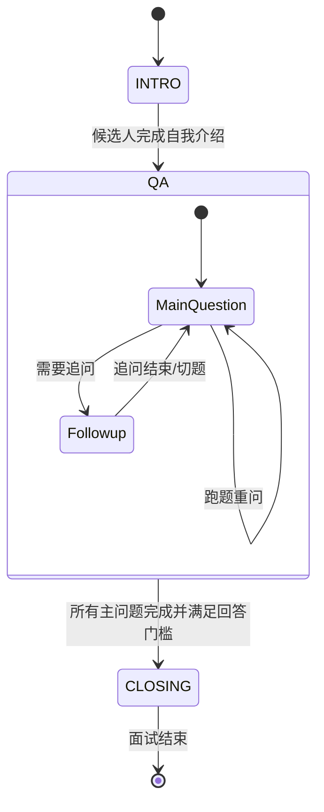

# Realtime Turn 编排器技术文档

## 📝 概述

`RealtimeTurnOrchestrator` 是实时面试系统的核心业务逻辑控制层。它负责管理对话的生命周期（Turn Lifecycle）、维护面试状态机、并处理 OpenAI Realtime API 事件与业务逻辑之间的映射。

## 🏗️ 核心概念

### 1. Turn (轮次)
一个 Turn 代表了从 AI 发起提问到候选人完成回答的一个完整交互单元。
- **TurnKind**: 定义了轮次的类型，如 `INTRO_PROMPT`（开场）、`MAIN_PROMPT`（主问题）、`FOLLOWUP_PROMPT`（追问）、`REASK_PROMPT`（重问）等。
- **TurnStatus**: 跟踪轮次的状态，包括 `PENDING`（待响应）、`IN_PROGRESS`（进行中）、`COMPLETED`（已完成）、`CANCELLED`（已取消）。

### 2. TurnPlan (轮次规划)
在候选人停止说话后，系统会预先生成一个 `TurnPlan`。它包含了：
- 下一个轮次的类型。
- 轮次完成后预期进入的面试阶段（`InterviewStage`）。
- 具体的 AI 控制指令（`control_instruction`）。
- **目标题号 (`question_order_after_completion`)**：该轮次预期推进到的题号，用于 drift 校验。

### 3. BusinessTransition (业务状态转换)
只有当一个 Turn 成功 `COMPLETED`（即 AI 完整说完了指令内容且未被中断）时，才会应用业务状态转换。这确保了面试进度（如已完成题目计数）与实际对话同步。
- **Drift 校验优先**：在应用转换前，系统会先根据 Turn 固化的 `target_question_order` 进行对齐检测。如果检测到跑题，则阻断转换并进入纠偏流程。

## 🔄 状态机模型

面试过程被划分为三个核心阶段 (`InterviewStage`)：

1.  **INTRO**: 开场白与自我介绍。
2.  **QA**: 核心问答阶段，包含主问题与动态追问。
3.  **CLOSING**: 结束语与面试提交。

## 🛠️ 关键方法说明

### `decide_next_turn_after_candidate_input()`
在候选人停止说话（`speech_stopped`）后调用，先尝试独立文本 LLM 决策，再映射为 `TurnPlan`。
- **决策输入最小化**：仅传入当前阶段、当前题、候选人最新发言、最近 2-4 轮对话摘要，控制 token 与延迟。
- **动作枚举**：`followup | next_question | answer_candidate_question | clarify | finish_interview`。
- **动作白名单约束**：每轮动态下发 `allowed_actions`，决策输出必须命中白名单（解析层二次校验）。
- **提前结束硬保护**：当 `main_questions_completed < main_count_target` 时，`finish_interview` 会被服务端阻断并改道到继续流程（优先 `next_question`）。
- **超时与失败兜底**：当决策超时、JSON 解析失败或 action 非法时，自动回退到 legacy 规则规划器。

### `legacy_rule_plan_next_turn_after_candidate_input()`
当决策层失败时启用的规则规划器，保持原有行为不变：
- **追问优先逻辑**：在 `QA` 阶段，系统会优先判断当前题目是否需要追问（`followups_used_for_current < followup_limit`）。只有在不追问时，才会判断是否进入 `CLOSING`。这确保了最后一题也能正常触发追问。
- **回答有效性门槛 (Answer Gate)**：在进入 `CLOSING` 阶段前，系统会校验候选人最后一题的回答质量。
    - **门槛条件**：去标点后长度需达到 `REALTIME_MIN_MAIN_ANSWER_CHARS`（默认 12），且不能仅包含确认词（如“嗯”、“好的”）。
    - **拦截处理**：若未达门槛，系统将生成 `REASK_PROMPT` 而非 `CLOSING_PROMPT`，引导候选人补充更多细节。

### `create_turn(plan, ...)`
根据 `TurnPlan` 创建一个新的 `TurnContext`。这是每一轮 AI 发言的起点，它会分配一个唯一的 `turn_id` 用于追踪。

### `bind_response(response_id)`
将 OpenAI 返回的 `response.created` 事件中的 `response_id` 与当前的活跃 Turn 绑定。这使得系统能够准确识别哪一段 AI 语音对应哪一个业务逻辑轮次。

### `complete_turn(response_id, usage)`
当收到 `response.done` 时调用。它会聚合该轮次的所有转写文本（Transcript），计算 Token 消耗，并将 Turn 标记为完成。

### `create_business_transition(plan, turn)`
这是状态推进的守门员。它会检查 Turn 的状态，只有在成功完成时才生成 `BusinessTransition` 对象，指导主流程推进 `current_main_question_order` 等计数器。

### 3. Context Reset (Instruction重置)

为了保持 AI 面试官在每一道主问题以及结束阶段的专注度，系统支持在关键节点自动清理对话历史（Instruction Reset）。

- **触发时机**：
    - **进入新主问题**：当从开场进入第一题，或从上一题切换到下一题时。
    - **进入结束阶段 (Closing)**：当所有主问题完成，AI 准备进行面试总结和结语时。
- **实现方式**：发送 `session.update` 事件，重新注入基础 `instructions`。这在 Realtime API 中起到了“软重置”作用，确保 AI 不会被之前的对话细节（如上一题的讨论内容）干扰当前的指令执行。
- **配置项**：`REALTIME_CONTEXT_RESET_MODE` (默认 `per_main_question`)。

## ⚙️ 决策层配置

- `REALTIME_DECISION_LAYER_ENABLED`：是否启用独立决策层（默认 `true`）。
- `REALTIME_DECISION_TIMEOUT_MS`：决策调用超时阈值（默认 `800ms`）。
- `REALTIME_DECISION_HISTORY_TURNS`：决策上下文保留的最近轮次数（默认 `3`）。
- `REALTIME_DECISION_MAX_CHARS`：决策输入文本截断上限（默认 `1200`）。
- `REALTIME_DECISION_MODEL`：独立文本决策模型（默认 `gpt-4o-mini`）。

## 🧭 观测事件

新增结构化事件用于观测决策层健康度：
- `decision_layer.requested`
- `decision_layer.succeeded`
- `decision_layer.fallback`
- `decision_layer.mapped_to_plan`
- `decision_layer.finish_blocked`

## 🛡️ 异常处理机制

- **打断处理 (Cancellation)**：如果候选人在 AI 发言时说话，前端会触发 `response.cancel`。编排器会将当前 Turn 标记为 `CANCELLED`，且**不触发**业务状态转换，确保面试进度不会因为 AI 被打断而错误推进。
- **超时重问 (Re-ask)**：如果候选人长时间未响应，系统会生成一个 `REASK_PROMPT` 类型的 Turn，用于礼貌提醒，同时保持当前题目进度不变。

## 📊 统计与监控

编排器实时维护以下统计指标，用于面试后的质量分析：
- `turns_created` / `turns_completed`: 轮次转化率。
- `turns_cancelled`: AI 被打断的频率。
- `transcript`: 每一轮对话的完整文本记录。
