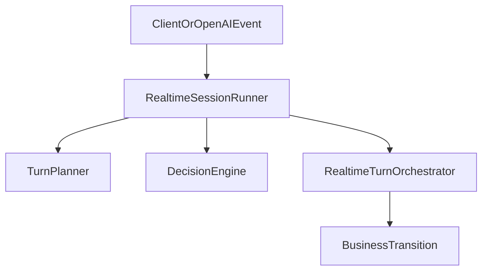
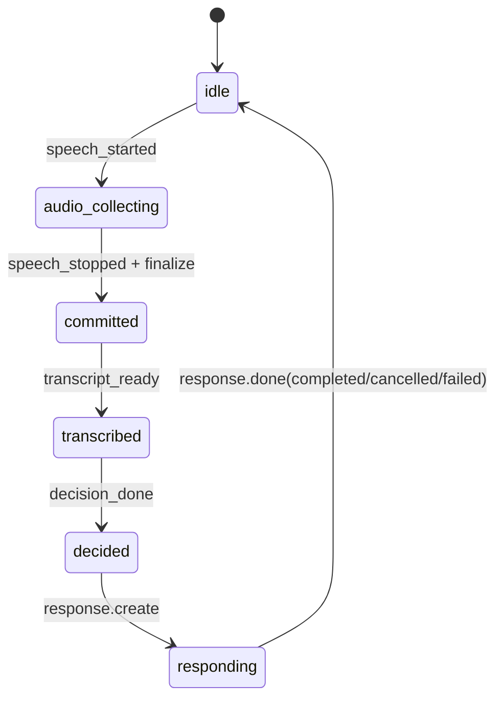

# Realtime Turn 编排器技术文档

## 概述

当前 realtime 后端不再由单个巨型 `realtime.py` 闭包同时处理音频、转写、决策、状态推进，而是拆成两层协作：

- `RealtimeSessionRunner`
  - 负责单一线性 Pipeline 的推进
  - 负责并发门闩和事件顺序
- `RealtimeTurnOrchestrator`
  - 负责 turn 生命周期
  - 负责只有在 AI 真正完成时才推进业务状态

这两个组件共同保证：

`candidate_audio -> transcription -> decision -> ai_response`

## 角色分工



### `RealtimeSessionRunner` 负责什么

文件：[`backend/app/services/realtime/session_runner.py`](../../backend/app/services/realtime/session_runner.py)

- 接收浏览器消息和 OpenAI 上游事件
- 维护 `pipeline_lock`
- 维护 `decision_pending`
- 统一执行 `finalize_candidate_segment()`
- 统一发送 `response.create`
- 在 `response.done(completed)` 后调用 orchestrator 完成 turn 并推进状态

### `RealtimeTurnOrchestrator` 负责什么

文件：[`backend/app/services/realtime_turn_orchestrator.py`](../../backend/app/services/realtime_turn_orchestrator.py)

- 为每一轮 AI 回复创建 `TurnContext`
- 用 `response_id` 绑定具体 turn
- 聚合 AI transcript
- 标记 turn 为 `COMPLETED` / `CANCELLED` / `FAILED`
- 只有 turn 真正 `COMPLETED` 时才生成 `BusinessTransition`

## 核心概念

### 1. Turn

一个 Turn 表示一轮 AI 发言的业务生命周期。

- `TurnKind`
  - `INTRO_PROMPT`
  - `MAIN_PROMPT`
  - `FOLLOWUP_PROMPT`
  - `REASK_PROMPT`
  - `CLOSING_PROMPT`
- `TurnStatus`
  - `PENDING`
  - `IN_PROGRESS`
  - `COMPLETED`
  - `CANCELLED`
  - `FAILED`

### 2. TurnPlan

`TurnPlan` 是决策层或 fallback planner 给出的“下一轮 AI 要怎么说”的结构化结果，主要包含：

- `turn_kind`
- `stage_after_completion`
- `question_order_after_completion`
- `expected_reply_after_completion`
- `control_instruction`
- `advance_main_completed`
- `next_followups_used`
- `next_clarifies_used`

### 3. BusinessTransition

`BusinessTransition` 是真正允许落到 `SessionState` 的状态变更，包含：

- 新阶段 `new_stage`
- 新题号 `new_question_order`
- 新的候选人期望回复类型 `new_expected_reply`
- 是否推进主问题完成数 `advance_main_completed`
- 新的追问/澄清计数

## 为什么不能在 `speech_stopped` 直接推进

这是旧架构最容易出错的地方。

`speech_stopped` 只说明：

- 当前候选人音频分段结束了

它并不说明：

- 转写已经完成
- 决策层已经看到最新文本
- AI 已经完成本轮回复

如果在 `speech_stopped` 直接推进题号或 closing，就会出现：

- 候选人还在澄清，但系统已切下一题
- AI 回复被打断，但计数器已经前进
- 一个 segment 被 `speech_stopped` 和 `end_turn` 双重触发

因此当前规则是：

1. `speech_stopped` 只产生 segment
2. `finalize_candidate_segment()` 完成 commit、等转写、做决策
3. 由 `response.create` 发起 AI 回复
4. 只有 `response.done(completed)` 后 orchestrator 才允许推进业务状态

## 当前状态机

### 业务阶段

- `INTRO`
- `QA`
- `CLOSING`

### Pipeline 阶段

由 [`backend/app/services/realtime/state.py`](../../backend/app/services/realtime/state.py) 中的 `PipelineStage` 描述：

- `idle`
- `audio_collecting`
- `committed`
- `transcribed`
- `decided`
- `responding`



## 关键方法协作

### 1. `finalize_candidate_segment()`

位置：[`backend/app/services/realtime/session_runner.py`](../../backend/app/services/realtime/session_runner.py)

职责：

- 拿 `pipeline_lock`
- 防止 `decision_pending` 下重复推进
- commit 音频
- 等待候选人转写
- 触发决策层或 fallback planner
- 单点发送 `response.create`

这是“候选人回答 -> 转写 -> 决策 -> AI 回复”链路的唯一推进入口。

### 2. `_decide_next_turn()`

职责：

- 先构造 `TurnPlanner`
- 生成 fallback plan
- 尝试调用 `DecisionEngine`
- 将动作映射为 `TurnPlan`
- 决策失败时回退到 `legacy_plan()`

### 3. `create_turn(plan, ...)`

位置：[`backend/app/services/realtime_turn_orchestrator.py`](../../backend/app/services/realtime_turn_orchestrator.py)

职责：

- 为本轮 AI 回复创建 `TurnContext`
- 固化本轮目标题号、目标回复类型
- 让后续 `response.created` / `response.done` 可以准确绑定

### 4. `bind_response(response_id)`

职责：

- 将 OpenAI 的 `response.id` 和当前 active turn 绑定
- 将 turn 状态从 `PENDING` 切到 `IN_PROGRESS`

### 5. `complete_turn(response_id, usage)`

职责：

- 聚合 transcript
- 标记 turn 为 `COMPLETED`
- 记录 usage
- 释放 active turn

### 6. `create_business_transition(plan, turn)`

职责：

- 只有在 `turn.status == COMPLETED` 时才返回 `BusinessTransition`
- `CANCELLED` / `FAILED` / `PENDING` 都不得推进业务状态

这正是避免“AI 没说完但题号先走了”的关键守门点。

## 决策层与 orchestrator 的关系

决策层并不直接修改业务状态。它只负责给出：

```json
{
  "action": "followup | next_question | clarify | finish_interview",
  "reason": "..."
}
```

后端必须经过以下步骤才会真正落地：

1. `DecisionEngine` 校验 action
2. `TurnPlanner` 映射为 `TurnPlan`
3. `RealtimeTurnOrchestrator.create_turn()` 创建 turn
4. OpenAI 完成真实回复
5. `RealtimeTurnOrchestrator.create_business_transition()` 返回 transition
6. `SessionState` 应用该 transition

也就是说：

- 决策层只决定“应该怎么说”
- orchestrator 决定“什么时候才算真正说完，可以推进”

## Drift Guard

当前 orchestrator 仍保留主问题对齐检查（drift guard）：

- 若 `MAIN_PROMPT` 的 AI transcript 与目标主问题不对齐
- 会阻断正常 transition
- 改为生成 `REASK_PROMPT`

这样可以减少以下问题：

- 模型没按预期问到目标题
- 状态已进入下一题，但实际话术仍停留在上一题

## 观测事件

目前与编排器强相关的结构化事件包括：

- `turn.created`
- `turn.completed`
- `turn.cancelled`
- `turn.failed`
- `turn.transition_applied`
- `decision_layer.requested`
- `decision_layer.succeeded`
- `decision_layer.fallback`
- `pipeline.segment_started`
- `pipeline.committed`
- `pipeline.transcribed`
- `pipeline.responding`
- `pipeline.completed`

## 设计收益

相较旧版闭包式流程，本次协作模型带来的直接收益是：

- 去掉 `speech_stopped` / `end_turn` 双触发导致的竞态
- 让决策层一定基于尽可能新的 transcript 工作
- 让业务状态推进与真实 AI 回复完成保持一致
- 让测试可以分别覆盖：
  - pipeline 顺序
  - 决策回退
  - turn 生命周期
  - business transition 守门

## 相关文档

- [实时语音面试功能](../03_features/03.2_realtime_interview.md)
- [OpenAI Realtime API 集成](04.1_realtime_api.md)
- [日志系统](../05_logging.md)
