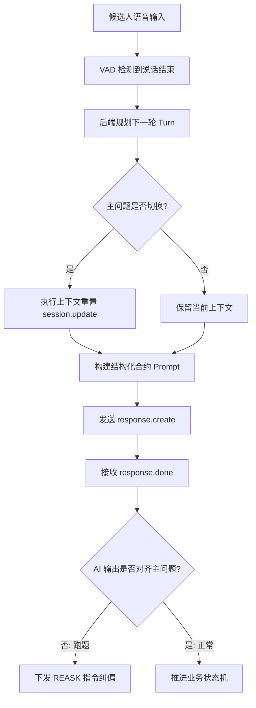

# Realtime 面试防跑题技术实现方案

## 📝 概述

针对 Realtime AI 面试官在流式生成过程中容易出现的跑题、上下文污染及指令权重下降等问题，本系统实现了一套基于“后端驱动状态机”的防跑题机制。该方案通过结构化 Prompt 合约、跨问题上下文隔离及业务状态护栏，将 AI 从“自由聊天模式”切换为“严格问答模式”。

## 🛠️ 核心机制

### 1. 结构化 Prompt 合约 (Structured Prompt Contract)

不再依赖模糊的自然语言指令，而是使用显式的结构化标签来定义每一轮对话的边界。

**实现位置**：`backend/app/api/realtime.py` 中的指令构建函数。

**模板示例**：
```text
[INTERVIEW_STAGE] qa_main
[QUESTION_ID] 1
[QUESTION] 请介绍一个你参与的 AI Agent 项目。
[REFERENCE] 考察项目复杂度、角色及技术选型。
[ALLOWED_ACTION] ask_only
[INSTRUCTION] 你必须且仅能提出上述主问题。提问时请先说明'主问题第1题'。禁止解释、禁止闲聊、禁止引入新话题。
```

### 2. 跨主问题上下文隔离 (Context Isolation)

为了防止旧话题（如上一题的讨论或 Intro 阶段的闲聊）污染新题目，系统在切换主问题时执行上下文重置。

**逻辑规则**：
- **同题保留**：在同一个主问题的追问（Follow-up）过程中，保留对话历史以维持连贯性。
- **跨题重置**：当 `question_order` 发生变化（如从 Intro 进入第一题，或从第一题进入第二题）时，触发重置。

**实现方式**：
在发送 `response.create` 前，通过 `session.update` 重新注入初始系统指令。这在 Realtime API 中能有效降低历史 Token 对当前生成的干扰权重。

### 3. 业务状态护栏 (Drift Guard)

系统对 AI 的输出进行实时对齐检测，一旦发现跑题，立即拦截状态推进并强制纠偏。

**流程控制**：
1. **对齐检测**：在 `response.done` 事件中，调用 `is_main_question_aligned` 校验 AI 文本是否包含预期的主问题关键词。校验目标使用当前 Turn 固化的 `target_question_order`，而非全局业务状态，以解决状态切换时的时序竞态。
2. **阻断推进**：如果检测到未对齐（Drift Detected），系统**不调用** `apply_business_transition`，即不增加已完成题目计数。
3. **强制重问**：系统立即下发一个 `REASK_PROMPT`，指令 AI 必须且仅能重述当前主问题，直到对齐成功。

### 4. 音频提交门控 (Commit Gating)

为了避免空音频提交导致的 `input_audio_buffer_commit_empty` 错误，系统引入了 `has_uncommitted_audio` 门控。
- **状态维护**：每当收到客户端 `audio` 事件时，标记 `has_uncommitted_audio = true`。
- **按需提交**：仅在门控为 `true` 时才执行 `input_audio_buffer.commit`。
- **状态重置**：在收到 `committed` 或 `commit_empty` 错误后，重置门控为 `false`。

## 📊 数据流图



## ⚙️ 配置项

在 `backend/app/config.py` 中可以通过以下参数控制该机制：

| 配置项 | 默认值 | 说明 |
| :--- | :--- | :--- |
| `REALTIME_STRICT_PROMPT_ENABLED` | `true` | 是否启用结构化 Prompt 和跑题拦截机制 |
| `REALTIME_CONTEXT_RESET_MODE` | `per_main_question` | 上下文重置模式：`none` 或 `per_main_question` |

## 🎯 预期效果

- **消除“幻觉追问”**：AI 不会根据上一题的语境在下一题开始前做无谓的总结或扩展。
- **强制回归流程**：即使候选人试图带偏话题，AI 也会在下一轮被后端强制拉回当前面试题目。
- **提高指令遵循度**：通过每轮重注指令，解决了长对话中 System Prompt 影响力减弱的问题。
