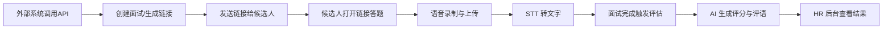

# 1.0 系统概述

## 1.1 项目简介

AI 招聘面试系统是一个端到端的智能面试解决方案，旨在通过自动化语音面试流程，减少人工介入，提升招聘效率。系统支持从面试创建、候选人语音答题、AI 自动评分到 HR 后台管理的完整闭环。

## 1.2 核心价值

- **自动化面试流程**：候选人通过链接自主完成面试，无需人工协调时间
- **语音交互**：支持语音录制与自动转文字，降低候选人作答门槛
- **AI 智能评估**：自动生成面试问题并评分，减少人工评审工作量
- **统一后台管理**：HR 可集中查看所有面试记录、评分和详情

## 1.3 技术架构

### 技术栈

- **后端**：Python + FastAPI
- **前端**：React + TypeScript
- **数据库**：SQLite (开发) / PostgreSQL (生产)
- **AI 服务**：OpenAI API (STT + LLM)

### 系统架构图

```
┌─────────────┐         ┌──────────────┐         ┌─────────────┐
│  外部系统   │────────>│   FastAPI    │────────>│  Database   │
│ (AI小替)   │   创建   │   Backend    │   存储   │  (SQLite)   │
└─────────────┘   面试   └──────────────┘   数据   └─────────────┘
                              │    │
                              │    └───────────────> OpenAI API
                              │                      (STT + LLM)
                              │
                    ┌─────────┴─────────┐
                    │                   │
            ┌───────▼────┐      ┌───────▼────┐
            │  候选人端   │      │  HR 后台   │
            │  (React)   │      │  (React)   │
            └────────────┘      └────────────┘
```

## 1.4 核心流程



### 流程说明

1. **面试创建**：外部系统或 HR 通过 API 创建面试，系统生成唯一链接
2. **候选人作答**：候选人打开链接，逐题录音回答
3. **语音处理**：每题音频上传后，调用 STT 服务转为文字
4. **自动评估**：面试结束后，汇总所有回答，调用 LLM 生成评分和评语
5. **后台管理**：HR 登录后台查看所有面试列表和详细结果

## 1.5 用户角色

| 角色       | 主要功能                                    |
|----------|------------------------------------------|
| 外部系统   | 调用 API 创建面试，获取候选人面试链接          |
| 候选人     | 通过链接访问面试页面，语音回答问题               |
| HR/管理员  | 登录后台，查看面试列表、评分、详情，创建新面试     |

## 1.6 数据模型概览

系统包含 3 个核心数据表：

- **admin_users**：后台管理员账号（用户名 + 密码哈希）
- **interviews**：面试记录（候选人信息、问题集、状态、评估结果）
- **answers**：答题记录（关联面试、音频文件、转文字结果）

## 1.7 部署架构

### 开发环境
- **后端**：`uvicorn app.main:app --reload` (端口 8000)
- **前端**：`npm run dev` (端口 5173)
- **数据库**：SQLite 本地文件

### 生产环境建议
- **后端**：Docker + Gunicorn + FastAPI
- **前端**：Nginx 静态托管
- **数据库**：PostgreSQL
- **文件存储**：S3 或对象存储服务

## 1.8 系统特点

### MVP 阶段功能
- ✅ 面试创建与链接分发
- ✅ 候选人语音答题界面
- ✅ STT 语音转文字（占位实现）
- ✅ AI 评分（占位实现）
- ✅ HR 后台登录与面试列表
- ✅ 面试详情查看

### 暂不支持功能
- ❌ 实时流式语音对话
- ❌ 复杂题库配置（导入/权重）
- ❌ 多岗位精细化管理
- ❌ 高级统计报表

## 1.9 环境要求

### 后端依赖
- Python 3.9+
- FastAPI
- SQLAlchemy
- Pydantic
- OpenAI SDK (可选)

### 前端依赖
- Node.js 16+
- React 18+
- TypeScript
- React Router
- Axios

## 1.10 快速启动

请参考项目根目录的 [README.md](../README.md) 获取详细启动步骤。

## 1.11 文档导航

- **2.0_feature_overview.md**：功能模块概览
- **2.1_interview_creation.md**：面试创建功能
- **2.2_candidate_interview.md**：候选人面试流程
- **2.3_ai_evaluation.md**：AI 评估机制
- **2.4_admin_backend.md**：HR 后台管理
