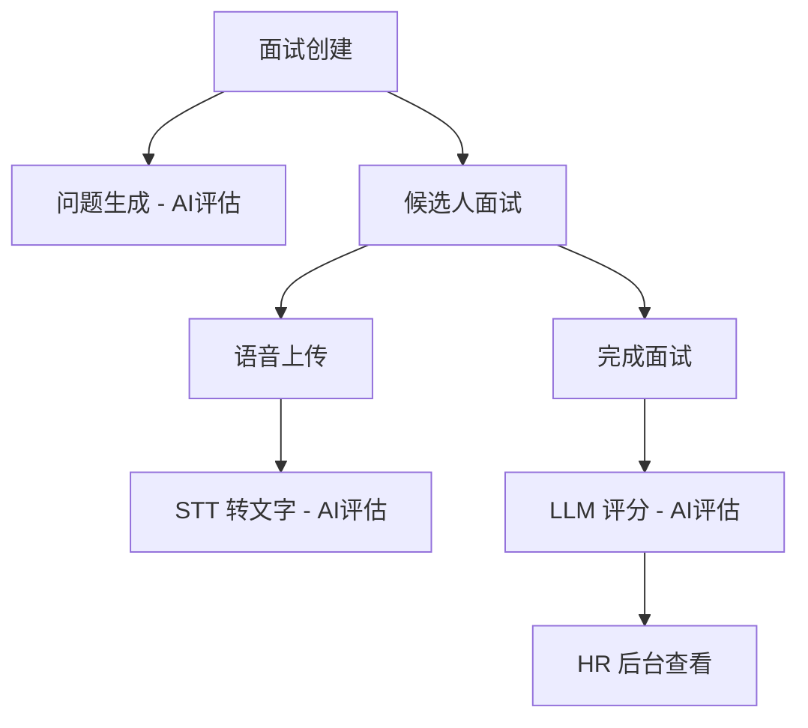

# 2.0 功能模块概览

## 2.1 功能全景图

```
┌─────────────────────────────────────────────────────────────────┐
│                      AI 招聘面试系统                             │
└─────────────────────────────────────────────────────────────────┘
                              │
        ┌─────────────────────┼─────────────────────┐
        │                     │                     │
┌───────▼────────┐   ┌────────▼───────┐   ┌────────▼──────────┐
│  面试创建模块   │   │  候选人面试模块  │   │   HR 后台模块     │
│  (2.1)         │   │  (2.2)          │   │   (2.4)           │
└────────────────┘   └─────────────────┘   └───────────────────┘
                              │
                     ┌────────▼────────┐
                     │  AI 评估模块     │
                     │  (2.3)          │
                     └─────────────────┘
```

## 2.2 模块概述

### 2.1 面试创建模块
**负责**：生成面试记录、问题集和候选人访问链接

**核心功能**：
- API 接口：接收外部系统/HR 的创建请求
- 问题生成：根据岗位和简历生成面试题目（可选 LLM 或固定模板）
- Token 生成：生成唯一且安全的面试链接 Token
- 数据持久化：将面试信息写入数据库

**用户角色**：外部系统、HR

**详细文档**：[2.1_interview_creation.md](2.1_interview_creation.md)

---

### 2.2 候选人面试模块
**负责**：为候选人提供友好的面试答题界面

**核心功能**：
- 面试链接访问与验证
- 逐题展示问题
- 语音录制与上传
- 答题进度管理
- 面试完成确认

**用户角色**：候选人

**详细文档**：[2.2_candidate_interview.md](2.2_candidate_interview.md)

---

### 2.3 AI 评估模块
**负责**：自动化的问题生成与面试评分

**核心功能**：
- 问题生成：基于岗位和简历生成针对性问题（LLM）
- 语音转文字：调用 STT 服务将音频转为文本
- 智能评分：汇总候选人回答，调用 LLM 生成评分与评语
- 结果结构化：输出总分、维度分、文字评价

**用户角色**：系统自动执行

**详细文档**：[2.3_ai_evaluation.md](2.3_ai_evaluation.md)

---

### 2.4 HR 后台模块
**负责**：为 HR 提供统一的面试管理界面

**核心功能**：
- 登录认证（JWT）
- 面试列表展示（分页、筛选）
- 面试详情查看（问答、评分、评语）
- 创建新面试
- 删除面试记录

**用户角色**：HR、管理员

**详细文档**：[2.4_admin_backend.md](2.4_admin_backend.md)

---

## 2.3 功能矩阵

| 模块          | 前端页面                        | 后端 API                                      | 数据库操作         |
|-------------|-----------------------------|---------------------------------------------|-----------------|
| 面试创建      | 后台创建弹窗                     | `POST /api/interviews/create`               | 写入 interviews  |
| 候选人面试     | `/interview/:token`          | `GET /api/interviews/{token}`               | 读取 interviews  |
|              | `/interview/:token`          | `POST /api/interviews/{token}/answer`       | 写入 answers     |
|              | `/interview/:token/done`     | `POST /api/interviews/{token}/complete`     | 更新 interviews  |
| AI 评估       | -                            | 内部服务（question_generator, stt, evaluator）| 读写 interviews  |
| HR 后台       | `/admin/login`               | `POST /api/admin/login`                     | 读取 admin_users |
|              | `/admin/interviews`          | `GET /api/admin/interviews`                 | 读取 interviews  |
|              | `/admin/interviews/:id`      | `GET /api/admin/interviews/{id}`            | 读取 interviews + answers |
|              | `/admin/interviews`          | `DELETE /api/admin/interviews/{id}`         | 删除 interviews  |

## 2.4 功能依赖关系



### 依赖说明
1. **面试创建** → **问题生成**：创建面试时需要调用 AI 评估模块生成问题
2. **候选人面试** → **STT 转文字**：每题答题后需要调用 AI 评估模块转文字
3. **完成面试** → **LLM 评分**：面试完成时触发 AI 评估模块进行智能评分
4. **所有模块** → **HR 后台**：HR 后台需要展示所有模块的数据结果

## 2.5 功能优先级（MVP）

### P0 - 核心功能（必须实现）
- ✅ 面试创建 API
- ✅ 候选人答题界面
- ✅ 语音录制与上传
- ✅ HR 后台登录
- ✅ 面试列表展示
- ✅ 面试详情查看

### P1 - 重要功能（占位实现，后续优化）
- 🔄 STT 语音转文字（当前返回占位文本）
- 🔄 LLM 问题生成（当前使用固定模板）
- 🔄 LLM 智能评分（当前返回固定评分）

### P2 - 增强功能（暂不实现）
- ❌ 实时流式语音对话
- ❌ 题库配置与管理
- ❌ 多岗位模板
- ❌ 高级统计报表
- ❌ 候选人身份验证

## 2.6 技术实现概览

### 前端技术栈
- **框架**：React 18 + TypeScript
- **路由**：React Router v6
- **HTTP 客户端**：Axios
- **音频录制**：MediaRecorder API (浏览器原生)
- **样式**：CSS-in-JS (内联样式)

### 后端技术栈
- **框架**：FastAPI
- **ORM**：SQLAlchemy
- **认证**：JWT (python-jose)
- **密码加密**：bcrypt (passlib)
- **文件上传**：FastAPI UploadFile
- **AI 服务**：OpenAI SDK (可选)

### 数据库设计
- **admin_users**：管理员账号表
- **interviews**：面试主表（包含问题集和评估结果 JSON）
- **answers**：答题明细表（关联面试 ID）

## 2.7 数据流向

```
创建面试流程：
外部系统 → POST /api/interviews/create → 生成问题 → 写入 DB → 返回链接

答题流程：
候选人 → GET /api/interviews/{token} → 读取问题 → 录音 →
POST /api/interviews/{token}/answer → STT → 写入 answers

完成流程：
候选人 → POST /api/interviews/{token}/complete → 读取 answers →
LLM 评分 → 更新 interviews.evaluation_result

查看流程：
HR → POST /api/admin/login → JWT →
GET /api/admin/interviews → 读取所有 interviews → 展示列表 →
GET /api/admin/interviews/{id} → 读取 interviews + answers → 展示详情
```

## 2.8 扩展性设计

### 易于扩展的点
- **问题生成策略**：可替换为不同的 LLM 模型或规则引擎
- **STT 服务**：可替换为不同的语音识别服务（Whisper、阿里云、腾讯云）
- **评分算法**：可自定义评分维度和权重
- **存储方式**：音频文件可切换到 S3、OSS 等对象存储
- **数据库**：可无缝切换到 PostgreSQL、MySQL

### 模块化架构
每个功能模块相对独立，便于：
- 单独测试
- 按需替换实现
- 水平扩展

## 2.9 下一步阅读

选择您关心的功能模块，查看详细文档：

- **[2.1 面试创建模块](2.1_interview_creation.md)**：了解如何创建面试并生成链接
- **[2.2 候选人面试模块](2.2_candidate_interview.md)**：了解候选人答题流程
- **[2.3 AI 评估模块](2.3_ai_evaluation.md)**：了解 AI 问题生成与评分机制
- **[2.4 HR 后台模块](2.4_admin_backend.md)**：了解后台管理功能
