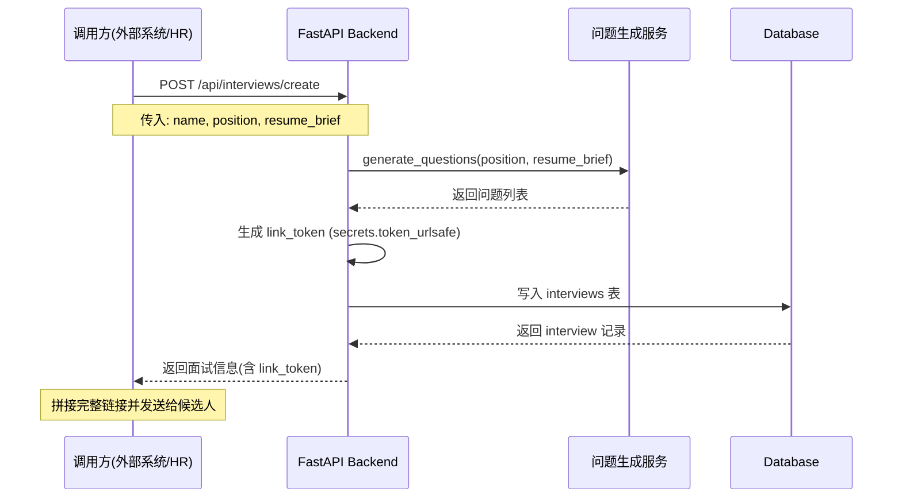

# 2.1 面试创建功能

## 功能概述

面试创建模块负责接收外部系统或 HR 的请求，生成面试记录、问题集和唯一访问链接。该模块是整个面试流程的起点。

## 使用场景

1. **外部系统集成**：AI 小替或简历筛选系统调用 API 自动创建面试
2. **HR 手动创建**：HR 在后台界面手动填写候选人信息并创建面试
3. **批量创建**：未来可扩展支持批量导入候选人并批量创建面试

## 功能流程



## API 规格

### 请求：POST /api/interviews/create

**端点**：`http://localhost:8000/api/interviews/create`

**请求头**：
```
Content-Type: application/json
```

**请求体**：
```json
{
  "name": "张三",
  "position": "Python 后端工程师",
  "external_id": "candidate_12345",
  "resume_brief": "3年 Python 开发经验，熟悉 FastAPI 和 Django..."
}
```

**字段说明**：

| 字段           | 类型   | 必填 | 说明                                    |
|--------------|------|------|---------------------------------------|
| name         | str  | 否   | 候选人姓名                               |
| position     | str  | 否   | 申请岗位                                 |
| external_id  | str  | 否   | 外部系统的候选人 ID（用于后续关联）          |
| resume_brief | str  | 否   | 简历摘要或背景信息（用于生成针对性问题）       |

**响应**：
```json
{
  "id": 1,
  "name": "张三",
  "position": "Python 后端工程师",
  "external_id": "candidate_12345",
  "resume_brief": "3年 Python 开发经验...",
  "status": "created",
  "link_token": "abc123xyz789...",
  "question_set": [
    {"order_index": 0, "question_text": "请简单介绍一下你自己"},
    {"order_index": 1, "question_text": "你为什么应聘这个岗位？"},
    {"order_index": 2, "question_text": "你最大的优势是什么？"}
  ],
  "evaluation_result": null,
  "created_at": "2026-03-10T10:30:00",
  "completed_at": null
}
```

**字段说明**：

| 字段               | 类型        | 说明                                      |
|------------------|-----------|------------------------------------------|
| id               | int       | 面试记录的数据库 ID                         |
| link_token       | str       | 唯一访问 Token（用于生成候选人链接）           |
| question_set     | list      | 问题列表（JSON 数组）                        |
| status           | str       | 面试状态（created / in_progress / finished）|
| evaluation_result| object    | 评估结果（完成后才有值）                      |

**生成候选人链接**：
```
候选人访问链接 = http://localhost:5173/interview/{link_token}
例如: http://localhost:5173/interview/abc123xyz789...
```

## 后端实现

### 代码位置
- **路由**：[backend/app/api/interviews.py:19-36](../backend/app/api/interviews.py)
- **问题生成**：[backend/app/services/question_generator.py](../backend/app/services/question_generator.py)
- **数据模型**：[backend/app/models/interview.py](../backend/app/models/interview.py)

### 核心逻辑

```python
@router.post("/create", response_model=InterviewResponse)
def create_interview(interview_in: InterviewCreate, db: Session = Depends(get_db)):
    # 1. 生成安全的唯一 Token
    link_token = secrets.token_urlsafe(32)

    # 2. 调用问题生成服务
    questions = generate_questions(interview_in.position, interview_in.resume_brief)

    # 3. 创建面试记录
    db_interview = Interview(
        name=interview_in.name,
        position=interview_in.position,
        external_id=interview_in.external_id,
        resume_brief=interview_in.resume_brief,
        link_token=link_token,
        question_set=questions,  # JSON 格式存储
        status=InterviewStatus.CREATED
    )

    # 4. 写入数据库
    db.add(db_interview)
    db.commit()
    db.refresh(db_interview)

    return db_interview
```

### Token 生成策略

使用 Python 标准库 `secrets.token_urlsafe(32)` 生成 URL 安全的随机 Token：
- 长度：32 字节（约 43 个字符）
- 字符集：A-Z、a-z、0-9、`-`、`_`
- 安全性：密码学安全的随机数生成器

**示例 Token**：
```
zT7qK9wX-3mLpR8sY4nB6vC1aF5hG2jD0eU
```

### 问题生成服务

#### 当前实现（MVP）

```python
DEFAULT_QUESTIONS = [
    {"order_index": 0, "question_text": "请简单介绍一下你自己"},
    {"order_index": 1, "question_text": "你为什么应聘这个岗位？"},
    {"order_index": 2, "question_text": "你最大的优势是什么？"},
]

def generate_questions(position: str = None, resume_brief: str = None):
    # Placeholder: 返回固定问题
    return DEFAULT_QUESTIONS
```

#### 未来扩展（LLM 生成）

```python
async def generate_questions(position: str = None, resume_brief: str = None):
    if not position and not resume_brief:
        return DEFAULT_QUESTIONS

    prompt = f"""
    根据以下信息生成 3-5 个面试问题：
    岗位：{position or "通用岗位"}
    简历摘要：{resume_brief or "无"}

    要求：
    1. 问题针对性强，考察候选人的经验和能力
    2. 避免过于宽泛或模糊的问题
    3. 返回 JSON 格式：[{{"order_index": 0, "question_text": "..."}}, ...]
    """

    response = await openai.ChatCompletion.create(
        model="gpt-4",
        messages=[{"role": "user", "content": prompt}]
    )

    questions = json.loads(response.choices[0].message.content)
    return questions
```

## 前端实现

### 代码位置
- **创建弹窗**：[frontend/src/pages/AdminInterviews.tsx:138-233](../frontend/src/pages/AdminInterviews.tsx)
- **API 调用**：[frontend/src/api/index.ts](../frontend/src/api/index.ts)

### 界面交互流程

1. **打开创建弹窗**：HR 点击"创建面试"按钮
2. **填写表单**：输入候选人姓名、岗位、简历摘要（均为可选）
3. **提交创建**：点击"立即创建"按钮
4. **显示结果**：弹窗展示生成的面试链接
5. **复制链接**：HR 点击"复制链接"按钮，将链接发送给候选人

### 核心代码

```typescript
const handleCreate = async () => {
  setSubmitting(true);
  try {
    const res = await createInterview(newInterview);
    const link = `${window.location.origin}/interview/${res.link_token}`;
    setCreatedLink(link);
    fetchInterviews(); // 刷新列表
  } catch (err) {
    alert('创建失败，请重试');
  } finally {
    setSubmitting(false);
  }
};
```

### API 调用实现

```typescript
export const createInterview = async (data: {
  name?: string;
  position?: string;
  resume_brief?: string;
  external_id?: string;
}) => {
  const response = await axios.post(
    'http://localhost:8000/api/interviews/create',
    data
  );
  return response.data;
};
```

## 数据存储

### interviews 表结构

| 字段               | 类型       | 说明                                    |
|------------------|----------|----------------------------------------|
| id               | Integer  | 主键                                    |
| name             | String   | 候选人姓名（可空）                        |
| position         | String   | 申请岗位（可空）                          |
| external_id      | String   | 外部系统 ID（可空）                       |
| resume_brief     | String   | 简历摘要（可空）                          |
| status           | String   | 状态（created/in_progress/finished）    |
| link_token       | String   | 唯一访问 Token（唯一索引）                 |
| question_set     | JSON     | 问题列表                                 |
| evaluation_result| JSON     | 评估结果（可空）                          |
| created_at       | DateTime | 创建时间                                 |
| completed_at     | DateTime | 完成时间（可空）                          |

### 示例记录

```json
{
  "id": 1,
  "name": "张三",
  "position": "Python 后端工程师",
  "external_id": "candidate_12345",
  "resume_brief": "3年 Python 开发经验...",
  "status": "created",
  "link_token": "zT7qK9wX-3mLpR8sY4nB6vC1aF5hG2jD0eU",
  "question_set": [
    {"order_index": 0, "question_text": "请简单介绍一下你自己"},
    {"order_index": 1, "question_text": "你为什么应聘这个岗位？"},
    {"order_index": 2, "question_text": "你最大的优势是什么？"}
  ],
  "evaluation_result": null,
  "created_at": "2026-03-10T10:30:00.123456",
  "completed_at": null
}
```

## 错误处理

### 常见错误场景

| 错误场景             | HTTP 状态码 | 处理方式                         |
|-------------------|-----------|--------------------------------|
| 数据库连接失败         | 500       | 返回通用错误信息                   |
| 问题生成服务失败       | 500       | 回退到默认问题列表                 |
| Token 生成冲突        | 500       | 重试生成（理论上概率极低）           |
| 请求参数格式错误       | 422       | Pydantic 自动校验并返回错误详情     |

### 示例错误响应

```json
{
  "detail": [
    {
      "loc": ["body", "name"],
      "msg": "field required",
      "type": "value_error.missing"
    }
  ]
}
```

## 安全性考虑

### Token 安全性
- 使用密码学安全的随机数生成器
- Token 长度足够（32 字节），暴力破解成本极高
- Token 存储在数据库中，有唯一索引约束
- 不暴露数据库 ID，防止遍历攻击

### 输入验证
- 所有字段均为可选，但会进行类型校验
- `resume_brief` 等文本字段应限制长度（未来可添加）
- 防止 SQL 注入：使用 SQLAlchemy ORM 参数化查询

## 性能优化

### 当前实现
- 问题生成使用固定模板，响应速度快（< 100ms）
- Token 生成使用内存操作，性能开销可忽略
- 数据库写入为单条记录，性能足够

### 未来优化点
- 如果接入 LLM 生成问题，可添加缓存机制（相同岗位+简历返回缓存结果）
- 批量创建场景可使用数据库批量插入
- Token 生成可使用 Redis 去重（分布式场景）

## 测试建议

### 单元测试
```python
def test_create_interview():
    response = client.post("/api/interviews/create", json={
        "name": "测试候选人",
        "position": "测试岗位"
    })
    assert response.status_code == 200
    data = response.json()
    assert data["name"] == "测试候选人"
    assert data["link_token"] is not None
    assert len(data["question_set"]) > 0
```

### 集成测试
1. 调用创建 API
2. 验证数据库中是否写入记录
3. 使用返回的 `link_token` 访问候选人页面
4. 验证页面能正常加载问题

## 扩展方向

### 短期优化
- 接入真实的 LLM 问题生成服务
- 添加问题模板库（不同岗位预设不同问题）
- 支持自定义问题数量

### 长期扩展
- 支持批量导入候选人（CSV/Excel）
- 问题库管理界面（CRUD）
- 面试链接过期机制
- 面试链接访问次数限制
- 候选人信息加密存储

## 相关文档

- **[2.2 候选人面试模块](2.2_candidate_interview.md)**：了解候选人如何使用生成的链接进行面试
- **[2.3 AI 评估模块](2.3_ai_evaluation.md)**：了解问题生成的详细机制
- **[2.4 HR 后台模块](2.4_admin_backend.md)**：了解 HR 如何在后台创建和管理面试
