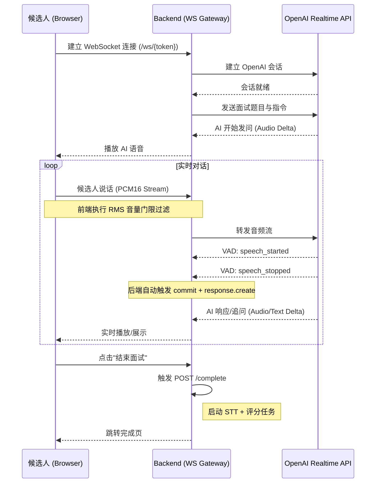

# 2.2 候选人面试功能 (Realtime 升级)

## 功能概述
候选人面试模块已升级为**实时语音对话**模式。候选人通过 WebSocket 与 AI 面试官进行实时通话，体验一问一答的交互。

## 交互流程



## 核心组件实现

### 前端：`Interview.tsx`
- **AudioContext**：处理 16kHz PCM 音频采集与播放。
- **设备选择与测试**：
  - 面试开始前提供麦克风与扬声器列表，允许用户选择特定输入/输出设备。
  - **实时音量条**：提供麦克风和扬声器的实时音量测试功能。麦克风测试通过 `AnalyserNode` 实现，扬声器测试通过播放测试音并分析输出信号实现。
- **采集链路优化**：
  - **Render Graph 保持**：为了确保 `ScriptProcessorNode` 的 `onaudioprocess` 回调在所有浏览器中稳定触发，采集链路被连接至一个静音 Gain 节点（`gain=0`）并最终输出到 `destination`。
  - **半双工音频策略 (Strategy A)**：
    - **原理**：为了解决 AI 声音被麦克风重新采集导致的回声/自回复问题，前端实现了基于时间轴的半双工控制逻辑。
    - **实现**：利用 `AudioContext.currentTime` 与预定播放结束时间 `nextStartTimeRef` 进行对比。
    - **拦截**：在 `onaudioprocess` 中，若当前时间小于 `nextStartTimeRef + 0.2s`（安全缓冲），则仅保留本地音量可视化，**停止**向后端 WebSocket 发送音频数据。
    - **预锁定**：在收到 `response.created` 事件时，提前将 `nextStartTimeRef` 推后 1.5s，确保在 AI 思考期间麦克风也是闭合的。
  - **持续音频流**：在非 AI 发言期间，前端会持续向后端发送 PCM16 音频流（包括静音片段）。这是为了确保 OpenAI 的 Server VAD 能够接收到完整的音频上下文，从而准确判定说话结束。
- **生命周期管理**：
  - **资源释放**：在设备枚举后立即停止临时流；在面试结束、连接错误或组件卸载时，统一调用 `cleanupInterview` 释放所有音频节点、停止轨道并关闭 `AudioContext`。
- **实时转写展示**：监听 `response.audio_transcript.delta` 事件，实现 AI 发言的逐字实时显示。
- **WebSocket**：管理与后端的实时双向通信。
- **状态管理**：连接中、通话中、错误处理。
- **提问限制**：面试过程支持动态配置。AI 面试官会根据 JD 中的 `main_question_count` 和 `followup_limit_per_question` 自动控制提问数量。AI 会利用题目的 `reference`（指导方向）判断候选人回答是否完整，并在确认完整后再进入下一题。
- **节奏控制与超时收尾**：
  - **动态节奏**：系统根据 `expected_duration_minutes` 自动计算时间预算。若面试进度落后于预设节奏，系统会实时指令 AI 减少或停止追问。
  - **阶段化流程**：面试统一分为“自我介绍 -> 主问题问答 -> 候选人提问 -> 自然结束”四个阶段。
  - **自然超时收尾**：当面试达到预设时长时，系统会进入超时模式。AI 会在候选人当前发言结束（`speech_stopped`）后，以自然的方式引导面试结束，不再提出新的主问题或追问，且不会在候选人说话时生硬打断。
  - **强制硬超时**：若面试时长严重超出（超过预设时长的 20% 或 5 分钟，取最大值），系统将发送强制结束指令并自动断开连接，作为最后保障。

### 后端：`realtime.py`
- **岗位配置集成**：通过 `JobProfile` 模型支持 CSV 题库与 JSON JD。
  - **JSON JD**：包含 `main_question_count`、`followup_limit_per_question`、`expected_duration_minutes` 等面试控制参数。
  - **CSV 题库**：包含 `question` 和 `reference`（答案指导方向）。
- **动态抽题**：创建面试时从题库随机抽取指定数量的题目。
- **Prompt 增强**：在 `session.instructions` 中注入 JD 背景、面试规则参数以及每道题的参考要点，提升 AI 面试官的专业度。
- **WS 转发**：在浏览器与 OpenAI 之间充当透明代理。
- **Server VAD 驱动**：完全依赖 OpenAI 的服务端语音活动检测（Server VAD）。
  - `silence_duration_ms` 设置为 `600ms`，在检测到静音后自动触发回复。
  - 后端不再手动发送 `commit` 或 `response.create` 指令，实现全自动对话。
- **VAD 精确录制**：利用 OpenAI Realtime 的 `input_audio_buffer.speech_started` 和 `input_audio_buffer.speech_stopped` 事件。
  - 只有在 `speech_started` 之后才开始累积音频。
  - 在 `speech_stopped` 时将累积的音频保存为 `.wav` 文件。
- **Session 配置优化**：使用最新的 `modalities` (text + audio) 和 `input_audio_transcription` 配置，确保稳定的语音输出与实时转写。
- **增强日志**：记录所有 OpenAI 原始事件流（除音频二进制外），便于调试。

#### 日志示例：首轮欢迎语的 TTS 流程

```text
2026-03-10 14:24:49,982 - ai_interview - INFO - OpenAI Realtime connection established for token: MT6Wo_9jJ3srJHMmaBij-hJsZN0X2fZIUQybLo-r6Dw
2026-03-10 14:24:50,486 - ai_interview - INFO - OpenAI Event: session.created - {... "voice": "alloy", "output_audio_format": "pcm16", ...}
2026-03-10 14:24:50,488 - ai_interview - INFO - OpenAI Event: session.updated - {... "instructions": "你是一名专业的 AI 面试官...", "voice": "alloy", ...}
2026-03-10 14:24:50,574 - ai_interview - INFO - OpenAI Event: response.created - {"type": "response.created", ...}
2026-03-10 14:24:50,792 - ai_interview - INFO - OpenAI Event: response.output_item.added - {"type": "response.output_item.added", ...}
2026-03-10 14:24:50,798 - ai_interview - INFO - OpenAI Event: response.content_part.added - {"type": "response.content_part.added", "part": {"type": "audio", "transcript": ""}}
2026-03-10 14:24:51,596 - ai_interview - INFO - OpenAI Event: response.audio.done - {"type": "response.audio.done", ...}
2026-03-10 14:24:51,597 - ai_interview - INFO - OpenAI Event: response.audio_transcript.done - {... "transcript": "您好，欢迎参加今天的面试！首先，请您简要介绍一下您自己以及您报名这个职位的原因。"}
2026-03-10 14:24:51,599 - ai_interview - INFO - OpenAI Event: response.done - {...}
2026-03-10 14:24:51,599 - ai_interview - INFO - OpenAI: Response done. Transcript: 您好，欢迎参加今天的面试！首先，请您简要介绍一下您自己以及您报名这个职位的原因。
```

从这段日志可以看出：

- 会话已使用 `"voice": "alloy"` 和 `"output_audio_format": "pcm16"` 成功建立；
- OpenAI 已生成完整的欢迎语音频（`response.audio.done`）并给出对应转写（`response.audio_transcript.done`）；
- 若前端看得到转写文本但听不到声音，通常说明问题出在「后端→前端事件转发」或「前端 AudioContext 播放」这两步，而不是云端 TTS 本身。

## 注意事项
- 实时面试需要稳定的网络连接。
- 浏览器必须获得麦克风授权。
- 面试结束后必须调用 `/complete` 接口才能生成最终评分。
