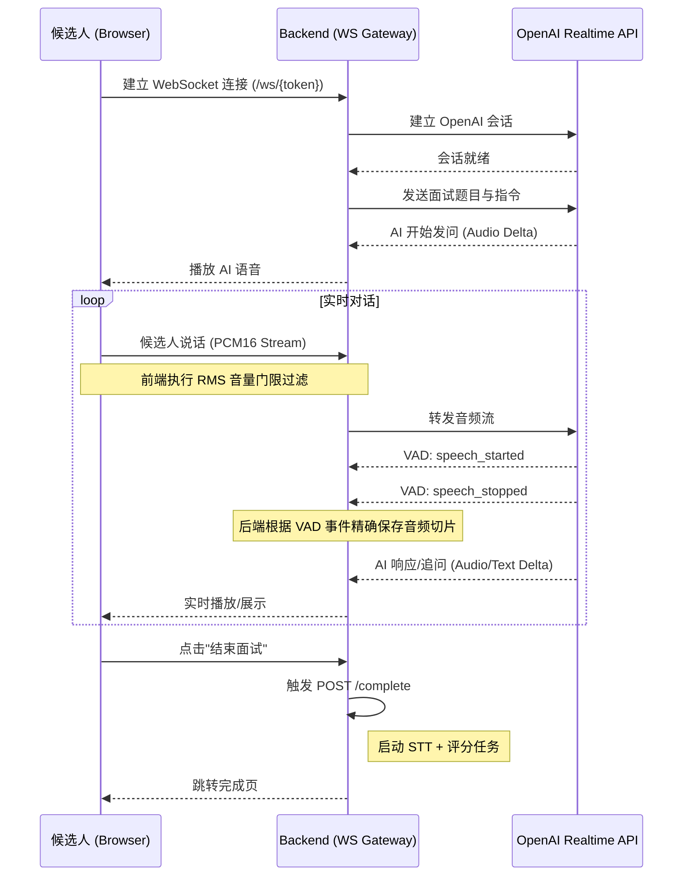

# 2.2 候选人面试功能 (Realtime 升级)

## 功能概述
候选人面试模块已升级为**实时语音对话**模式。候选人通过 WebSocket 与 AI 面试官进行实时通话，体验一问一答的交互。

## 交互流程

## 核心组件实现

### 前端：`Interview.tsx`
- **AudioContext**：处理 16kHz PCM 音频采集与播放。
- **设备选择**：面试开始前提供麦克风与扬声器列表，允许用户选择特定输入/输出设备。
- **音量门限 (Silence Filter)**：在 `onaudioprocess` 中计算 RMS 值，仅当音量超过 0.01 时才发送音频数据，减少无效网络带宽占用。
- **WebSocket**：管理与后端的实时双向通信。
- **状态管理**：连接中、通话中、错误处理。

### 后端：`realtime.py`
- **WS 转发**：在浏览器与 OpenAI 之间充当透明代理。
- **VAD 精确录制**：利用 OpenAI Realtime 的 `input_audio_buffer.speech_started` 和 `input_audio_buffer.speech_stopped` 事件。
  - 只有在 `speech_started` 之后才开始累积音频。
  - 在 `speech_stopped` 时将累积的音频保存为 `.wav` 文件。
- **指令注入**：将 `question_set` 注入 OpenAI Session Instructions。

## 注意事项
- 实时面试需要稳定的网络连接。
- 浏览器必须获得麦克风授权。
- 面试结束后必须调用 `/complete` 接口才能生成最终评分。
