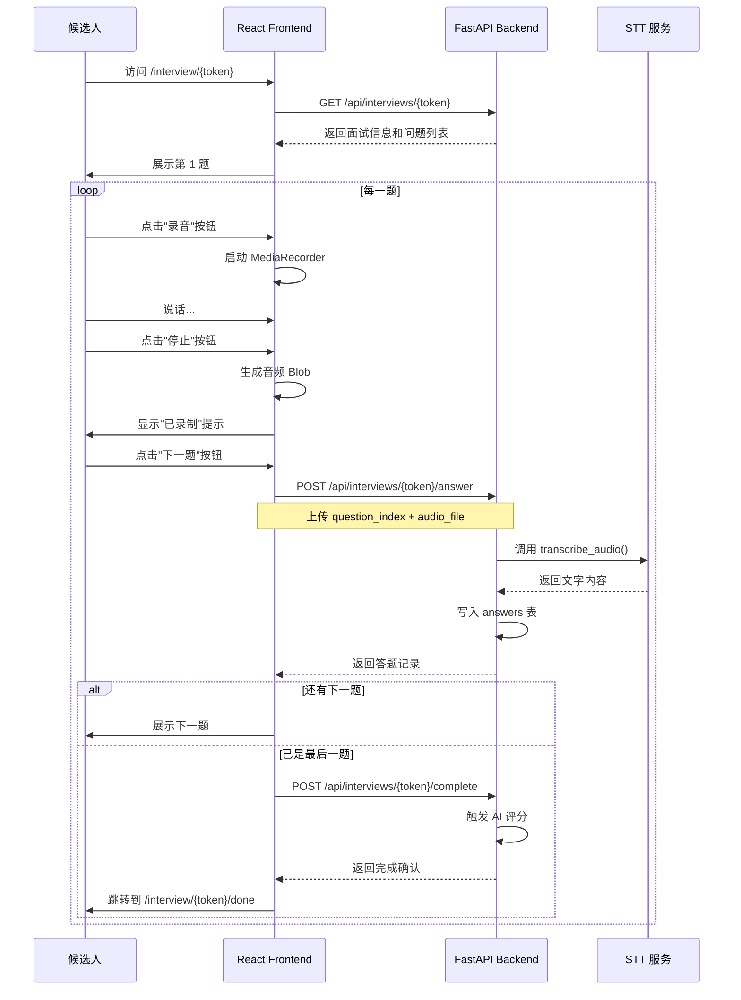

# 2.2 候选人面试功能

## 功能概述

候选人面试模块为候选人提供友好的 Web 面试界面，支持逐题展示问题、语音录制、答案上传和面试完成等完整流程。候选人无需注册或登录，仅需访问唯一的面试链接即可开始面试。

## 使用场景

1. **单次面试**：候选人收到面试链接，打开后逐题作答
2. **断点续答**：如果中途关闭页面，重新打开链接可继续答题（未实现持久化进度）
3. **移动端访问**：支持手机浏览器访问和录音

## 功能流程



## 页面路由

### 1. 面试页面：`/interview/:token`

**功能**：展示问题并录音答题

**URL 示例**：
```
http://localhost:5173/interview/zT7qK9wX-3mLpR8sY4nB6vC1aF5hG2jD0eU
```

**页面元素**：
- 标题：显示岗位和候选人姓名
- 问题卡片：显示当前题号和问题文本
- 录音按钮：圆形按钮，点击开始/停止录音
- 录制状态提示：显示"正在录音..."或"已录制 (XX KB)"
- 下一题/完成面试按钮：提交当前答案

**代码位置**：[frontend/src/pages/Interview.tsx](../frontend/src/pages/Interview.tsx)

---

### 2. 完成页面：`/interview/:token/done`

**功能**：显示面试完成提示

**URL 示例**：
```
http://localhost:5173/interview/zT7qK9wX-3mLpR8sY4nB6vC1aF5hG2jD0eU/done
```

**页面内容**：
- ✅ 面试已完成
- 感谢您的参与，我们会尽快与您联系

**代码位置**：[frontend/src/pages/InterviewDone.tsx](../frontend/src/pages/InterviewDone.tsx)

## API 接口

### 1. 获取面试信息

**接口**：`GET /api/interviews/{token}`

**请求示例**：
```
GET http://localhost:8000/api/interviews/zT7qK9wX-3mLpR8sY4nB6vC1aF5hG2jD0eU
```

**响应**：
```json
{
  "id": 1,
  "name": "张三",
  "position": "Python 后端工程师",
  "status": "created",
  "link_token": "zT7qK9wX-3mLpR8sY4nB6vC1aF5hG2jD0eU",
  "question_set": [
    {"order_index": 0, "question_text": "请简单介绍一下你自己"},
    {"order_index": 1, "question_text": "你为什么应聘这个岗位？"},
    {"order_index": 2, "question_text": "你最大的优势是什么？"}
  ],
  "created_at": "2026-03-10T10:30:00"
}
```

**错误处理**：
- **404 Not Found**：Token 不存在或已过期
- **500 Internal Server Error**：数据库连接失败

---

### 2. 提交答案

**接口**：`POST /api/interviews/{token}/answer`

**请求格式**：`multipart/form-data`

**请求参数**：

| 字段           | 类型   | 说明                      |
|--------------|------|--------------------------|
| question_index | int  | 题目索引（从 0 开始）        |
| audio_file   | File | 音频文件（WebM/WAV 格式）    |

**请求示例（curl）**：
```bash
curl -X POST \
  http://localhost:8000/api/interviews/zT7qK9wX-3mLpR8sY4nB6vC1aF5hG2jD0eU/answer \
  -F "question_index=0" \
  -F "audio_file=@answer_0.webm"
```

**前端代码示例**：
```typescript
const formData = new FormData();
formData.append('question_index', currentQuestionIndex.toString());
formData.append('audio_file', recordedBlob, 'answer.webm');

await axios.post(
  `http://localhost:8000/api/interviews/${token}/answer`,
  formData,
  {
    headers: { 'Content-Type': 'multipart/form-data' }
  }
);
```

**响应**：
```json
{
  "id": 1,
  "interview_id": 1,
  "question_index": 0,
  "audio_url": "./app/static/uploads/zT7qK9wX_0_a1b2c3d4.webm",
  "transcript": "我叫张三，有 3 年的 Python 开发经验...",
  "created_at": "2026-03-10T10:35:12"
}
```

**错误处理**：
- **404 Not Found**：Token 不存在
- **422 Unprocessable Entity**：参数缺失或格式错误
- **500 Internal Server Error**：文件保存失败或 STT 服务异常

---

### 3. 完成面试

**接口**：`POST /api/interviews/{token}/complete`

**请求示例**：
```
POST http://localhost:8000/api/interviews/zT7qK9wX-3mLpR8sY4nB6vC1aF5hG2jD0eU/complete
```

**响应**：
```json
{
  "message": "Interview completed",
  "evaluation": {
    "total_score": 85,
    "dimension_scores": {
      "communication": 90,
      "experience": 80,
      "potential": 85
    },
    "comment": "候选人沟通能力强，经验丰富，潜力巨大。"
  }
}
```

**错误处理**：
- **404 Not Found**：Token 不存在
- **500 Internal Server Error**：评分服务失败

## 前端实现

### 核心组件

#### 1. Interview.tsx（主页面）

**职责**：
- 获取面试信息
- 管理当前题号
- 协调录音组件和答案提交

**核心状态**：
```typescript
const [interview, setInterview] = useState<Interview | null>(null);
const [currentQuestionIndex, setCurrentQuestionIndex] = useState(0);
const [isRecording, setIsRecording] = useState(false);
const [recordedBlob, setRecordedBlob] = useState<Blob | null>(null);
const [isUploading, setIsUploading] = useState(false);
```

**核心逻辑**：
```typescript
// 提交答案并切换到下一题
const handleNext = async () => {
  if (!recordedBlob) {
    alert('请先录制回答');
    return;
  }

  setIsUploading(true);
  try {
    await submitAnswer(token, currentQuestionIndex, recordedBlob);
    setRecordedBlob(null); // 重置录音状态

    if (currentQuestionIndex < interview.question_set.length - 1) {
      setCurrentQuestionIndex(currentQuestionIndex + 1); // 下一题
    } else {
      await completeInterview(token); // 完成面试
      navigate(`/interview/${token}/done`); // 跳转完成页
    }
  } catch (err) {
    setError('提交回答失败，请重试');
  } finally {
    setIsUploading(false);
  }
};
```

---

#### 2. AudioRecorder.tsx（录音组件）

**职责**：
- 启动/停止录音
- 处理麦克风权限
- 生成音频 Blob

**代码位置**：[frontend/src/components/AudioRecorder.tsx](../frontend/src/components/AudioRecorder.tsx)

**核心逻辑**：
```typescript
const startRecording = async () => {
  try {
    // 请求麦克风权限
    const stream = await navigator.mediaDevices.getUserMedia({ audio: true });
    const mediaRecorder = new MediaRecorder(stream);

    mediaRecorder.ondataavailable = (e) => {
      if (e.data.size > 0) {
        chunksRef.current.push(e.data);
      }
    };

    mediaRecorder.onstop = () => {
      // 合并音频片段
      const blob = new Blob(chunksRef.current, { type: 'audio/webm' });
      onStop(blob); // 回调给父组件
      stream.getTracks().forEach(track => track.stop()); // 释放麦克风
    };

    mediaRecorder.start();
    setIsRecording(true);
  } catch (err) {
    alert('无法访问麦克风，请确保已授权。');
  }
};

const stopRecording = () => {
  if (mediaRecorderRef.current && isRecording) {
    mediaRecorderRef.current.stop();
    setIsRecording(false);
  }
};
```

**浏览器兼容性**：
- Chrome/Edge：✅ 完全支持
- Firefox：✅ 完全支持
- Safari：✅ 支持（需 HTTPS 或 localhost）
- 移动端 Safari：✅ 支持（iOS 14.3+）

---

### 状态管理

```
页面加载
  └─> loading: true
  └─> 调用 GET /api/interviews/{token}
      ├─> 成功：setInterview(data), loading: false
      └─> 失败：setError('链接无效'), loading: false

录音交互
  └─> 点击"录音"按钮
      └─> isRecording: true
      └─> 点击"停止"按钮
          └─> isRecording: false, recordedBlob: Blob

提交答案
  └─> 点击"下一题"按钮
      └─> isUploading: true
      └─> 调用 POST /api/interviews/{token}/answer
          ├─> 成功：currentQuestionIndex++, recordedBlob: null
          └─> 失败：alert('提交失败')
      └─> isUploading: false

完成面试
  └─> 最后一题提交成功
      └─> 调用 POST /api/interviews/{token}/complete
      └─> navigate('/interview/{token}/done')
```

## 后端实现

### 1. 获取面试信息

**代码位置**：[backend/app/api/interviews.py:38-43](../backend/app/api/interviews.py)

```python
@router.get("/{token}", response_model=InterviewResponse)
def get_interview(token: str, db: Session = Depends(get_db)):
    interview = db.query(Interview).filter(Interview.link_token == token).first()
    if not interview:
        raise HTTPException(status_code=404, detail="Interview not found")
    return interview
```

**性能优化**：
- `link_token` 字段有唯一索引，查询速度快
- 返回的 `question_set` 为 JSON 类型，无需关联查询

---

### 2. 提交答案

**代码位置**：[backend/app/api/interviews.py:45-81](../backend/app/api/interviews.py)

```python
@router.post("/{token}/answer", response_model=AnswerResponse)
async def submit_answer(
    token: str,
    question_index: int = Form(...),
    audio_file: UploadFile = File(...),
    db: Session = Depends(get_db)
):
    # 1. 验证面试存在
    interview = db.query(Interview).filter(Interview.link_token == token).first()
    if not interview:
        raise HTTPException(status_code=404, detail="Interview not found")

    # 2. 保存音频文件
    file_ext = os.path.splitext(audio_file.filename)[1]
    file_name = f"{token}_{question_index}_{secrets.token_hex(4)}{file_ext}"
    file_path = os.path.join(settings.UPLOAD_DIR, file_name)

    with open(file_path, "wb") as buffer:
        buffer.write(await audio_file.read())

    # 3. 调用 STT 转文字
    transcript = await transcribe_audio(file_path)

    # 4. 写入答题记录
    db_answer = Answer(
        interview_id=interview.id,
        question_index=question_index,
        audio_url=file_path,
        transcript=transcript
    )
    db.add(db_answer)

    # 5. 更新面试状态
    if interview.status == InterviewStatus.CREATED:
        interview.status = InterviewStatus.IN_PROGRESS

    db.commit()
    db.refresh(db_answer)
    return db_answer
```

**文件命名规则**：
```
{token}_{question_index}_{random_hex}.webm
例如：zT7qK9wX_0_a1b2c3d4.webm
```

**文件存储位置**：
```
backend/app/static/uploads/
```

---

### 3. 完成面试

**代码位置**：[backend/app/api/interviews.py:83-100](../backend/app/api/interviews.py)

```python
@router.post("/{token}/complete")
async def complete_interview(token: str, db: Session = Depends(get_db)):
    # 1. 获取面试记录
    interview = db.query(Interview).filter(Interview.link_token == token).first()
    if not interview:
        raise HTTPException(status_code=404, detail="Interview not found")

    # 2. 获取所有答案
    answers = db.query(Answer).filter(Answer.interview_id == interview.id).all()

    # 3. 调用 LLM 评分
    answers_data = [{"question_index": a.question_index, "transcript": a.transcript} for a in answers]
    evaluation = await evaluate_interview(answers_data)

    # 4. 更新面试记录
    interview.status = InterviewStatus.FINISHED
    interview.evaluation_result = evaluation  # JSON 格式
    interview.completed_at = datetime.utcnow()

    db.commit()
    return {"message": "Interview completed", "evaluation": evaluation}
```

## 数据存储

### answers 表结构

| 字段           | 类型       | 说明                          |
|--------------|----------|------------------------------|
| id           | Integer  | 主键                          |
| interview_id | Integer  | 关联的面试 ID（外键）            |
| question_index| Integer | 题目索引（从 0 开始）            |
| audio_url    | String   | 音频文件路径                    |
| transcript   | String   | STT 转文字结果（可空）           |
| created_at   | DateTime | 创建时间                       |

### 示例记录

```json
{
  "id": 1,
  "interview_id": 1,
  "question_index": 0,
  "audio_url": "./app/static/uploads/zT7qK9wX_0_a1b2c3d4.webm",
  "transcript": "我叫张三，有 3 年的 Python 开发经验，主要使用 FastAPI 和 Django...",
  "created_at": "2026-03-10T10:35:12.123456"
}
```

## 用户体验优化

### 1. 状态提示

| 状态           | 提示内容                      | 样式          |
|--------------|----------------------------|-------------|
| 加载中         | "加载中..."                 | 灰色文字      |
| 链接无效       | "面试链接无效或已过期"          | 红色文字      |
| 录音中         | "正在录音..."               | 红色高亮      |
| 已录制         | "✓ 已录制 (XX KB)"          | 绿色提示      |
| 上传中         | "正在提交..."（按钮禁用）      | 按钮变灰      |

---

### 2. 按钮状态控制

```typescript
<button
  onClick={handleNext}
  disabled={isRecording || isUploading || !recordedBlob}
>
  {isUploading ? '正在提交...' : (isLastQuestion ? '完成面试' : '下一题')}
</button>
```

**禁用条件**：
- 正在录音
- 正在上传
- 未录制音频

---

### 3. 移动端适配

```css
/* 响应式设计 */
max-width: 600px;
margin: 40px auto;
padding: 20px;

/* 大按钮便于点击 */
width: 80px;
height: 80px;
border-radius: 50%;
```

## 错误处理

### 前端错误处理

```typescript
// 麦克风权限拒绝
catch (err) {
  alert('无法访问麦克风，请确保已授权。');
}

// 提交失败
catch (err) {
  setError('提交回答失败，请重试');
}

// 链接无效
.catch(() => setError('面试链接无效或已过期'))
```

### 后端错误处理

| 错误场景             | HTTP 状态码 | 错误信息                    |
|-------------------|-----------|---------------------------|
| Token 不存在        | 404       | "Interview not found"     |
| 文件保存失败         | 500       | 自动抛出异常               |
| STT 服务失败        | 500       | 返回占位文本（不中断流程）    |
| 重复提交相同题目      | 200       | 覆盖旧记录（未做去重校验）    |

## 安全性考虑

### 1. Token 验证
- 每次请求都验证 Token 有效性
- Token 不存在时返回 404，避免泄露信息

### 2. 文件上传安全
- 文件名使用随机字符串，避免覆盖
- 未对文件类型做严格校验（未来可添加）
- 文件大小限制：FastAPI 默认 100MB（可配置）

### 3. 跨域配置
```python
allow_origins=["*"]  # 开发环境，生产应限制域名
```

## 性能优化

### 前端优化
- 音频 Blob 在内存中临时存储，提交后立即释放
- 使用 `useEffect` 懒加载面试数据
- 录音组件使用 `useRef` 避免重复渲染

### 后端优化
- 文件写入使用异步 I/O（`await audio_file.read()`）
- STT 调用为异步操作，不阻塞请求
- 数据库查询使用索引（`link_token` 有唯一索引）

### 未来优化点
- 音频压缩：前端压缩后再上传
- 断点续传：支持大文件分片上传
- 进度持久化：将答题进度存储到 localStorage

## 测试建议

### 前端测试
```typescript
// 测试录音功能
it('should record audio', async () => {
  const { getByText } = render(<AudioRecorder />);
  fireEvent.click(getByText('录音'));
  await waitFor(() => expect(getByText('停止')).toBeInTheDocument());
});

// 测试提交流程
it('should submit answer', async () => {
  const { getByText } = render(<Interview />);
  // 模拟录音 → 提交 → 验证 API 调用
});
```

### 后端测试
```python
def test_submit_answer():
    # 创建测试音频文件
    with open('test_audio.webm', 'rb') as f:
        response = client.post(
            f"/api/interviews/{token}/answer",
            data={"question_index": 0},
            files={"audio_file": f}
        )
    assert response.status_code == 200
    assert response.json()["transcript"] is not None
```

## 扩展方向

### 短期优化
- 添加"重新录制"按钮
- 显示剩余题目数量
- 支持试听已录制的音频

### 长期扩展
- 实时语音对话（替代录制-上传模式）
- 视频面试（WebRTC）
- 答题时间限制
- 面试暂停/恢复功能
- 多语言支持

## 相关文档

- **[2.1 面试创建模块](2.1_interview_creation.md)**：了解面试链接的生成过程
- **[2.3 AI 评估模块](2.3_ai_evaluation.md)**：了解 STT 和评分的详细实现
- **[2.4 HR 后台模块](2.4_admin_backend.md)**：了解 HR 如何查看候选人答题结果
