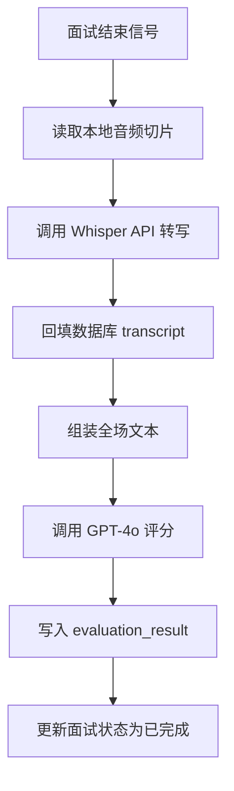

# 2.3 AI 评估功能 (Realtime 升级)

## 功能概述
AI 评估模块负责题目匹配、语音转写（STT）和综合评分。

## 1. 题目匹配 (CSV Selector)
- **数据源**：`backend/app/static/question_bank.csv`。
- **逻辑**：根据 `position` 字段匹配。
- **回退**：无匹配或文件异常时，回退到 3 道默认基础题。

## 2. 语音转写 (STT)
- **模型**：OpenAI Whisper-1。
- **触发时机**：面试结束后，在 `complete` 阶段对所有缓存的 `.wav` 切片进行批量转写。
- **存储**：转写结果回填至 `answers.transcript`。

## 3. 智能评分 (Evaluator)
- **模型**：GPT-4o。
- **输入**：全场面试的完整 Transcript（含问题与回答）。
- **输出**：JSON 格式的评估报告。
  - `total_score`: 0-100。
  - `dimension_scores`: 沟通、专业、潜力等。
  - `comment`: 综合评语。

## 评估流程图

