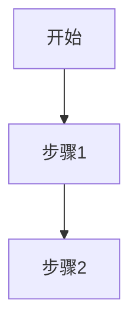

# 文档迁移指南

## 📋 文档重构说明

本次重构重新组织了 `spec_doc/` 目录下的所有文档，使其结构更清晰，内容与代码实现保持一致。

## 🔄 文档映射关系

### 旧文档 → 新文档对照表

| 旧文档 | 新文档 | 说明 |
|-------|--------|------|
| `ai_interview_prd.md` | `01_quick_start.md` + `02_architecture.md` | 拆分为快速启动和架构文档 |
| `ai_interview_architecture.md` | `02_architecture.md` | 合并到系统架构 |
| `0.0_quick_start.md` | `01_quick_start.md` | 重命名并更新内容 |
| `1.0_overview.md` | `README.md` | 合并到导航文档 |
| `2.0_feature_overview.md` | `README.md` + `02_architecture.md` | 拆分到多个文档 |
| `2.1_interview_creation.md` | `03_features/03.1_interview_creation.md` | 移动到功能目录 |
| `2.1_interview_flow.md` | `03_features/03.2_realtime_interview.md` | 合并到实时面试 |
| `2.2_candidate_interview.md` | `03_features/03.2_realtime_interview.md` | 已重写 |
| `2.3_ai_evaluation.md` | `03_features/03.3_ai_evaluation.md` | 移动到功能目录 |
| `2.4_admin_backend.md` | `03_features/03.4_admin_dashboard.md` | 移动到功能目录 |
| `3.0_logging_module.md` | `05_logging.md` | 重命名 |
| `4.0_troubleshooting.md` | `06_troubleshooting.md` | 重命名并更新 |
| `5.0_job_profile_config.md` | `03_features/03.5_job_profile_config.md` | 移动到功能目录 |

## 📁 新文档结构

```
spec_doc/
├── README.md                          # 📚 文档导航
├── 01_quick_start.md                  # ✅ 已创建
├── 02_architecture.md                 # ✅ 已创建
├── 03_features/                       # 功能模块
│   ├── 03.1_interview_creation.md     # ⏳ 待创建（基于旧 2.1）
│   ├── 03.2_realtime_interview.md     # ✅ 已创建（全新）
│   ├── 03.3_ai_evaluation.md          # ⏳ 待创建（基于旧 2.3）
│   ├── 03.4_admin_dashboard.md        # ⏳ 待创建（基于旧 2.4）
│   └── 03.5_job_profile_config.md     # ⏳ 待创建（基于旧 5.0）
├── 04_technical_details/              # 技术细节
│   ├── 04.1_realtime_api.md           # ⏳ 待创建
│   ├── 04.2_audio_processing.md       # ⏳ 待创建
│   ├── 04.3_vad_mechanism.md          # ⏳ 待创建
│   └── 04.4_half_duplex_strategy.md   # ⏳ 待创建
├── 05_logging.md                      # ⏳ 待创建（基于旧 3.0）
├── 06_troubleshooting.md              # ⏳ 待创建（基于旧 4.0）
└── MIGRATION_GUIDE.md                 # 本文档
```

## 🛠️ 待完成文档列表

### 高优先级（核心功能）

1. **03.5_job_profile_config.md**
   - 基于：`5.0_job_profile_config.md.old`
   - 内容：岗位配置、CSV 题库、JSON JD
   - 参考代码：`backend/app/api/job_profiles.py`, `backend/app/models/job_profile.py`

2. **06_troubleshooting.md**
   - 基于：`4.0_troubleshooting.md.old`
   - 新增：半双工音频问题、AudioContext 问题
   - 参考：`spec_doc/03_features/03.2_realtime_interview.md#调试技巧`

### 中优先级（技术细节）

3. **04.4_half_duplex_strategy.md**
   - 全新文档
   - 内容：时间轴门控、预锁定机制、策略对比
   - 参考代码：`frontend/src/pages/Interview.tsx:244-263`

4. **04.2_audio_processing.md**
   - 内容：PCM16 格式、24kHz 采样率、音频链路
   - 参考代码：`frontend/src/pages/Interview.tsx`, `backend/app/api/realtime.py`

5. **05_logging.md**
   - 基于：`3.0_logging_module.md.old`
   - 更新：Realtime 相关日志
   - 参考代码：`backend/app/utils/logger.py`

### 低优先级（补充文档）

6. **03.1_interview_creation.md**
   - 基于：`2.1_interview_creation.md.old`
   - 更新：JobProfile 集成

7. **03.3_ai_evaluation.md**
   - 基于：`2.3_ai_evaluation.md.old`
   - 参考代码：`backend/app/services/evaluator.py`

8. **03.4_admin_dashboard.md**
   - 基于：`2.4_admin_backend.md.old`
   - 参考代码：`backend/app/api/admin.py`, `frontend/src/pages/AdminInterviews.tsx`

9. **04.1_realtime_api.md**
   - 内容：OpenAI Realtime API 事件流、配置参数
   - 参考代码：`backend/app/api/realtime.py:94-141`

10. **04.3_vad_mechanism.md**
    - 内容：Server VAD 原理、事件监听、精确录制
    - 参考代码：`backend/app/api/realtime.py:240-341`

## 📝 补全指南

### 方式 1：基于旧文档改写

```bash
cd /Users/ziwenchen/AI_Interviewer/spec_doc

# 示例：创建岗位配置文档
# 1. 阅读旧文档
cat 5.0_job_profile_config.md.old

# 2. 查看相关代码
cat ../backend/app/api/job_profiles.py
cat ../backend/app/models/job_profile.py

# 3. 创建新文档（修正错误，对齐代码）
# vim 03_features/03.5_job_profile_config.md
```

### 方式 2：从头编写

对于全新的技术细节文档（如 `04.4_half_duplex_strategy.md`），建议：

1. 明确文档目标和读者
2. 绘制流程图（Mermaid）
3. 引用关键代码片段（带文件路径和行号）
4. 提供调试技巧和常见问题

### 文档模板

```markdown
# {文档标题}

## 📝 功能概述

简要描述功能/技术的目的和价值。

## 🎯 核心特性

- ✅ 特性 1
- ✅ 特性 2

## 🔄 实现流程



## 🔧 关键代码

**文件**：[path/to/file.ts:123](../path/to/file.ts#L123)

```typescript
// 代码片段
```

## 🔍 调试技巧

常见问题和解决方案。

## 📚 相关文档

- [文档A](link)
- [文档B](link)
```

## 🧹 清理旧文档（可选）

所有旧文档已重命名为 `.old` 后缀，存放在 `spec_doc/` 目录下作为参考。

**完成新文档补全后**，可以删除旧文档：

```bash
cd /Users/ziwenchen/AI_Interviewer/spec_doc
rm *.old
```

## ✅ 验证清单

新文档应满足以下要求：

- [ ] 内容与代码实现一致（无虚假信息）
- [ ] 包含实际的文件路径和行号引用
- [ ] 使用 Mermaid 图表增强可读性
- [ ] 提供调试技巧和常见问题
- [ ] 链接到相关文档
- [ ] 修正技术错误（如 24kHz vs 16kHz）

## 🎯 下一步

1. 根据优先级逐步补全待创建文档
2. 确保所有文档链接有效
3. 更新根目录 `README.md` 中的文档链接
4. 删除旧文档备份（可选）

---

**文档重构日期**：2026-03-11
**重构原因**：
- 旧文档结构混乱（编号不统一）
- 内容与代码实现不一致（24kHz vs 16kHz）
- 缺失关键功能文档（JobProfile, 半双工策略）
- 重复内容过多

**重构目标**：
- ✅ 清晰的文档结构（导航 + 分类）
- ✅ 与代码实现高度一致
- ✅ 完整覆盖所有功能和技术细节
- ✅ 易于查找和维护
