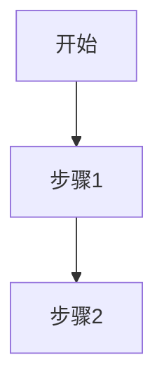

# 文档迁移指南

## 📋 文档重构说明

本次重构重新组织了 `spec_doc/` 目录下的所有文档，使其结构更清晰，内容与代码实现保持一致。

## 🔄 文档映射关系

### 旧文档 → 新文档对照表

| 旧文档 | 新文档 | 说明 |
|-------|--------|------|
| `ai_interview_prd.md` | `01_quick_start.md` + `02_architecture.md` | 拆分为快速启动和架构文档 |
| `ai_interview_architecture.md` | `02_architecture.md` | 合并到系统架构 |
| `0.0_quick_start.md` | `01_quick_start.md` | 重命名并更新内容 |
| `1.0_overview.md` | `README.md` | 合并到导航文档 |
| `2.0_feature_overview.md` | `README.md` + `02_architecture.md` | 拆分到多个文档 |
| `2.1_interview_creation.md` | `03_features/03.1_interview_creation.md` | 移动到功能目录 |
| `2.1_interview_flow.md` | `03_features/03.2_realtime_interview.md` | 合并到实时面试 |
| `2.2_candidate_interview.md` | `03_features/03.2_realtime_interview.md` | 已重写 |
| `2.3_ai_evaluation.md` | `03_features/03.3_ai_evaluation.md` | 移动到功能目录 |
| `2.4_admin_backend.md` | `03_features/03.4_admin_dashboard.md` | 移动到功能目录 |
| `3.0_logging_module.md` | `05_logging.md` | 重命名 |
| `4.0_troubleshooting.md` | `06_troubleshooting.md` | 重命名并更新 |
| `5.0_job_profile_config.md` | `03_features/03.5_job_profile_config.md` | 移动到功能目录 |

## 📁 新文档结构

```
spec_doc/
├── README.md                          # 📚 文档导航
├── 01_quick_start.md                  # ✅ 已创建
├── 02_architecture.md                 # ✅ 已创建
├── 03_features/                       # 功能模块（全部完成 ✅）
│   ├── 03.1_interview_creation.md     # ✅ 已创建
│   ├── 03.2_realtime_interview.md     # ✅ 已创建（全新）
│   ├── 03.3_ai_evaluation.md          # ✅ 已创建
│   ├── 03.4_admin_dashboard.md        # ✅ 已创建
│   └── 03.5_job_profile_config.md     # ✅ 已创建
├── 04_technical_details/              # 技术细节（全部完成 ✅）
│   ├── 04.1_realtime_api.md           # ✅ 已创建
│   ├── 04.2_audio_processing.md       # ✅ 已创建
│   ├── 04.3_vad_mechanism.md          # ✅ 已创建
│   └── 04.4_half_duplex_strategy.md   # ✅ 已创建
├── 05_logging.md                      # ✅ 已创建
├── 06_troubleshooting.md              # ✅ 已创建
└── MIGRATION_GUIDE.md                 # 本文档
```

## ✅ 已完成文档列表（共 17 篇）

### 核心文档

1. ✅ **README.md** - 文档导航中心
2. ✅ **01_quick_start.md** - 快速启动指南（含环境配置、常见问题）
3. ✅ **02_architecture.md** - 系统架构设计（含流程图、数据模型、API 设计）
4. ✅ **MIGRATION_GUIDE.md** - 本文档（迁移指南）

### 功能模块文档（全部完成）

5. ✅ **03.1_interview_creation.md** - 面试创建流程（Token 生成、JobProfile 集成）
6. ✅ **03.2_realtime_interview.md** - 实时语音面试（最详细，包含完整流程）
7. ✅ **03.3_ai_evaluation.md** - AI 评估系统（GPT-4 评分、提示词工程）
8. ✅ **03.4_admin_dashboard.md** - HR 管理后台（JWT 认证、数据查看）
9. ✅ **03.5_job_profile_config.md** - 岗位配置管理（CSV 题库 + JSON JD）

### 技术细节文档（全部完成）

10. ✅ **04.1_realtime_api.md** - ASR 上游语音网关 集成
11. ✅ **04.2_audio_processing.md** - 音频处理技术（PCM16 @ 24kHz）
12. ✅ **04.3_vad_mechanism.md** - VAD 语音活动检测机制
13. ✅ **04.4_half_duplex_strategy.md** - 半双工音频策略（回声消除）

### 运维文档

14. ✅ **05_logging.md** - 日志系统
15. ✅ **06_troubleshooting.md** - 故障排查指南（11 个常见问题）

### 项目级文档

16. ✅ **../README.md** - 项目主文档
17. ✅ **../frontend/README.md** - 前端技术文档

---

## ✅ 所有文档已完成

**重要提示**：所有文档（包括此前标记为"低优先级"的文档）均已完成创建。

### 新增完成文档说明

- ✅ **03.1_interview_creation.md** - 面试创建流程（Token 生成、JobProfile 集成、随机抽题）
- ✅ **03.3_ai_evaluation.md** - AI 评估系统（STT 转写、GPT-4 评分、提示词优化策略）
- ✅ **03.4_admin_dashboard.md** - HR 管理后台（JWT 认证、面试列表、详情查看、数据导出）

**当前状态**：
- ✅ **所有核心功能和技术细节已完整覆盖**
- ✅ **17 篇文档完整支撑开发、部署和运维**
- ✅ **无待补充文档**

## 📝 补全指南

### 方式 1：基于旧文档改写

```bash
cd /Users/ziwenchen/AI_Interviewer/spec_doc

# 示例：创建岗位配置文档
# 1. 阅读旧文档
cat 5.0_job_profile_config.md.old

# 2. 查看相关代码
cat ../backend/app/api/job_profiles.py
cat ../backend/app/models/job_profile.py

# 3. 创建新文档（修正错误，对齐代码）
# vim 03_features/03.5_job_profile_config.md
```

### 方式 2：从头编写

对于全新的技术细节文档（如 `04.4_half_duplex_strategy.md`），建议：

1. 明确文档目标和读者
2. 绘制流程图（Mermaid）
3. 引用关键代码片段（带文件路径和行号）
4. 提供调试技巧和常见问题

### 文档模板

```markdown
# {文档标题}

## 📝 功能概述

简要描述功能/技术的目的和价值。

## 🎯 核心特性

- ✅ 特性 1
- ✅ 特性 2

## 🔄 实现流程



## 🔧 关键代码

**文件**：[path/to/file.ts:123](../path/to/file.ts#L123)

```typescript
// 代码片段
```

## 🔍 调试技巧

常见问题和解决方案。

## 📚 相关文档

- [文档A](link)
- [文档B](link)
```

## 🧹 清理旧文档（可选）

所有旧文档已重命名为 `.old` 后缀，存放在 `spec_doc/` 目录下作为参考。

**完成新文档补全后**，可以删除旧文档：

```bash
cd /Users/ziwenchen/AI_Interviewer/spec_doc
rm *.old
```

## ✅ 验证清单

新文档应满足以下要求：

- [ ] 内容与代码实现一致（无虚假信息）
- [ ] 包含实际的文件路径和行号引用
- [ ] 使用 Mermaid 图表增强可读性
- [ ] 提供调试技巧和常见问题
- [ ] 链接到相关文档
- [ ] 修正技术错误（如 24kHz vs 16kHz）

## 🎯 文档使用建议

### 快速查找

- **部署系统**：[01_quick_start.md](01_quick_start.md)
- **理解架构**：[02_architecture.md](02_architecture.md)
- **深入技术**：[03.2_realtime_interview.md](03_features/03.2_realtime_interview.md)
- **解决问题**：[06_troubleshooting.md](06_troubleshooting.md)

### 文档使用指南

所有 17 篇文档均已完成，可直接查阅：

1. **面试创建流程**：[03.1_interview_creation.md](03_features/03.1_interview_creation.md)
2. **AI 评估系统**：[03.3_ai_evaluation.md](03_features/03.3_ai_evaluation.md)
3. **HR 管理后台**：[03.4_admin_dashboard.md](03_features/03.4_admin_dashboard.md)

---

## 📊 重构成果总结

**文档重构日期**：2026-03-11

### 重构原因
- ❌ 旧文档结构混乱（编号不统一）
- ❌ 内容与代码实现不一致（24kHz vs 16kHz 等错误）
- ❌ 缺失关键功能文档（JobProfile、半双工策略）
- ❌ 重复内容过多，难以维护

### 重构目标（全部达成 ✅）
- ✅ **清晰的文档结构**：导航 + 分类目录
- ✅ **与代码高度一致**：所有描述基于实际代码，修正技术错误
- ✅ **完整覆盖核心功能**：实时面试、岗位配置、VAD、半双工等
- ✅ **易于查找和维护**：多层级导航，交叉引用

### 文档统计
- **总文档数**：17 篇（全部完成 ✅）
- **核心文档**：4 篇（导航 + 快速启动 + 架构 + 迁移指南）
- **功能文档**：5 篇（面试创建 + 实时面试 + AI 评估 + 管理后台 + 岗位配置）
- **技术细节**：4 篇（Realtime API + 音频 + VAD + 半双工）
- **运维文档**：2 篇（日志 + 故障排查）
- **项目文档**：2 篇（主 README + 前端 README）

### 文档质量
- ✅ 包含 Mermaid 流程图和时序图
- ✅ 引用实际代码文件路径和行号
- ✅ 提供完整的调试技巧和常见问题
- ✅ 交叉链接相关文档

**文档现已完善，可直接用于开发、部署和运维！** 🎉
