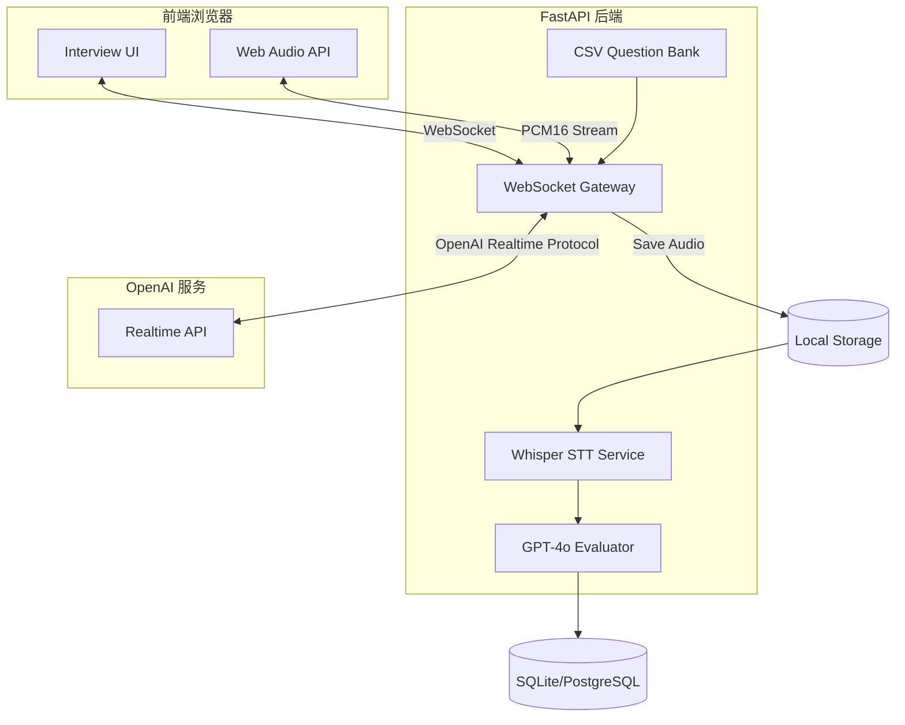

# AI 招聘面试 技术方案 (Realtime 升级版)

## 1. 目标与定位

- **实时交互**：基于 OpenAI Realtime API 实现一问一答的实时语音面试。
- **动态出题**：优先匹配 CSV 岗位题库，无匹配则回退默认题。
- **智能评估**：面试结束后统一进行 STT 转写与 LLM 维度评分。
- **技术栈**：FastAPI + React + WebSocket + OpenAI Realtime.

## 2. 架构示意

## 3. 核心流程变更

### 3.1 实时对话阶段
1. 建立 WebSocket 连接：前端 -> 后端 -> OpenAI Realtime。
2. 后端加载 `question_set` 并作为 `instructions` 发送给 OpenAI。
3. AI 实时发问，候选人语音回答。
4. 后端实时缓存候选人音频流并按题切片。

### 3.2 评估阶段
1. 候选人结束通话。
2. 后端对缓存的音频切片调用 Whisper API 进行 STT 转写。
3. 汇总全场 Transcript，调用 GPT-4o 生成 `evaluation_result`（总分、维度分、评语）。

## 4. 题库配置 (CSV)

路径：`backend/app/static/question_bank.csv`
字段映射配置：`QUESTION_BANK_FIELD_MAP` (默认 `{"position": "岗位"}`)

## 5. API 接口

- `WS /api/realtime/ws/{token}`: 实时面试长连接。
- `POST /api/interviews/{token}/complete`: 触发面试结束、STT 与评分流程。
