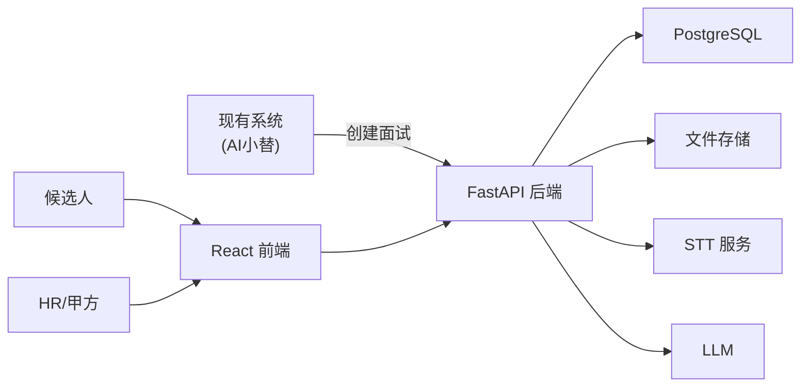

# AI 招聘面试 技术方案

## 1. 目标与定位

- **对接现有系统**：AI 小替/简历筛选 → 调用接口拿面试链接 → 发给候选人
- **新增能力**：语音面试 + STT 转文字 + AI 评分 + HR 后台表格
- **技术栈**：Python FastAPI + React + PostgreSQL

## 2. 架构示意

## 3. 数据表（精简）

### 3.1 admin_users

仅后台登录用。MVP 可用环境变量写死账号。

| 字段 | 说明 |
|------|------|
| id | |
| username | |
| password_hash | |
| created_at | |

### 3.2 interviews

| 字段 | 说明 |
|------|------|
| id | |
| name | 候选人姓名（可选） |
| position | 岗位 |
| external_id | 外部系统候选人 ID（可选） |
| resume_brief | 简历摘要（可选） |
| status | created / in_progress / finished / evaluated |
| link_token | 候选人访问 token |
| question_set | JSON：问题列表（含 order_index, question_text） |
| evaluation_result | JSON：总分、维度分、评语 |
| created_at | |
| completed_at | |

### 3.3 answers

| 字段 | 说明 |
|------|------|
| id | |
| interview_id | |
| question_index | 第几题 |
| audio_url | 语音文件地址 |
| transcript | STT 转文字 |
| created_at | |

## 4. 核心 API

### 4.1 对接现有系统

- **POST /api/interviews/create**
  - 入参：`name`, `position`, `external_id`, `resume_brief`（均可选）
  - 逻辑：生成问题（LLM 或固定模板）→ 写入 `interviews` → 返回 `interview_url`

### 4.2 候选人侧

- **GET /api/interviews/{token}**  
  返回：面试信息 + `question_set`

- **POST /api/interviews/{token}/answer**  
  入参：`question_index`, `audio_file`  
  逻辑：存音频 → 调 STT → 写 `answers`

- **POST /api/interviews/{token}/complete**  
  逻辑：汇总回答 → 调 LLM 评分 → 写 `evaluation_result` → 更新 status

### 4.3 后台

- **POST /api/admin/login** → 返回 JWT
- **GET /api/admin/interviews** → 列表（分页、筛选、含简单统计）
- **GET /api/admin/interviews/{id}** → 详情（问答 + 评分）

## 5. 前端页面

| 路由 | 说明 |
|------|------|
| /interview/:token | 候选人答题：逐题展示 + 录音 + 上传 |
| /interview/:token/done | 完成提示 |
| /admin/login | 后台登录 |
| /admin/interviews | 表格 + 顶部统计数字 |

详情页：表格行点击展开或弹窗，展示问答 + 评分。

## 6. 语音流程与交互模式

### 6.1 交互模式说明
当前系统采用 **“异步录制”** 模式，而非实时流式对话。
- **题目来源**：后端预设或 LLM 生成的静态问题列表。
- **展示方式**：前端以文本形式展示题目。
- **回答方式**：候选人手动点击“录音”开始，点击“停止”结束，点击“下一题”上传音频。
- **处理方式**：后端接收完整音频后进行 STT 转文字。

### 6.2 语音处理流程
- 前端：录音 → 上传 `audio_file`
- 后端：存文件 → 调 STT（如 Whisper API）→ 得 `transcript` → 写 `answers`
- 完成时：汇总 `transcript` → 调 LLM → 输出 JSON 写入 `evaluation_result`

## 7. 开发节奏

| 天数 | 内容 |
|------|------|
| 1 | 后端骨架 + 3 张表 + create / get / answer / complete |
| 2 | 前端候选人页 + 录音组件 |
| 3 | 接入 STT + LLM（出题、评分） |
| 4 | 后台登录 + 列表 + 详情 |
| 5 | 联调、收尾 |
