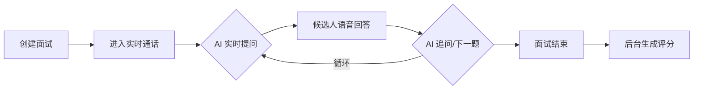

# AI 招聘面试 PRD (Realtime 升级版)

## 1. 核心需求
升级面试体验为**实时语音对话**模式，模拟真人面试官的即时追问与互动，提升候选人体验与评估深度。

## 2. 交互流程

## 3. 功能特性

### 3.1 实时语音面试官
- **流式交互**：无需等待录音上传，AI 实时感知候选人说话并做出回应。
- **专业引导**：AI 根据预设题目引导面试，并能根据回答进行追问。

### 3.2 岗位题库匹配
- **CSV 导入**：支持通过 CSV 文件配置不同岗位的题库。
- **智能筛选**：创建面试时指定岗位，系统自动匹配对应题目。

### 3.3 深度评估报告
- **全场转写**：面试结束后对每道题的回答进行精准转写。
- **多维度评分**：基于全场表现，AI 从沟通、专业、潜力等维度给出量化分数。

## 4. 非功能性需求
- **低延迟**：语音交互延迟应控制在 1-2 秒内。
- **稳定性**：WebSocket 连接断开支持重连。
- **安全性**：OpenAI API Key 仅在后端存储，不暴露给前端。
