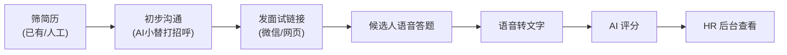

# AI 招聘面试 PRD（精简版）

## 1. 甲方需求

> 筛简历 → 初步沟通 → 微信/网页 → 自动面试（语音题）→ 转文字 → AI 判断，整个过程尽可能减少人工。

**甲方后台**：登录后能查看统计表格即可。

## 2. 核心流程

1. **筛简历**：已有能力或人工初筛
2. **初步沟通**：AI 小替打招呼（已有）
3. **发面试链接**：通过微信或网页发给候选人
4. **自动面试**：候选人打开链接，听语音题、语音回答
5. **转文字**：STT 将回答转为文本
6. **AI 判断**：LLM 评分并生成评语
7. **HR 查看**：登录后台看统计表格和详情

## 3. 用户角色

| 角色 | 行为 |
|------|------|
| 候选人 | 点击链接 → 语音答题 |
| HR/甲方 | 登录后台 → 查看面试列表、统计、详情 |

## 4. 功能范围（MVP）

### 4.1 对接现有系统

- 现有「AI 小替」或简历筛选系统调用一个接口，拿到面试链接
- 把链接发给候选人（微信/网页）

### 4.2 语音面试

- 候选人打开链接，逐题作答
- 每题：展示题目（可文字或 TTS 读题）→ 录音 → 上传
- 系统：STT 转文字 → 存库

### 4.3 AI 评分

- 面试结束后，汇总所有回答
- LLM 输出：总分、维度分、文字评语
- 写入面试记录

### 4.4 后台

- 登录（账号密码）
- 表格：候选人、岗位、状态、总分、时间
- 详情：问答内容、评分、评语

## 5. 不做（MVP 阶段）

- 复杂题库配置（CSV 导入、权重等）
- 多岗位精细化管理
- 实时流式语音
- 复杂统计报表
